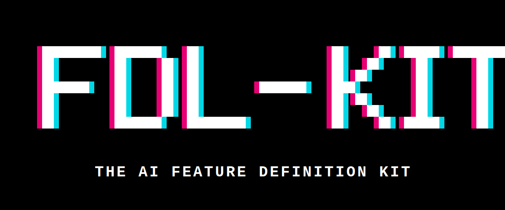

<p align="center">
  
</p>

<h1 align="center">ai-fdl-kit</h1>
<p align="center"><strong>The AI Feature Definition Language</strong> — portable YAML blueprints for software features, consumable by any AI coding tool.</p>

<p align="center">
  <a href="https://www.npmjs.com/package/ai-fdl-kit"></a>
  <a href="LICENSE"></a>
  <a href="blueprints/"></a>
  <a href="https://theunsbarnardt.github.io/ai-fdl-kit/using-with-other-ai/"></a>
  <a href="https://theunsbarnardt.github.io/ai-fdl-kit/"></a>
</p>

---

## One command, any project, no clone

```bash
npx ai-fdl-kit init --tool cursor
```

Bootstraps FDL into your existing project — schema, config, AI tool instructions — without cloning anything. Your project gets ~3 small files. The ~200 community blueprints stay remote and are pulled on demand.

```bash
npx ai-fdl-kit list              # browse the remote catalog
npx ai-fdl-kit pull auth/login   # copy a blueprint locally
npx ai-fdl-kit check             # validate + completeness gate
```

**Define features as YAML blueprints. Generate complete implementations for any framework. Extract architectural patterns from any codebase, API docs, or business document.**

ai-fdl-kit is an open-source system for writing "blueprints" — YAML specifications that describe software features completely. You define the *what* (fields, rules, outcomes, errors, events). Any AI tool — Claude, ChatGPT, Copilot, Cursor, Gemini — reads the blueprint and generates a correct, complete implementation for your chosen language and framework.

No code. No YAML knowledge needed. The CLI + conversational skills handle everything in plain English.

---

## What Problems Does This Solve?

- **Every developer rebuilds the same features from scratch.** Login, signup, password reset — something always gets missed.
- **When you ask AI to "build login", it guesses.** There's no shared definition of what "login" actually needs.
- **Business rules live in people's heads.** When it's time to build software, critical rules get lost.

**FDL solves all three.** A blueprint is the single source of truth for a feature — what data it needs, what rules govern it, what should happen in every scenario.

---

## How It Works

| Method | When to use it | Command |
|--------|---------------|---------|
| **Build a full app** | Describe your app in plain English | `/fdl-build "nextjs POS with OTP login"` |
| **Brainstorm a feature** | You have a problem, not a solution | `/fdl-brainstorm` |
| **Create from scratch** | You know what feature you want | `/fdl-create checkout payment` |
| **Extract from a document** | You have a BRD, policy doc, or SOP | `/fdl-extract docs/policy.pdf` |
| **Extract from a website** | API docs, developer portal | `/fdl-extract-web https://docs.example.com/api` |
| **Extract from code** | Existing codebase or git repo | `/fdl-extract-code ./src/auth login auth` |
| **Extract features selectively** | Large repo, pick only what you want | `/fdl-extract-code-feature https://github.com/org/repo` |
| **Generate code** | You have a blueprint, want code | `/fdl-generate login nextjs` |
| **Export for other AI tools** | Use blueprints with ChatGPT, Gemini, etc. | `/fdl-build-yaml "my app description"` |
| **Install for AI tools** | Set up Cursor, Windsurf, Copilot, etc. | `/fdl-install cursor` |
| **Auto-evolve** | Validate, regenerate docs, and commit | `/fdl-auto-evolve` |

---

## Getting Started

### Option 1 — No clone, use the CLI in any project ✨ recommended

```bash
cd your-existing-project
npx ai-fdl-kit init --tool cursor    # or windsurf, copilot, gemini, cline, ...
```

That's it. The CLI writes:
- `blueprints/` — where your feature specs live. Each feature ships as a pair: `{feature}.blueprint.yaml` (the spec) and `{feature}.md` (an auto-generated human-friendly summary, regenerated by `npm run generate` — never hand-edit).
- `schema/blueprint.schema.yaml` — for IDE autocomplete
- `fdl.config.yaml` — project config
- `.cursor/rules/fdl.mdc` (or equivalent for your AI tool) — tells the AI how to read blueprints

Then ask your AI tool: *"Build login using the auth/login blueprint"* — it fetches the blueprint over HTTP from the remote registry and generates code for your stack.

### Option 2 — Clone the full repo (for contributors and blueprint authors)

```bash
git clone https://github.com/TheunsBarnardt/ai-fdl-kit.git
cd ai-fdl-kit
npm install
```

Then open Claude Code and use the conversational skills:

```
/fdl-build "nextjs app with login and POS"   # Build a full app (recommended)
/fdl-brainstorm                              # Socratic elicitation if the idea is vague
/fdl-create login auth                        # Create a single blueprint
/fdl-generate login nextjs                    # Generate code from a blueprint
/fdl-extract-code ./src auth                 # Reverse-engineer features from existing code
```

---

## Static API for AI Tools

Every blueprint is available as JSON — no scraping needed:

```
GET /api/registry.json              — index of all 203 blueprints
GET /api/blueprints/auth/login.json — complete blueprint as JSON
```

Paste into ChatGPT: `https://theunsbarnardt.github.io/ai-fdl-kit/api/blueprints/auth/login.json`

[Browse the API registry](https://theunsbarnardt.github.io/ai-fdl-kit/api/registry.json)

---

## Third-Party Skill Integration

`/fdl-generate` and `/fdl-brainstorm` can compose with Claude skill packs from any community catalog — without crawling or auto-installing:

- **Auto-detected** — popular stacks (shadcn, tailwind, clerk, prisma, drizzle, nextauth) and data sources (google-calendar, stripe, twilio, resend, s3, maps) are matched against a fixed trigger table on every run
- **User-provided** — one explicit question per run lets you paste install commands or URLs from [skills.sh](https://skills.sh), [anthropics/skills](https://github.com/anthropics/skills), or [awesome-claude-skills](https://github.com/travisvn/awesome-claude-skills). Example:

  ```
  npx skills add https://github.com/shadcn/ui --skill shadcn
  ```

Install commands always land in the final summary for you to run yourself — FDL never auto-executes third-party installers. Auto-detected + user-provided skills both flow through the same downstream pipeline, so you only decide once per invocation.

---

## What Else You Gain

Blueprints aren't just templates — they encode transferable architectural patterns:

- **Auth Pack** — Rate limiting, token lifecycle, enumeration prevention
- **Integration Pack** — Async callbacks, idempotency, hardware state machines
- **UI Pack** — Registry architecture, MCP server integration, drag-and-drop
- **CMS Pack** — Lifecycle hooks, row-level security, draft/publish workflows
- **Visual Editor Pack** — Collision detection, undo/redo, plugin systems
- **ERP Pack** — POS sessions, tax computation, bank reconciliation, automation rules
- **Workflow Pack** — Approval chains, SLA enforcement, event-driven automation
- **Wealth Management Pack** — Portfolio valuations, market data feeds, document management, multi-account hierarchies, real-time pricing integration
- **Onboarding Pack** — Client and advisor registration, multi-step onboarding workflows, proposal/quotation generation, state machines, DocuSign integration

---

## 🔧 Improve the low-scoring blueprints

The fitness scorer (`npm run fitness`) flags blueprints scoring **below 70/100** as needing semantic help — the mechanical auto-improver can't fix missing outcomes, unbound error codes, or absent relationships. The list below pairs each weak blueprint with upstream open-source reference implementations. Pick a row, paste the command into Claude Code, and `/fdl-auto-evolve` will re-score after extraction — successful upgrades drop off this list automatically.

<!-- BEGIN:recommended-repos -->
<!-- Auto-generated by `npm run fitness:recommend`. Do not edit by hand. -->

_Last run: 2026-04-12 — 54 blueprints below the fitness threshold. Pick a row, paste the command into Claude Code, and `/fdl-auto-evolve` will re-score after extraction._

### 🔴 integration/user-federation-ldap-kerberos — 59/100
**Weakest dimension:** `relationships` (0/10) — no relationships

- **keycloak/keycloak** — Federation is keycloak-services/src/main/java/.../federation/ldap
  ```
  /fdl-extract-code https://github.com/keycloak/keycloak user-federation-ldap-kerberos integration
  ```
- **ory/hydra** — Canonical OAuth2/OIDC reference
  ```
  /fdl-extract-code https://github.com/ory/hydra user-federation-ldap-kerberos integration
  ```

### 🔴 auth/multi-factor-authentication — 61/100
**Weakest dimension:** `relationships` (0/10) — no relationships

- **privacyidea/privacyidea** — Dedicated MFA server — token types, enrollment, validation all first-class
  ```
  /fdl-extract-code https://github.com/privacyidea/privacyidea multi-factor-authentication auth
  ```
- **authelia/authelia** — MFA (TOTP, WebAuthn, push) configuration is first-class
  ```
  /fdl-extract-code https://github.com/authelia/authelia multi-factor-authentication auth
  ```
- **keycloak/keycloak** — Realm → client → user → role → group graph is richly typed
  ```
  /fdl-extract-code https://github.com/keycloak/keycloak multi-factor-authentication auth
  ```

### 🔴 auth/saml-2-identity-provider — 61/100
**Weakest dimension:** `relationships` (0/10) — no relationships

- **keycloak/keycloak** — SAML 2.0 IdP is a core Keycloak protocol
  ```
  /fdl-extract-code https://github.com/keycloak/keycloak saml-2-identity-provider auth
  ```
- **SAML-Toolkits/java-saml** — Reference SAML 2.0 toolkit — clean protocol state machine
  ```
  /fdl-extract-code https://github.com/SAML-Toolkits/java-saml saml-2-identity-provider auth
  ```
- **goauthentik/authentik** — Modern alternative with strong flow/stage modeling
  ```
  /fdl-extract-code https://github.com/goauthentik/authentik saml-2-identity-provider auth
  ```

### 🔴 access/fine-grained-authorization — 62/100
**Weakest dimension:** `relationships` (0/10) — no relationships

- **openfga/openfga** — The canonical fine-grained authorization reference
  ```
  /fdl-extract-code https://github.com/openfga/openfga fine-grained-authorization access
  ```
- **cerbos/cerbos** — Policy-as-code alternative with richly structured rules
  ```
  /fdl-extract-code https://github.com/cerbos/cerbos fine-grained-authorization access
  ```
- **ory/keto** — Permission server with explicit cross-feature relationships (Zanzibar tuples)
  ```
  /fdl-extract-code https://github.com/ory/keto fine-grained-authorization access
  ```

### 🔴 access/user-consent-management — 62/100
**Weakest dimension:** `relationships` (0/10) — no relationships

- **ory/hydra** — OAuth2 consent flow is a core Hydra primitive
  ```
  /fdl-extract-code https://github.com/ory/hydra user-consent-management access
  ```
- **keycloak/keycloak** — Client consent is a first-class Keycloak flow
  ```
  /fdl-extract-code https://github.com/keycloak/keycloak user-consent-management access
  ```
- **ory/keto** — Permission server with explicit cross-feature relationships (Zanzibar tuples)
  ```
  /fdl-extract-code https://github.com/ory/keto user-consent-management access
  ```

### 🔴 access/user-groups-organizations — 62/100
**Weakest dimension:** `relationships` (0/10) — no relationships

- **ory/keto** — Group/namespace modeling is first-class
  ```
  /fdl-extract-code https://github.com/ory/keto user-groups-organizations access
  ```
- **keycloak/keycloak** — Groups + organizations are native concepts
  ```
  /fdl-extract-code https://github.com/keycloak/keycloak user-groups-organizations access
  ```
- **openfga/openfga** — Relationship tuples are first-class
  ```
  /fdl-extract-code https://github.com/openfga/openfga user-groups-organizations access
  ```

### 🔴 auth/user-account-self-service — 63/100
**Weakest dimension:** `relationships` (0/10) — no relationships

- **ory/kratos** — Identity management server — self-service flows are the product focus
  ```
  /fdl-extract-code https://github.com/ory/kratos user-account-self-service auth
  ```
- **keycloak/keycloak** — Account console has every self-service flow
  ```
  /fdl-extract-code https://github.com/keycloak/keycloak user-account-self-service auth
  ```
- **goauthentik/authentik** — Modern alternative with strong flow/stage modeling
  ```
  /fdl-extract-code https://github.com/goauthentik/authentik user-account-self-service auth
  ```

### 🔴 auth/user-authentication-session-management — 63/100
**Weakest dimension:** `relationships` (0/10) — no relationships

- **authelia/authelia** — Session management is the product focus
  ```
  /fdl-extract-code https://github.com/authelia/authelia user-authentication-session-management auth
  ```
- **lucia-auth/lucia** — Session-based auth library with typed session lifecycle
  ```
  /fdl-extract-code https://github.com/lucia-auth/lucia user-authentication-session-management auth
  ```
- **keycloak/keycloak** — Realm → client → user → role → group graph is richly typed
  ```
  /fdl-extract-code https://github.com/keycloak/keycloak user-authentication-session-management auth
  ```

### 🔴 notification/device-alarm-notifications — 64/100
**Weakest dimension:** `error_binding` (2/10) — 1 of 1 codes unbound

_No candidates mapped for `notification` + `error_binding`. Run `/fdl-recommend-discover device-alarm-notifications` to find some._

### 🔴 workflow/maintenance-reminders — 64/100
**Weakest dimension:** `error_binding` (2/10) — 2 of 2 codes unbound

_No candidates mapped for `workflow` + `error_binding`. Run `/fdl-recommend-discover maintenance-reminders` to find some._

### 🔴 asset/trip-replay — 65/100
**Weakest dimension:** `error_binding` (2/10) — 1 of 1 codes unbound

_No candidates mapped for `asset` + `error_binding`. Run `/fdl-recommend-discover trip-replay` to find some._

### 🔴 data/fuel-level-reporting — 65/100
**Weakest dimension:** `error_binding` (2/10) — 1 of 1 codes unbound

- **payloadcms/payload** — Node headless CMS — rich data modeling, access control, hooks
  ```
  /fdl-extract-code https://github.com/payloadcms/payload fuel-level-reporting data
  ```
- **directus/directus** — Database-first data platform — collections, fields, relations, flows
  ```
  /fdl-extract-code https://github.com/directus/directus fuel-level-reporting data
  ```

### 🔴 data/payload-globals — 65/100
**Weakest dimension:** `structure` (0/10)

- **payloadcms/payload** — Payload CMS — globals are a core first-class primitive in this project
  ```
  /fdl-extract-code https://github.com/payloadcms/payload payload-globals data
  ```
- **directus/directus** — Database-first data platform — collections, fields, relations, flows
  ```
  /fdl-extract-code https://github.com/directus/directus payload-globals data
  ```

### 🔴 workflow/cost-based-route-optimization — 65/100
**Weakest dimension:** `error_binding` (2/10) — 2 of 2 codes unbound

_No candidates mapped for `workflow` + `error_binding`. Run `/fdl-recommend-discover cost-based-route-optimization` to find some._

### 🔴 workflow/multi-vehicle-route-optimization — 65/100
**Weakest dimension:** `error_binding` (2/10) — 2 of 2 codes unbound

_No candidates mapped for `workflow` + `error_binding`. Run `/fdl-recommend-discover multi-vehicle-route-optimization` to find some._

### 🔴 workflow/vehicle-capacity-constraints — 65/100
**Weakest dimension:** `error_binding` (2/10) — 2 of 2 codes unbound

_No candidates mapped for `workflow` + `error_binding`. Run `/fdl-recommend-discover vehicle-capacity-constraints` to find some._

### 🔴 asset/location-visit-history — 66/100
**Weakest dimension:** `error_binding` (2/10) — 1 of 1 codes unbound

_No candidates mapped for `asset` + `error_binding`. Run `/fdl-recommend-discover location-visit-history` to find some._

### 🔴 data/driver-identification — 66/100
**Weakest dimension:** `error_binding` (2/10) — 2 of 2 codes unbound

- **payloadcms/payload** — Node headless CMS — rich data modeling, access control, hooks
  ```
  /fdl-extract-code https://github.com/payloadcms/payload driver-identification data
  ```
- **directus/directus** — Database-first data platform — collections, fields, relations, flows
  ```
  /fdl-extract-code https://github.com/directus/directus driver-identification data
  ```

### 🔴 data/payload-versions — 66/100
**Weakest dimension:** `structure` (1/10)

- **payloadcms/payload** — Node headless CMS — rich data modeling, access control, hooks
  ```
  /fdl-extract-code https://github.com/payloadcms/payload payload-versions data
  ```
- **directus/directus** — Database-first data platform — collections, fields, relations, flows
  ```
  /fdl-extract-code https://github.com/directus/directus payload-versions data
  ```

### 🔴 notification/device-power-alerts — 66/100
**Weakest dimension:** `error_binding` (2/10) — 1 of 1 codes unbound

_No candidates mapped for `notification` + `error_binding`. Run `/fdl-recommend-discover device-power-alerts` to find some._

### 🔴 trading/commodity-derivatives-eod-data-delivery — 66/100
**Weakest dimension:** `structure` (1/10)

- **OpenBB-finance/OpenBB** — Commodity + derivatives data loaders and EOD flows
  ```
  /fdl-extract-code https://github.com/OpenBB-finance/OpenBB commodity-derivatives-eod-data-delivery trading
  ```
- **quantlib/quantlib** — Quantitative finance library — richly typed pricing and valuation rules
  ```
  /fdl-extract-code https://github.com/quantlib/quantlib commodity-derivatives-eod-data-delivery trading
  ```

### 🔴 workflow/priority-urgency-weighting — 66/100
**Weakest dimension:** `error_binding` (2/10) — 1 of 1 codes unbound

_No candidates mapped for `workflow` + `error_binding`. Run `/fdl-recommend-discover priority-urgency-weighting` to find some._

### 🔴 workflow/skill-based-assignment — 66/100
**Weakest dimension:** `error_binding` (2/10) — 1 of 1 codes unbound

_No candidates mapped for `workflow` + `error_binding`. Run `/fdl-recommend-discover skill-based-assignment` to find some._

### 🔴 workflow/stop-detection — 66/100
**Weakest dimension:** `error_binding` (2/10) — 1 of 1 codes unbound

_No candidates mapped for `workflow` + `error_binding`. Run `/fdl-recommend-discover stop-detection` to find some._

### 🔴 trading/currency-derivatives-eod-data-delivery — 67/100
**Weakest dimension:** `structure` (1/10)

- **OpenBB-finance/OpenBB** — Open-source finance platform — commodity, equity, derivatives data workflows
  ```
  /fdl-extract-code https://github.com/OpenBB-finance/OpenBB currency-derivatives-eod-data-delivery trading
  ```
- **quantlib/quantlib** — Quantitative finance library — richly typed pricing and valuation rules
  ```
  /fdl-extract-code https://github.com/quantlib/quantlib currency-derivatives-eod-data-delivery trading
  ```

### 🔴 trading/interest-rates-derivatives-eod-data-delivery — 67/100
**Weakest dimension:** `structure` (1/10)

- **OpenBB-finance/OpenBB** — Open-source finance platform — commodity, equity, derivatives data workflows
  ```
  /fdl-extract-code https://github.com/OpenBB-finance/OpenBB interest-rates-derivatives-eod-data-delivery trading
  ```
- **quantlib/quantlib** — Quantitative finance library — richly typed pricing and valuation rules
  ```
  /fdl-extract-code https://github.com/quantlib/quantlib interest-rates-derivatives-eod-data-delivery trading
  ```

### 🔴 workflow/stop-eta-calculation — 67/100
**Weakest dimension:** `error_binding` (2/10) — 1 of 1 codes unbound

_No candidates mapped for `workflow` + `error_binding`. Run `/fdl-recommend-discover stop-eta-calculation` to find some._

### 🔴 asset/vehicle-efficiency-metrics — 68/100
**Weakest dimension:** `error_binding` (2/10) — 1 of 1 codes unbound

_No candidates mapped for `asset` + `error_binding`. Run `/fdl-recommend-discover vehicle-efficiency-metrics` to find some._

### 🔴 data/engine-hours-tracking — 68/100
**Weakest dimension:** `error_binding` (2/10) — 1 of 1 codes unbound

- **payloadcms/payload** — Node headless CMS — rich data modeling, access control, hooks
  ```
  /fdl-extract-code https://github.com/payloadcms/payload engine-hours-tracking data
  ```
- **directus/directus** — Database-first data platform — collections, fields, relations, flows
  ```
  /fdl-extract-code https://github.com/directus/directus engine-hours-tracking data
  ```

### 🔴 data/odometer-tracking — 68/100
**Weakest dimension:** `error_binding` (2/10) — 1 of 1 codes unbound

- **payloadcms/payload** — Node headless CMS — rich data modeling, access control, hooks
  ```
  /fdl-extract-code https://github.com/payloadcms/payload odometer-tracking data
  ```
- **directus/directus** — Database-first data platform — collections, fields, relations, flows
  ```
  /fdl-extract-code https://github.com/directus/directus odometer-tracking data
  ```

### 🔴 data/prisma-migrations — 68/100
**Weakest dimension:** `structure` (1/10)

- **payloadcms/payload** — Node headless CMS — rich data modeling, access control, hooks
  ```
  /fdl-extract-code https://github.com/payloadcms/payload prisma-migrations data
  ```
- **directus/directus** — Database-first data platform — collections, fields, relations, flows
  ```
  /fdl-extract-code https://github.com/directus/directus prisma-migrations data
  ```

### 🔴 data/sorted-set-and-hash-operations — 68/100
**Weakest dimension:** `error_binding` (2/10) — 3 of 3 codes unbound

- **payloadcms/payload** — Node headless CMS — rich data modeling, access control, hooks
  ```
  /fdl-extract-code https://github.com/payloadcms/payload sorted-set-and-hash-operations data
  ```
- **directus/directus** — Database-first data platform — collections, fields, relations, flows
  ```
  /fdl-extract-code https://github.com/directus/directus sorted-set-and-hash-operations data
  ```

### 🔴 notification/geofence-alerts — 68/100
**Weakest dimension:** `error_binding` (2/10) — 1 of 1 codes unbound

_No candidates mapped for `notification` + `error_binding`. Run `/fdl-recommend-discover geofence-alerts` to find some._

### 🔴 trading/bond-etp-eod-data-delivery — 68/100
**Weakest dimension:** `structure` (1/10)

- **OpenBB-finance/OpenBB** — Open-source finance platform — commodity, equity, derivatives data workflows
  ```
  /fdl-extract-code https://github.com/OpenBB-finance/OpenBB bond-etp-eod-data-delivery trading
  ```
- **quantlib/quantlib** — Quantitative finance library — richly typed pricing and valuation rules
  ```
  /fdl-extract-code https://github.com/quantlib/quantlib bond-etp-eod-data-delivery trading
  ```

### 🔴 trading/equity-derivatives-eod-data-delivery — 68/100
**Weakest dimension:** `structure` (1/10)

- **OpenBB-finance/OpenBB** — Open-source finance platform — commodity, equity, derivatives data workflows
  ```
  /fdl-extract-code https://github.com/OpenBB-finance/OpenBB equity-derivatives-eod-data-delivery trading
  ```
- **quantlib/quantlib** — Quantitative finance library — richly typed pricing and valuation rules
  ```
  /fdl-extract-code https://github.com/quantlib/quantlib equity-derivatives-eod-data-delivery trading
  ```

### 🔴 trading/money-market-eod-data-delivery — 68/100
**Weakest dimension:** `structure` (1/10)

- **OpenBB-finance/OpenBB** — Open-source finance platform — commodity, equity, derivatives data workflows
  ```
  /fdl-extract-code https://github.com/OpenBB-finance/OpenBB money-market-eod-data-delivery trading
  ```
- **quantlib/quantlib** — Quantitative finance library — richly typed pricing and valuation rules
  ```
  /fdl-extract-code https://github.com/quantlib/quantlib money-market-eod-data-delivery trading
  ```

### 🔴 asset/trip-energy-consumption — 69/100
**Weakest dimension:** `error_binding` (2/10) — 1 of 1 codes unbound

_No candidates mapped for `asset` + `error_binding`. Run `/fdl-recommend-discover trip-energy-consumption` to find some._

### 🔴 asset/vehicle-sleep-wake-detection — 69/100
**Weakest dimension:** `error_binding` (2/10) — 1 of 1 codes unbound

_No candidates mapped for `asset` + `error_binding`. Run `/fdl-recommend-discover vehicle-sleep-wake-detection` to find some._

### 🔴 asset/vehicle-state-machine — 69/100
**Weakest dimension:** `error_binding` (2/10) — 2 of 2 codes unbound

_No candidates mapped for `asset` + `error_binding`. Run `/fdl-recommend-discover vehicle-state-machine` to find some._

### 🔴 data/payload-preferences — 69/100
**Weakest dimension:** `error_binding` (2/10) — 1 of 1 codes unbound

- **payloadcms/payload** — Node headless CMS — rich data modeling, access control, hooks
  ```
  /fdl-extract-code https://github.com/payloadcms/payload payload-preferences data
  ```
- **directus/directus** — Database-first data platform — collections, fields, relations, flows
  ```
  /fdl-extract-code https://github.com/directus/directus payload-preferences data
  ```

### 🔴 data/set-operations — 69/100
**Weakest dimension:** `error_binding` (2/10) — 1 of 1 codes unbound

- **payloadcms/payload** — Node headless CMS — rich data modeling, access control, hooks
  ```
  /fdl-extract-code https://github.com/payloadcms/payload set-operations data
  ```
- **directus/directus** — Database-first data platform — collections, fields, relations, flows
  ```
  /fdl-extract-code https://github.com/directus/directus set-operations data
  ```

### 🔴 data/device-status-tracking — 70/100
**Weakest dimension:** `error_binding` (2/10) — 1 of 1 codes unbound

- **payloadcms/payload** — Node headless CMS — rich data modeling, access control, hooks
  ```
  /fdl-extract-code https://github.com/payloadcms/payload device-status-tracking data
  ```
- **directus/directus** — Database-first data platform — collections, fields, relations, flows
  ```
  /fdl-extract-code https://github.com/directus/directus device-status-tracking data
  ```

### 🔴 notification/overspeed-alerts — 70/100
**Weakest dimension:** `error_binding` (2/10) — 1 of 1 codes unbound

_No candidates mapped for `notification` + `error_binding`. Run `/fdl-recommend-discover overspeed-alerts` to find some._

### 🔴 workflow/routing-profile-selection — 70/100
**Weakest dimension:** `structure` (4/10)

_No candidates mapped for `workflow` + `structure`. Run `/fdl-recommend-discover routing-profile-selection` to find some._

### 🔴 workflow/trip-detection — 70/100
**Weakest dimension:** `error_binding` (2/10) — 1 of 1 codes unbound

_No candidates mapped for `workflow` + `error_binding`. Run `/fdl-recommend-discover trip-detection` to find some._

### 🔴 workflow/workshop-directory — 70/100
**Weakest dimension:** `error_binding` (2/10) — 3 of 3 codes unbound

_No candidates mapped for `workflow` + `error_binding`. Run `/fdl-recommend-discover workshop-directory` to find some._

### 🔴 asset/ev-charging-session — 71/100
**Weakest dimension:** `error_binding` (2/10) — 1 of 1 codes unbound

_No candidates mapped for `asset` + `error_binding`. Run `/fdl-recommend-discover ev-charging-session` to find some._

### 🔴 data/ignition-detection — 71/100
**Weakest dimension:** `error_binding` (2/10) — 1 of 1 codes unbound

- **payloadcms/payload** — Node headless CMS — rich data modeling, access control, hooks
  ```
  /fdl-extract-code https://github.com/payloadcms/payload ignition-detection data
  ```
- **directus/directus** — Database-first data platform — collections, fields, relations, flows
  ```
  /fdl-extract-code https://github.com/directus/directus ignition-detection data
  ```

### 🔴 integration/obd-dtc-diagnostics — 71/100
**Weakest dimension:** `structure` (3/10)

- **ory/hydra** — Canonical OAuth2/OIDC reference
  ```
  /fdl-extract-code https://github.com/ory/hydra obd-dtc-diagnostics integration
  ```
- **keycloak/keycloak** — Canonical identity brokering reference
  ```
  /fdl-extract-code https://github.com/keycloak/keycloak obd-dtc-diagnostics integration
  ```

### 🔴 notification/vehicle-renewal-reminders — 71/100
**Weakest dimension:** `error_binding` (2/10) — 2 of 2 codes unbound

_No candidates mapped for `notification` + `error_binding`. Run `/fdl-recommend-discover vehicle-renewal-reminders` to find some._

### 🔴 security/prompt-attack-augmentation — 71/100
**Weakest dimension:** `error_binding` (2/10) — 2 of 2 codes unbound

_No candidates mapped for `security` + `error_binding`. Run `/fdl-recommend-discover prompt-attack-augmentation` to find some._

### 🔴 workflow/driver-shift-break-constraints — 71/100
**Weakest dimension:** `structure` (4/10)

_No candidates mapped for `workflow` + `structure`. Run `/fdl-recommend-discover driver-shift-break-constraints` to find some._

### 🔴 workflow/order-sla-eta — 71/100
**Weakest dimension:** `error_binding` (2/10) — 2 of 2 codes unbound

_No candidates mapped for `workflow` + `error_binding`. Run `/fdl-recommend-discover order-sla-eta` to find some._

### 🔴 integration/remote-device-commands — 74/100
**Weakest dimension:** `structure` (3/10)

- **ory/hydra** — Canonical OAuth2/OIDC reference
  ```
  /fdl-extract-code https://github.com/ory/hydra remote-device-commands integration
  ```
- **keycloak/keycloak** — Canonical identity brokering reference
  ```
  /fdl-extract-code https://github.com/keycloak/keycloak remote-device-commands integration
  ```

---

_Legend: 🔴 untried or below-threshold · 🟡 partial improvement (70–74) · ✅ proven wins (≥ 75) are removed from this list. State tracked in `.fitness-recommend-state.json`._

<!-- END:recommended-repos -->

---

## Data Protection & POPIA Compliance

FDL enforces **zero-tolerance for leaked secrets and private data** at every layer:

| Layer | Protection |
|-------|-----------|
| **Policy** | CLAUDE.md rules — refuse to process secrets even if pasted in chat |
| **Validator** | `scripts/validate.js` scans all blueprint strings for API keys, JWTs, connection strings, private keys, SA ID numbers |
| **Completeness Check** | `scripts/completeness-check.js` provides secondary secret detection |
| **Skills** | All `/fdl-extract-*` skills scan source material and redact secrets before generating blueprints |

Detected patterns include: OpenAI/Stripe keys (`sk-`), AWS keys (`AKIA`), GitHub tokens (`ghp_`), JWT tokens, connection strings with credentials, private keys, and South African ID numbers. Any blueprint containing secrets **fails validation** — no exceptions.

---

## AGI-Readiness Layer

All 203 blueprints include an `agi` section that makes them consumable by autonomous AI agents:

| Sub-section | Purpose | Example |
|------------|---------|---------|
| **Goals** | Business objectives with measurable success criteria | `"Authenticate users with < 2% lockout rate"` |
| **Autonomy** | Human involvement level | `human_in_loop`, `supervised`, `semi_autonomous`, `fully_autonomous` |
| **Verification** | Invariants, acceptance tests, monitoring thresholds | Self-verifying specs agents can validate |
| **Composability** | Declared capabilities, boundaries, and tradeoffs | `"prefer security over performance"` |
| **Evolution** | Adaptive triggers and deprecation schedules | `"if error_rate > 1%, add circuit breaker"` |
| **Coordination** | Multi-agent collaboration protocols | `protocol: pub_sub`, `exposes`, `consumes` with fallback |
| **Safety** | Per-action granular permissions | `autonomous`, `supervised`, `human_required` with cooldowns |
| **Explainability** | Decision logging and audit trails | `log_decisions: true`, `audit_events` with required fields |
| **Learning** | Feedback loops and adaptive behavior | Signals, experiments, rollback conditions |

Run `/fdl-propagate-agi` to auto-generate AGI sections for new blueprints, or `/fdl-research` to research the latest AI patterns and improve FDL.

---

## Documentation

Full documentation at **[theunsbarnardt.github.io/ai-fdl-kit](https://theunsbarnardt.github.io/ai-fdl-kit/)**:

- [All Eleven Commands](https://theunsbarnardt.github.io/ai-fdl-kit/commands/) — detailed reference
- [Blueprint Format](https://theunsbarnardt.github.io/ai-fdl-kit/blueprint-format/) — what's inside a blueprint
- [Blueprint Catalog](https://theunsbarnardt.github.io/ai-fdl-kit/catalog/) — browse all 203 blueprints
- [Combining Blueprints](https://theunsbarnardt.github.io/ai-fdl-kit/combining/) — build complex systems
- [Real-World Examples](https://theunsbarnardt.github.io/ai-fdl-kit/examples/) — 8 walkthroughs
- [Using with ChatGPT & Others](https://theunsbarnardt.github.io/ai-fdl-kit/using-with-other-ai/) — no Claude required
- [FAQ](https://theunsbarnardt.github.io/ai-fdl-kit/faq/)

---

## License

MIT
