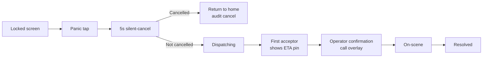
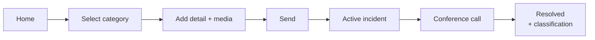
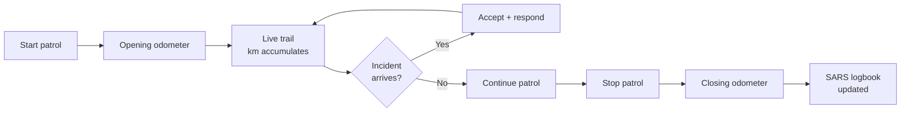
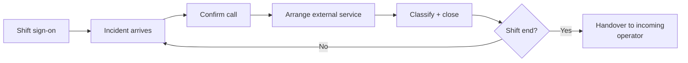
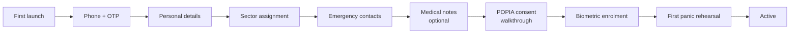
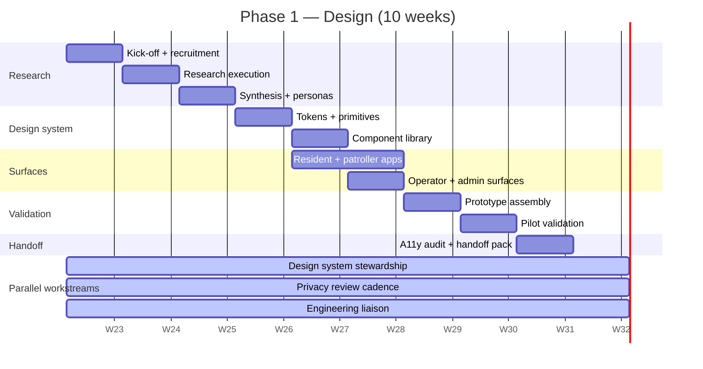

# Community Safety Platform — Design Plan

**A dedicated 10-week design phase to produce the Figma design system, full screen set, interactive prototype, and validated critical flows before engineering build begins.**

> This plan is the companion to the main implementation plan
> ([community-safety-platform.md](./community-safety-platform.md)).
> It expands Phase 1 into week-by-week scope, research activities, deliverables,
> tools, team, and success criteria.
> It exists because emergency UX has failure modes that only surface through
> deliberate design and user validation — and engineering time is too expensive
> to spend rediscovering them in code.

---

## 1. Purpose

Design Phase 1 produces a complete, tested, production-ready design artefact set for all four platform surfaces. Engineering build (Phase 2) cannot start before this phase delivers its exit criteria.

The purpose is not "make the product pretty." The purpose is:

1. **Reduce cognitive load at the moment of emergency.** A resident in distress has roughly ten seconds of usable cognition before adrenaline impairs decision-making. Every screen on the critical path has to work inside that budget.
2. **Validate the critical paths with real users before code is written.** It is radically cheaper to revise a Figma prototype than a shipped app.
3. **Create a single design language across four surfaces.** Resident mobile, patroller mobile, operator web, operator mobile-mode — these must feel like one product with four shapes, not four projects glued together.
4. **Bake in accessibility, multi-language, and POPIA transparency** as design constraints, not patches.
5. **Hand engineering a complete specification.** Every component, every interaction, every motion, every accessibility rule is specified in Figma with matching tokens.

---

## 2. Design Principles

Seven principles, in priority order. When they conflict, the earlier principle wins.

### 2.1 Safety first. Aesthetics never outrank safety.

If a visual decision increases time-to-panic or introduces confusion, the visual decision loses. The panic button is always one tap from the entry surface; never behind a modal, never obscured by a banner, never requiring scroll.

### 2.2 Emergency context dictates interaction, not convention.

Standard mobile UX conventions (tap-hold to activate destructive actions, confirmation modals, multi-step wizards) do not apply to the critical path. The app assumes the user is in a bad moment. Default interactions are optimised for:
- Locked-screen activation.
- One-thumb use.
- Visual impairment under stress.
- Partial or failing connectivity.

### 2.3 Every data collection event is visible and consented.

POPIA is a design problem, not a legal footer. Consent flows are first-class screens with plain-language copy. The privacy dashboard is a top-level resident surface. Every screen that shares data externally (location, profile, media) shows *that it is doing so* on the screen, not in the settings.

### 2.4 Role fluidity is a UI reality.

A volunteer may hold multiple privileges (resident, patroller, operator, admin). The app presents the *mode they are currently acting in* clearly and lets them switch without losing context. Operator-mode on mobile is a deliberate surface, not an accident.

### 2.5 Accessibility is baseline, not enhancement.

WCAG 2.2 AA is the minimum, not the ceiling. Critical emergency paths (panic, incident, active incident) are validated with assistive technology — screen readers, haptic-only, voice activation — during design, not after launch.

### 2.6 Multi-language designed-in, not bolted-on.

Layouts tolerate text expansion of +40% (isiZulu, Xhosa) without breakage. Iconography does not rely on English-language metaphors. Typography scale works across Latin, Nguni, and Sotho orthographies. Right-to-read languages are not scoped for v1 but layouts do not preclude them.

### 2.7 Low-end device reality.

A significant slice of South African residents use budget Android devices. The design assumes 5" screens, modest CPUs, and imperfect networks. Motion is tasteful and optional. Complex interactions degrade gracefully.

---

## 3. Research and Discovery (weeks 1–3, in parallel with system setup)

### 3.1 Participant recruitment

Recruit through the pilot sector's CPF structure and a partner armed-response company. Participants are paid a small honorarium and reimbursed for travel. All research is POPIA-consented and recordings are purpose-limited.

- **Residents:** 12 total. Age, gender, disability, home-language, and tech-comfort diversity. At least 3 participants over 60, at least 2 with declared disabilities.
- **CPF patrollers:** 6 total. Mix of experience. At least 2 unarmed, at least 2 who have responded to violent-crime incidents.
- **Private-security responders:** 4 total. Mix of PSIRA grades.
- **Volunteer operator candidates:** 4 total. At least 2 who would also patrol.
- **Admin candidates:** 2 total.

### 3.2 Research activities

- **Contextual interviews** with 12 residents. 45–60 minutes. Topics: current emergency habits, familiarity with 10111/10177/armed-response, experience of past emergencies, device habits, privacy attitudes, language preference.
- **Patroller shadowing** — 3 half-day patrol ride-alongs with CPF patrollers in the pilot sector. Observe current tools (phone, radio, WhatsApp groups), current frustrations, what a useful app would look like from their seat.
- **Operator workshop** — a half-day session with current volunteer operators at a nearby CPF callcenter to understand triage patterns, handover friction, and shift-rota pain.
- **Accessibility interviews** — 4 sessions with residents who have declared accessibility needs (vision, hearing, motor, cognitive). Specific focus on emergency activation: what works, what fails, what they currently do instead.
- **Competitive analysis** — review 8–10 existing emergency / panic / community-safety apps (both SA market and international), document what works, what fails, what we must not copy.
- **Privacy review with the privacy officer** — walk every proposed data collection point against POPIA conditions; document constraints that feed design.

### 3.3 Research deliverables (end of week 3)

- **Resident persona set** (3–5 personas, spanning age, disability, tech-comfort, language).
- **Patroller persona set** (3 personas: active CPF volunteer, newly-vetted armed responder, hybrid operator-patroller).
- **Operator persona** (2 personas: shift-at-home, on-the-road mobile mode).
- **Critical-path journey map** — what the resident sees, does, and feels from recognising an emergency to on-scene arrival.
- **Constraint register** — POPIA, PSIRA, CPF, device, network, accessibility constraints documented as design inputs.
- **Research report** summarising findings and implications.

---

## 4. Design System

### 4.1 Tokens

- **Colour:** accessible palette with emergency-context semantics (panic red, attention amber, resolved green, information blue, neutral greys). Every semantic pair meets WCAG AA contrast on both light and dark backgrounds. Dark mode is first-class for night patrols.
- **Typography:** one open-source sans-serif supporting Latin + Nguni + Sotho orthographies. Scale defined for mobile (body 16/24) and web (body 14/20). Line-height accommodates Nguni diacritics. Body copy never below 14pt on mobile.
- **Spacing:** 4pt baseline grid.
- **Iconography:** consistent stroke weight, corner radius, optical alignment. No icons that rely on English metaphors.
- **Motion:** tasteful, meaningful, and always optional (honours platform reduce-motion settings). Panic feedback is haptic + audio + visual redundantly.
- **Elevation:** subtle, used only to signal interactivity or active state.
- **Accessibility tokens:** minimum tap target 44×44pt, minimum contrast ratio, focus-ring specs, screen-reader label patterns.

### 4.2 Component library

Atomic → compound → pattern hierarchy. Documented variants for each component (state, size, density, platform, locale).

Minimum component set:
- Typography primitives.
- Button (primary, secondary, destructive, emergency, ghost, icon). Minimum emergency size 64pt diameter.
- Input (text, numeric, phone, OTP, search).
- Select / multi-select (including skill and category selection).
- Map component (primary patroller + responder map; operator overview map with filters).
- Incident card (primary; compact; operator variant).
- Message thread components (bubble, compose, attachment).
- Sheet / modal / dialog (each with accessibility rules).
- Navigation (tab bar, nav drawer, web header, web sidebar, breadcrumbs).
- Alert / banner / toast (including critical system-down banner).
- List / row / pill / tag / badge.
- Form patterns (onboarding step, consent, verify).
- Empty state, error state, loading state, offline state — every screen specifies all four.

### 4.3 Platform variants

React Native components follow native platform conventions where they diverge (iOS navigation, Android back behaviour) but share colour, typography, and iconography. Web components are designed for pointer + keyboard primarily, touch secondarily.

---

## 5. Surfaces and Screens

Every surface is designed end-to-end, not just the happy path.

### 5.1 Resident mobile app

**Screens:**
- Splash / offline / update-required.
- Onboarding: phone, OTP, name, ID, address, sector confirmation, proof-of-address upload, emergency contacts, medical notes, consent flow, biometric enrolment.
- Home (panic big-button, request help, sector name, last incident).
- Panic flow: tap, 5s silent-cancel, confirm transmit, active incident handoff.
- Active incident: live map, acceptor pins with ETA, status, call action, chat, cancel.
- Request help (categorised): category chooser, detail, media, send.
- History list + detail.
- Messages: inbox, thread, compose.
- Profile: personal, address, emergency contacts, medical (with per-field consent).
- Privacy dashboard: what we hold, who has seen what (audit subset), consents, download my data, delete my account.
- Settings: notifications, language, biometric re-auth, sign out.
- Help / FAQ.
- Accessibility variants: all primary screens in VoiceOver/TalkBack mode, dynamic-type large, reduce-motion.

### 5.2 Patroller mobile app

**Screens:**
- Onboarding: phone, OTP, role declaration (CPF / private), documents upload, skills, response opt-ins (with informed-consent for sensitive categories), PSIRA/affiliation numbers, vehicle, biometric enrolment.
- Home / duty toggle.
- Patrol mode: start, odometer entry, live trail, km accumulated, time elapsed, incidents-seen count, stop patrol, closing odometer.
- Incident inbox: filtered feed, card detail, accept, decline.
- Active incident: map with resident location, other acceptors, route, voice conference join, chat, on-scene, resolved.
- Liability-ack modal (full-screen when acknowledging out-of-opt-in acceptance).
- SARS logbook: summary, year selector, export.
- Peer chat: sector channel, direct messages with operator.
- Profile: skills, opt-ins (with consent toggles), documents, vehicle, availability.
- Privacy dashboard: volunteer-time log, patrol-log viewer, data download, consent management.
- Operator-mode elevation surface (if privilege held): entry into mobile operator-mode.

### 5.3 Volunteer operator surfaces

**Web console (primary for dedicated shifts):**
- Sign-in and shift sign-up.
- Live queue (filterable, sortable, sector-scoped).
- Live map (aggregated, with sector overlays, filters, heat-map optional).
- Incident card (full detail, call controls, external-service dial, classification, audit trail).
- Broadcast composer (target selector, severity, audit-reason, preview, send).
- External-service tracker (pending, ETA, handover checklist).
- Shift handover panel.
- Profile and duty-history.

**Mobile operator-mode (elevated mode of patroller app):**
- Compact queue.
- Compact incident card with critical actions (confirm call, external service, assign, broadcast, stand-down).
- Broadcast composer (reduced form).
- Presence indicator shown to peers ("operator on mobile — web if possible").
- Explicit mode banner so the volunteer always knows they are acting as operator.

### 5.4 Administrator web portal

- People directory (search, filter by role, profile view with audit prompt).
- Patroller and operator vetting queue.
- Sector management (draw polygons, assign rosters, SLA).
- Skill taxonomy editor.
- Audit log viewer and export.
- Export workshop (SARS logbook, incident reports, audit snapshots).
- POPIA operator panel (DSAR, deletion, breach workflow).
- System configuration (feature flags, SLA, notification templates, external-service endpoints, monitoring).

---

## 6. Flows to Prototype

Five interactive Figma prototypes. Each is clickable end-to-end and validated with participants.

### 6.1 Panic (resident)

### 6.2 Categorised incident (resident)

### 6.3 Patrol shift (patroller)

### 6.4 Volunteer operator triage

Prototyped on both web console and mobile operator-mode.

### 6.5 Resident onboarding

Prototypes use realistic content (sector names, distances, times) drawn from the pilot sector research.

---

## 7. Accessibility

Accessibility is validated during design, not after launch.

- **Screen readers:** every screen has semantic structure; every interactive element has a clear accessible label; order-of-reading is validated.
- **Dynamic type:** layouts survive up to +300% text size on critical paths (Android large, iOS accessibility sizes).
- **Colour:** no information conveyed by colour alone. Contrast ratios meet WCAG 2.2 AA across light and dark modes.
- **Motor:** minimum 44×44pt targets; destructive actions avoid accidental triggers; one-thumb paths for the critical flow.
- **Hearing-impaired emergency:** panic activation available via home-screen widget and hardware-button combo without relying on audio; operator can text-first with a resident marked as hearing-impaired.
- **Vision-impaired emergency:** panic activation works with VoiceOver / TalkBack active; screen reader announces dispatching and ETA; haptic feedback replaces visual cues where configured.
- **Cognitive:** copy validated for grade-8 reading level; consent flows use plain-language summaries before legal detail.
- **Validation:** two separate audits — internal design-team self-audit, and external audit by an accessibility specialist before phase exit.

---

## 8. Multi-Language Strategy

v1 ships English. Designed-in for isiZulu and Afrikaans. Layout patterns proven for future addition of isiXhosa, Sesotho, and Setswana without redesign.

- **Text-expansion tolerance:** all layouts designed with +40% text length as a target.
- **Copy management:** all strings extracted to a localisation table during Phase 1; English is the source-of-truth; translation commissioning happens in Phase 2 but strings are designed and keyed now.
- **Plain-language first:** consent copy is validated with translators to ensure it survives translation without drift.
- **Cultural review:** a small cultural advisory group reviews iconography, metaphors, and consent framing for appropriateness across the three primary language groups in v1.
- **Language switching:** users can change language at any time; the choice persists across sessions and devices.

---

## 9. Interaction and Motion

- **Motion is meaning.** Motion confirms an action (panic transmitted), shows state (dispatching pulse), or guides attention (incoming incident alert). Never decorative.
- **Panic feedback is redundant.** Haptic + audio + visual together, because any one channel may be unavailable.
- **Reduce-motion respected.** Platform settings override decorative motion; meaningful motion is replaced with a stable alternative (e.g. dispatching pulse → static "dispatching" label).
- **Latency masking.** Where network round-trips are needed on critical paths, the UI shows optimistic state (panic sent; waiting for acceptance) so the user perceives responsiveness even on poor networks.

---

## 10. Timeline — Week by Week

| Week | Focus | Key deliverables |
|---|---|---|
| 1 | Kick-off, research setup | Recruitment plan, research guide, privacy-officer review of research protocols |
| 2 | Research execution | 6 resident interviews, 2 patroller shadows, operator workshop |
| 3 | Research synthesis | Remaining interviews, persona set, journey map, constraint register, research report |
| 4 | Design system foundation | Tokens, typography, colour, component primitives |
| 5 | Component library | Atomic + compound components across mobile and web |
| 6 | Resident app + patroller app screens | All screens, happy and failure paths |
| 7 | Operator + admin surfaces | Web console + mobile operator-mode + admin portal screens |
| 8 | Prototype assembly | Five clickable prototypes wired up |
| 9 | Pilot validation | 6 resident + 4 patroller participant sessions; iteration based on findings |
| 10 | Accessibility + handoff | Accessibility audit, multi-language specimens, engineering handoff pack, sign-off |

Parallel workstreams throughout:
- **Design system stewardship** — the design lead keeps the library coherent as screens are produced.
- **Privacy review** — the privacy officer reviews consent, privacy-dashboard, and data-export screens at the end of each week.
- **Engineering liaison** — the engineering lead joins weekly to flag technical constraints and RN/web feasibility questions.

---

## 11. Team

| Role | FTE | Weeks |
|---|---|---|
| Design lead | 1.0 | 1–10 |
| Supporting designer (production capacity) | 1.0 | 4–10 |
| Accessibility specialist (fractional) | 0.2 | 1, 3, 7, 9, 10 |
| Product lead | 0.5 | 1–10 |
| Privacy officer | 0.2 | 1, 3, 6, 9, 10 |
| Engineering lead (advisory) | 0.15 | 1–10, weekly touchpoint |
| User researcher (contract) | 1.0 | 1–3, returning for 9 |
| Translation / cultural advisor (contract) | 0.1 | 4, 6, 10 |

Participant honoraria and reimbursements are budgeted separately.

**Commissioning option.** The board decides whether the design pair is in-house, commissioned to an external studio, or hybrid (recommended — in-house lead + external production designer).

---

## 12. Tools

- **Figma** — primary design tool. Team library for tokens and components; per-surface files for screens; prototype links for validation sessions.
- **Figma variables + modes** — used for colour modes (light/dark), text scale, and language specimens.
- **Miro** — journey maps, research synthesis, flow whiteboarding, workshops.
- **Lottie** — motion specs where platform-native animation is insufficient.
- **Notion or equivalent** — research repository, participant notes (POPIA-consented and access-controlled).
- **Zoom / Google Meet** — remote interviews with recording consent.
- **Maze or equivalent** — unmoderated prototype testing where useful (supplements moderated sessions).

All tools are reviewed for data-residency implications (Figma, Miro, Notion all process research data that may contain SA PII — research data is pseudonymised at intake).

---

## 13. Success Criteria (Phase 1 Exit)

- Complete Figma design system published to the team library.
- All screens (resident, patroller, operator web + mobile, admin) designed to high fidelity with states (default, loading, empty, error, offline) specified.
- Five interactive prototypes validated with the required participant counts.
- Accessibility audit: WCAG 2.2 AA baseline achieved; critical paths validated with assistive technology.
- Multi-language specimens produced; localisation table keyed.
- Research report and persona set published.
- Engineering handoff pack delivered: component specs, interaction specs, motion specs, accessibility notes, all cross-referenced to FDL blueprints.
- Privacy officer sign-off on every consent, consent-change, and privacy-dashboard screen.
- Board sign-off on Phase 1 completion and authorisation to proceed to Phase 2 build.

---

## 14. Risks (Design-Phase Specific)

| Risk | Likelihood | Impact | Mitigation |
|---|---|---|---|
| Research participants drop out or do not reflect sector reality | Medium | Medium | Oversample by 30%; recruit through two independent channels; compensate fairly |
| Pilot validation surfaces a critical-path redesign requirement late | Medium | High | Validate panic and incident flows in week 5 (low fidelity) before full commit; budget 1 week contingency inside phase |
| Multi-language layouts break core flows | Medium | Medium | Design at +40% text in week 4; commission translation specimens before week 10 |
| Accessibility audit fails at phase exit | Low | High | Accessibility specialist engaged from week 1; mid-phase audit at week 7 |
| Design drift between mobile and web | Medium | Medium | Shared tokens and primary design lead accountable for cross-surface coherence |
| Privacy-officer review cycle slows production | Low | Medium | Scheduled weekly review; privacy officer embedded in kick-off and research phases to set context |
| Board requests scope changes mid-phase | Medium | Medium | Clear scope agreed at kick-off; change requests go through product lead + design lead; any mid-phase scope add triggers exit-criteria renegotiation |
| Designer burnout / single-point-of-failure | Medium | Medium | Design pair (not solo); work logged and shared; external production capacity available |

---

## 15. Deliverables Summary

At Phase 1 exit the following artefacts exist and are handed to engineering / board:

- `design-system/` Figma library (components, tokens, patterns).
- `surfaces/resident/` full screen set with states.
- `surfaces/patroller/` full screen set with states.
- `surfaces/operator-web/` full screen set with states.
- `surfaces/operator-mobile/` full screen set with states.
- `surfaces/admin/` full screen set with states.
- `prototypes/panic/`, `prototypes/incident/`, `prototypes/patrol/`, `prototypes/operator/`, `prototypes/onboarding/` — clickable.
- `research/` — personas, journey map, research report, constraint register, validation session notes (POPIA-scoped).
- `accessibility/` — audit report and remediation log.
- `i18n/` — localisation table and multi-language specimens.
- `handoff/` — engineering handoff pack, per-blueprint mapping, interaction and motion specs.
- `copy/` — source-of-truth copy for all strings, reviewed by privacy officer and cultural advisor.

---

## 16. Decision Requested from the Board

The board is asked to:

1. **Approve Phase 1 design** as a dedicated phase preceding engineering build.
2. **Authorise the Phase 1 budget** per the separate financial paper.
3. **Decide the commissioning route** for the design pair (in-house, external studio, or hybrid — recommendation: hybrid).
4. **Nominate pilot-sector research participants** so recruitment can begin in week 1.
5. **Confirm v1 language scope** (recommended: English ships, isiZulu + Afrikaans designed-in).

---

*End of design plan.*
