# Community Safety Response Platform

**A hybrid CPF + private-security emergency coordination system for registered residents, sector-based, free-at-point-of-use, built for POPIA.**

> This document is the full-scope implementation plan for board review.
> It covers the product, the operating model, the architecture, the privacy and legal posture, the phased delivery plan, the risks, and the budget shape.
> Every design decision in this plan traces back to a concrete resident-safety outcome.

---

## 1. Executive Summary

South African residents in many sectors rely on a patchwork of emergency contact points — 10111 (SAPS), 10177 (medical), private armed-response subscriber hotlines, Community Policing Forum (CPF) WhatsApp groups, and informal neighbour-to-neighbour networks. In a real emergency this patchwork fails on three dimensions: **time to first response** (the victim has to remember which number to call), **dispatch quality** (the person dispatched may not have the right skills, may be on the wrong side of the suburb, or may not be available at all), and **post-incident accountability** (there is no auditable record of who was notified, who responded, when they arrived, and what was done).

This platform unifies all three into a single, always-on, low-friction application accessible to residents from a locked phone screen. It is a four-surface system:

- **Resident mobile app** — one-tap panic, categorised incident requests, messaging within their sector, and live tracking of approaching responders.
- **Patroller / responder mobile app** — incident inbox filtered by skills and opt-ins, accept-to-activate dispatch, patrol shift logging, and in-incident comms.
- **Volunteer operator console** — live incident queue, live sector map, outbound confirmation calls, external-service coordination (ambulance, fire, SAPS), and broadcast tools. Available as both a web console (for dedicated shifts) and a mobile operator-mode (for operators who are also patrolling or otherwise on the move).
- **Administrator web portal** — sector management, patroller onboarding and vetting, skill taxonomy, audit trails, SARS export, and system configuration.

**Everyone operating the platform is a volunteer.** The platform operator employs no operators, no patrollers, and no administrators. Residents, patrollers, volunteer operators, and volunteer admins all participate under a volunteer agreement and POPIA consent. The **build team** — engineers, designers, security, legal — are the only paid professionals, engaged during delivery phases. Steady-state operations are entirely volunteer-run, following a well-established Community Policing Forum model.

The platform supports two coexisting responder profiles: **Community Policing Forum volunteers** (SAPS-cleared, typically unarmed) and **registered private security responders** (PSIRA-graded — who may be employed by armed-response companies outside this platform, but participate here as volunteers of their time). Residents see a unified service; dispatch logic routes each incident to the right responder type based on the incident category, the responder's declared skills, the responder's consent-based opt-ins, and geographic proximity within the sector.

**Roles are fluid.** A single volunteer can hold multiple privileges — patroller, operator, admin — and act in whichever mode they have declared active. An operator on a road patrol can triage an incoming incident from their mobile device while in the vehicle; a patroller on-scene at an incident can arrange an ambulance directly through the same external-service channels that a desk-bound operator would use. Privilege gates enforce *what* a volunteer can do; the surface is designed so that *where they are* and *what they are doing* does not block legitimate action.

The service is **free at the point of use for the resident.** Funding is not in scope for this platform — revenue/subsidy arrangements with armed-response companies, municipalities, or NPOs are handled outside the software boundary.

**Compliance posture:** every feature that touches personal information is architected around the Protection of Personal Information Act (POPIA, Act 4 of 2013). The platform's canonical compliance reference is the `popia-compliance` blueprint, and every new blueprint declares it as a required related feature. Patroller location is only collected during a declared duty context (patrol or incident response); resident location is only streamed while an incident is active; every view of another person's location is audit-logged.

**Timeline at a glance:**

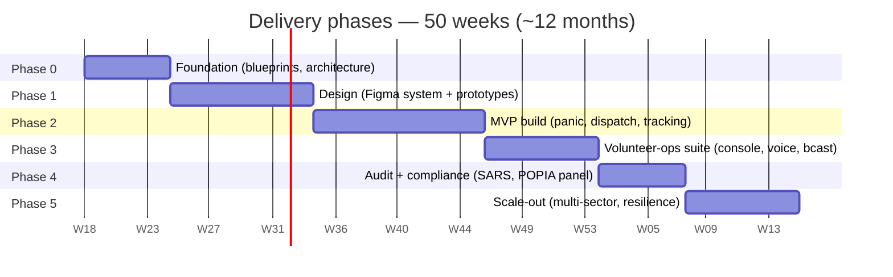

| Phase | Duration | Milestone |
|---|---|---|
| Phase 0 — Foundation | 6 weeks | Blueprint set complete, architecture signed off |
| Phase 1 — Design | 10 weeks | Full Figma design system, all flows, interactive prototype, pilot walk-through |
| Phase 2 — MVP build | 12 weeks | Panic + dispatch + tracking live in pilot sector |
| Phase 3 — Volunteer-ops suite | 8 weeks | Operator console (web + mobile) + voice conference + broadcast |
| Phase 4 — Audit & compliance | 6 weeks | SARS export, location audit, POPIA operator panel |
| Phase 5 — Scale-out | 8 weeks | Multi-sector rollout, resilience hardening |
| **Total** | **~12 months** | Production multi-sector service |

Phase 1 design is a separate deliverable with its own plan: see [community-safety-platform-design.md](./community-safety-platform-design.md).

---

## 2. Problem Statement

### 2.1 The user's actual moment of need

A resident in distress — a break-in at 02:00, a medical emergency, a collision — has roughly **ten seconds of usable cognition** before adrenaline impairs their decision-making. In that window they must:

1. Decide what kind of emergency it is.
2. Remember which number applies.
3. Unlock their phone, open the dialer, type or find the number.
4. Stay calm enough to explain their location and situation to an operator who does not know them.

Every step is a failure point. **The platform's north-star metric is the time from recognising an emergency to a skilled responder being en route, with a location fix, in the correct sector, and a recorded audit trail.** Everything else flows from that.

### 2.2 What's wrong with the current patchwork

| Current channel | Failure mode |
|---|---|
| 10111 (SAPS) | National number, call centre is centralised, no knowledge of the resident's sector or history, dispatch depends on SAPS vehicle availability (often poor in many areas) |
| 10177 (medical) | Similarly centralised, cannot coordinate with local patrollers |
| Armed-response hotline | Only works if the resident is a subscriber of that specific company and remembers the number; no interoperability |
| CPF WhatsApp group | Informal, not legally admissible, depends on who happens to be looking at their phone, no audit trail, no location data, no SLA |
| Neighbour phone trees | Social capital only, fails at 03:00 or in new neighbourhoods |

### 2.3 What this platform solves

- **Single entry point:** one tap, from a locked screen, works for any emergency type.
- **Right responder, first time:** skill-matched, opt-in-gated, sector-scoped dispatch.
- **Multi-acceptor race with failover:** several patrollers can accept; the nearest-ETA takes the incident, with automatic promotion if they go dark.
- **Three-way visibility:** resident sees the responder approaching; responder sees the resident's location; callcenter sees both.
- **Always-on operator oversight:** every incident is mirrored to the callcenter, whose operator outbound-calls the resident within seconds to confirm, offer reassurance, and coordinate external services if needed.
- **Tamper-evident audit trail:** every notification, every acceptance, every location view, every message, every call is logged and exportable for compliance, tax claims, or police evidence.

### 2.4 What this platform is explicitly NOT

- Not a replacement for SAPS, ER24, or municipal fire services — it coordinates *with* them, it does not replace them.
- Not a payment platform — the service is free to residents and revenue arrangements with funders sit outside.
- Not a surveillance platform — location collection is strictly scoped to declared duty or active-incident contexts, and every cross-person view is logged.
- Not a crime-prediction or AI-profiling tool — POPIA Section 71 prohibits solely automated decisions with legal effect, and this platform respects that.

---

## 3. Operating Model

### 3.1 Actors and authority

All platform participants are volunteers. "Actor" here means the role a volunteer is currently acting in — a single volunteer may hold multiple role privileges and switch between them.

| Actor (role) | Who | Authority | Lawful basis (POPIA) |
|---|---|---|---|
| **Resident** | Individual registered against a sector at a verified address | Request help, message within sector, view own history | Consent + legitimate interest (community safety) |
| **CPF patroller** | SAPS-cleared community volunteer, affiliated to a CPF structure | Observe, report, coordinate, self-dispatch to any category with liability acknowledgement | Volunteer agreement + legitimate interest (community safety) |
| **Private security responder** | PSIRA-graded officer (employed by an armed-response company elsewhere); participates in this platform as a volunteer of their time | Armed response, physical intervention, on-scene external-service arrangement | Volunteer agreement + legitimate interest |
| **Volunteer operator** | Volunteer who has completed operator training and active vetting | Triage, confirmation calls, external-service dispatch, broadcast, audit view — from web console or mobile operator-mode | Volunteer agreement + legitimate interest |
| **Volunteer administrator** | Volunteer trusted with platform configuration and vetting authority | Sector configuration, user management, skill taxonomy, audit export | Volunteer agreement + legitimate interest |
| **External service** | SAPS, ER24, fire brigade, other 3rd parties | Receive referrals from operators or on-scene responders | Section 11(1)(d) — protection of data subject's life / legitimate interest |
| **Platform operator (legal entity)** | The responsible party per POPIA — typically an NPO or PBO | Accountable for processing; employs build-team professionals only | Statutory responsibility |

**Role fluidity.** A volunteer can simultaneously hold `patroller`, `operator`, and `admin` privileges. At any moment they are **acting** in at most one or two modes (e.g. *patrolling + operating* — on the road, patrolling, and also triaging an incoming incident on a passenger's device). The platform enforces privilege gates, not role exclusivity.

### 3.2 Sector model

The sector is the fundamental unit of operational and privacy scope.

A **sector** is:
- A named geographic polygon (managed by admin, typically matching a CPF zone, suburb boundary, or armed-response beat).
- A roster of **residents** whose verified physical address falls inside the polygon.
- A roster of **patrollers** who are declared available to respond inside the polygon (a patroller may serve multiple sectors; residents belong to exactly one primary sector).
- A privacy boundary: messaging is sector-locked by default; broadcasts target sectors; operators see the queue scoped to the sectors they are assigned to, with admin override for multi-sector incidents.

Sectors overlap and nest. A large metro may have nested sectors (suburb → block → estate). Dispatch widens the notification ring if no acceptor appears within the primary sector within a configurable SLA (default 30 seconds).

### 3.3 Duty states for patrollers

Patrollers have **two independent duty states**, never passive tracking:

| State | Trigger | GPS behaviour | Visible to |
|---|---|---|---|
| `off_duty` | Default | No tracking, no collection | Nobody |
| `patrolling` | Patroller taps **Start Patrol** | Trail, timestamps, distance logged to the patrol log | Admin + callcenter (oversight only) |
| `responding` | Patroller accepts an incident | Live stream to incident-linked parties (resident, operator, other acceptors) | Incident parties only |
| `patrolling + responding` | Both | Both | Both |

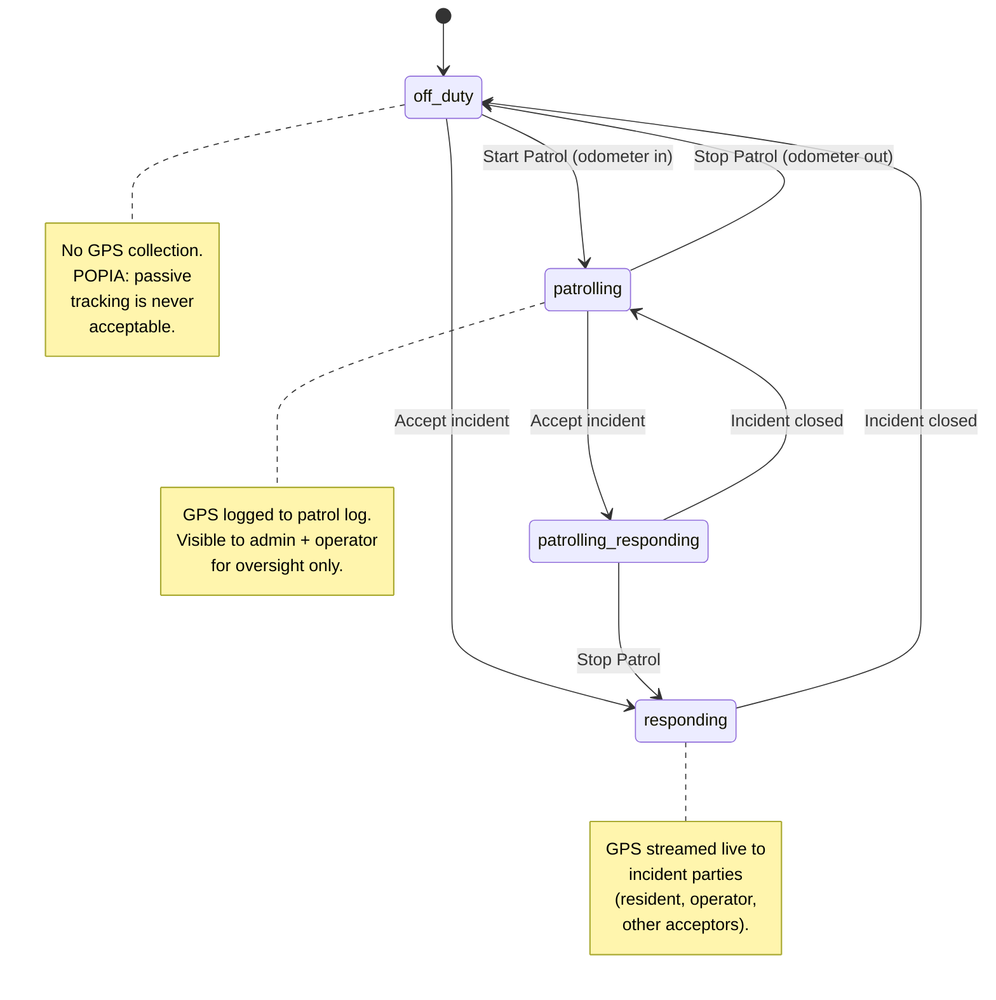

When the patroller stops the patrol, the trail closes and becomes an immutable patrol log record. When the incident closes, the stream ends and retention policy applies (snapshot of trail retained as evidence, live stream discarded).

### 3.4 Dispatch filter — four gates

Every incident notification passes four eligibility gates before reaching a patroller's device:

```
notify = patrollers WHERE
    (1) incident.required_skills  ⊆ patroller.skills              -- capability gate
AND (2) incident.category         ∈ patroller.response_opt_ins    -- consent gate
AND (3) patroller.served_sectors  ∋ incident.fanout_sectors       -- geography gate
AND (4) patroller.device_active   = true                          -- reachability gate
```

Admin/operator can declare an **all-hands broadcast** (mass-casualty event, multi-sector manhunt) that **bypasses the consent gate only** — the capability gate always stands, because notifying an unqualified responder creates legal and safety risk.

### 3.5 Multi-acceptor race

Dispatch is not winner-takes-all. Multiple eligible patrollers can accept the same incident. The resident's app shows the **ranked list by live ETA**, with the top pin moving on the map. If the primary acceptor goes dark (no GPS heartbeat for 45 seconds, or no response to operator ping), the next-ranked acceptor is auto-promoted — no re-broadcast is needed.

### 3.6 Fan-out order on panic / categorised incident

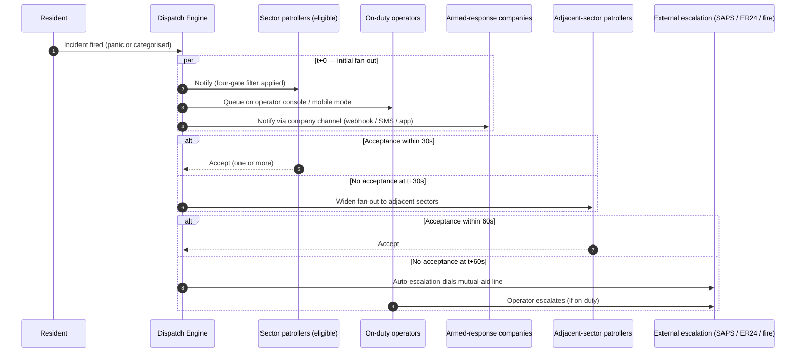

The on-duty operator is **always a recipient, never a gatekeeper** — dispatch does not block on operator acknowledgement. If no operator is on duty, dispatch still fan-outs and the auto-escalation fills the confirmation role after SLA.

### 3.7 Volunteer operator function

Volunteer operators are not a dispatch gate. They are the **system of record, confirmation layer, and external-service coordinator** — and their presence is best-effort, not guaranteed. Specifically:

- **Confirmation call:** when one or more operators are on duty, the first available one outbound-calls the resident within a target of 15 seconds to confirm the emergency and filter false alarms (pocket dials, accidental taps). If no operator is on duty, confirmation falls to the first on-scene responder when they arrive.
- **External services:** when an incident requires ambulance, fire, SAPS, hazmat, or specialist response, **either an on-duty operator or an accepted on-scene responder** can arrange it via pre-established channels. The platform exposes the same external-service-coordination surface to both. An on-scene patroller does not need an operator's approval to dial an ambulance.
- **Broadcast:** operators can broadcast informational alerts to a sector, a set of sectors, a role group, or (with admin approval) system-wide. Every broadcast carries an audited justification.
- **Log:** every incident, call, broadcast, external-service referral, and on-scene action is logged with the acting volunteer's identity, timestamp, and (where required) justification.
- **Graceful degradation under no-operator conditions:** if zero operators are on duty at the moment a panic fires, the dispatch pipeline still fans out to eligible patrollers and armed-response companies. The incident is queued for operator review as soon as one comes on duty. A configurable **auto-escalation** rule can additionally dial a pre-configured mutual-aid number (SAPS community-policing desk, partner armed-response central line) after a timeout with no acceptance, so coverage gaps do not leave a resident stranded.
- **Volunteer rota, not employment roster:** coverage is achieved by a published volunteer schedule with committed shifts, supported by a mobile operator-mode so that a volunteer can cover a shift from anywhere with a reliable connection (including while a passenger in a patrolling vehicle). The platform makes it easy to sign up for shifts, hand over mid-shift, and log time contributed.

### 3.8 Resident messaging and calling

| Channel | Always | During active incident | After incident closes |
|---|---|---|---|
| Resident → Callcenter (voice) | Yes | Yes | Yes |
| Resident → Patroller (voice, direct) | **Never** | **Never** | **Never** |
| Resident ↔ Accepted responders ↔ Callcenter (conference voice) | — | Yes, conference bridge | Auto-closes |
| Resident ↔ Sector (text message) | Sector-scoped | Sector-scoped | Sector-scoped |
| Resident ↔ Patroller (text, direct) | **Never** | Conference-channel only | — |

Direct resident-to-patroller voice calling is **structurally impossible** in the platform. The privacy barrier is enforced at the signalling layer, not just the UI, so a compromised client build cannot open the channel. This prevents harassment, cold-call tracking, and the formation of informal responder-resident relationships that undermine the operator's oversight role.

### 3.9 External-service arrangement from the field

Either a volunteer operator or an accepted on-scene responder can trigger an external-service referral (ambulance, fire, SAPS, hazmat, tow service, utility). The platform exposes:

- A **one-tap "call ambulance"** action on the incident card / active-incident screen that auto-dials the configured medical provider and opens a referral record with the incident linked.
- Equivalent one-tap actions for fire, SAPS, and sector-specific pre-configured numbers.
- A structured handover log: responder enters the external service's reference number (ambulance case number, SAPS CAS number) so the incident record links outward for follow-up.
- Full audit: who arranged what, at what time, which incident.

Responders do not need operator approval to arrange external services — **time to ambulance on scene is dominated by human hesitation, not by technical gating**, and the design strips that hesitation. Abuse (wrongful arrangement of services) is an audit concern, not a prevention concern; it is handled by review, not by gating.

---

## 4. User Surfaces

### 4.1 Resident mobile app

**Platforms:** iOS and Android, built once in React Native + Expo.

**Core screens:**

- **Home** — a single big panic button, a categorised "request help" list (medical, fire, crime in progress, suspicious activity, property damage, accident, domestic, other), the resident's sector name, and their last-known incident status.
- **Panic flow** — tap once from the home screen or lock screen widget. A 5-second silent-cancel countdown appears; if not cancelled, the incident fires with auto-location and auto-category (`panic_uncategorised`).
- **Active incident screen** — map with approaching responder pins ranked by ETA, incident status (dispatching → accepted → en-route → on-scene → resolved), voice call button (joins conference), text message thread.
- **Messages** — sector-scoped inbox. Direct messages to the operator, operator broadcast alerts, no direct line to any patroller outside of an active incident.
- **History** — list of past incidents with their resolution and response time, downloadable summary.
- **Profile** — verified address, emergency contacts, medical notes (optional, encrypted, only visible to responders during an active incident), disability flags, home layout notes.
- **Settings** — notification preferences, privacy dashboard (see §7.7), logout.

**Always-on session.** Residents log in once at onboarding. The device holds a long-lived refresh token backed by device attestation (hardware-backed keystore). Biometric re-auth is gated on sensitive actions only (profile edit, emergency-contact changes, delete account, logout). Panic and incident request do **not** require re-auth — friction in those flows is a safety defect.

**Offline behaviour.** Panic can be fired offline. The app queues the activation locally with the last known GPS fix, shows a "sending — no signal" banner, and retries on reconnect. If connectivity returns within the incident window, the resident's location stream resumes from the current fix. If not, the last-known fix is the responder's reference point.

### 4.2 Patroller mobile app

**Platforms:** iOS and Android, shared codebase with resident app but a distinct build target (different entitlements, different UI shell).

**Core screens:**

- **Duty toggle** — Start Patrol / Stop Patrol, with an odometer reading entry for SARS logbook compliance on shift start and shift end.
- **Patrol dashboard (while on patrol)** — live map of own trail, km accumulated, time on patrol, recent incidents seen, quick-open of incident inbox.
- **Incident inbox** — chronological feed of eligible incidents (those that passed the four dispatch gates). Tap to see category, location, requested skills, distance, current acceptor list. Accept or decline. Declining does not remove the incident from the feed — the patroller may reconsider until the incident closes or another acceptor reaches on-scene.
- **Active incident screen** — map with resident location, route, other acceptors, voice conference join button, chat with resident + operator, on-scene button, resolved button.
- **Liability-ack gate** — when accepting an incident outside declared opt-ins (e.g. unarmed CPF accepting `armed_robbery`), a modal presents the risk and requires explicit acknowledgement. The ack is recorded on the incident record and a high-alert is sent to the callcenter.
- **Messages** — sector-scoped peer chat with fellow patrollers, operator broadcast channel, direct operator DM.
- **Profile** — skills, response opt-ins (with informed-consent confirmation on sensitive categories), PSIRA grade / CPF affiliation number, vehicle registration, insurance.
- **SARS logbook** — view accumulated km, export current tax year's logbook as PDF in SARS travel-logbook format.

### 4.3 Volunteer operator surface — web console + mobile operator-mode

Because operators are volunteers who may cover shifts from anywhere (home, on the road as a passenger in a patrol vehicle, at a community hall), the operator surface is **dual-form**:

- **Web console** — Next.js, WebSocket-driven real-time updates, designed for a dual-monitor setup when a volunteer takes a dedicated shift at home or in a community office.
- **Mobile operator-mode** — an elevated mode of the patroller app, unlocked for volunteers who hold operator privilege. Shows a compact incident queue, confirmation-call action, external-service dial-out, and broadcast composer. Intentionally designed for one-handed use in a vehicle (as a passenger) or standing.

The same backend APIs serve both surfaces. Feature parity on the critical path (triage an incident, confirm with resident, arrange external service) is a Phase 3 exit criterion. Bulk work (analytics, configuration) is web-only.

**Core panels:**

- **Live queue** — incidents sorted by priority × age, colour-coded by severity, filterable by sector and category. Click an incident to open the full card.
- **Live map** — aggregated view of all active patrollers (by duty state) and all active incidents, with sector overlays. Operator can pan, zoom, filter by sector, by patroller type, by incident category. Heat-map of last 24h incident density optional.
- **Incident card** — full detail: resident profile, incident category, current acceptors with ETAs, conversation thread, outbound-call controls, external-service referral (ambulance, fire, SAPS), close and classify buttons, audit trail of every action.
- **Broadcast composer** — target selector (sector, set of sectors, role group, all residents, all patrollers), message body, scheduled or immediate, audit-reason field (mandatory for multi-sector broadcasts).
- **External-service tracker** — pending ambulance/fire/SAPS referrals, ETA from the external service, scene handover checklist.
- **Shift handover panel** — end-of-shift summary, open incidents transferred to incoming operator, handover notes.

### 4.4 Administrator portal

**Platform:** web, Next.js, role-gated.

**Core areas:**

- **Sector management** — draw polygons on a map, name, assign patrollers, set SLA overrides, enable/disable.
- **People** — user directory with search by role. Resident profile view (with POPIA access justification prompt and audit log). Patroller onboarding queue with vetting workflow. Deactivation and revocation.
- **Skill taxonomy** — CRUD the list of skills and incident categories, set default opt-in/opt-out, set required-skill mappings for each category.
- **Audit** — searchable log of all sensitive actions: location views, profile views, broadcasts, external-service referrals, liability acks, data exports, admin actions. Tamper-evident (hash-chained).
- **Exports** — on-demand generation of patrol logs (per patroller, for SARS), incident reports (per sector, per date range), audit trail snapshots.
- **POPIA operator panel** — data subject access requests (Section 23), deletion requests (Section 24), opt-out requests, breach notification workflow.
- **System** — feature flags, SLA configuration, notification templates, external-service integration endpoints, monitoring health.

---

## 5. Core Flows — How It Works

### 5.1 Resident onboarding

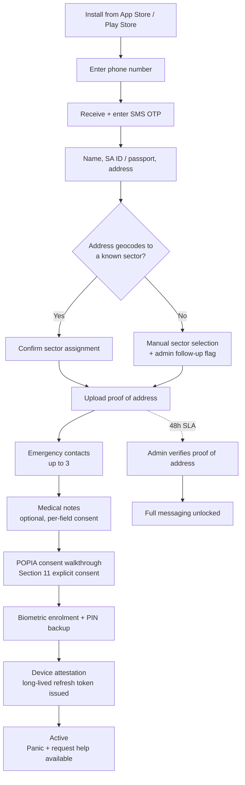

Notes:
- Panic and request-help are available **immediately** after step M, even before the admin has verified proof of address (step V). This is deliberate — no safety feature is withheld behind an admin-verification queue.
- Full sector messaging is gated on admin verification to prevent impersonation of neighbours.
- The POPIA walkthrough (K) is a first-class screen set, not a tick-box — see the design plan for copy-level requirements.

### 5.2 Patroller onboarding and vetting

CPF volunteer path and private-security path share a pipeline but gate on different documents.

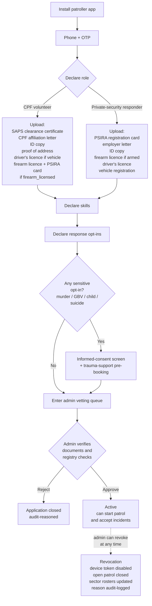

### 5.3 Panic button — the ten-second path

The central flow. Every other flow in the platform is a variation of this one.

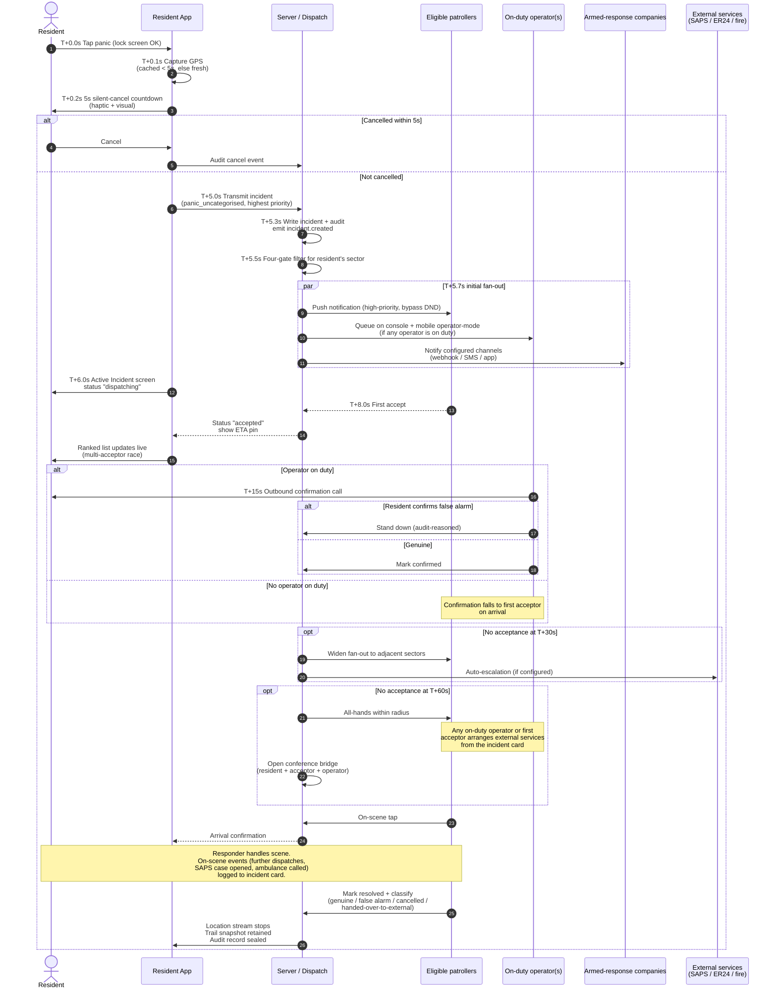

Every arrow above is an auditable event with actor, timestamp, and data payload. The sequence is timed against p95 targets — see §13.1 SLOs.

### 5.4 Categorised incident request

Same pipeline as panic, with two differences:

- The resident chooses the category up-front, which allows the dispatch engine to apply the correct required-skills filter (medical requires `first_aid` or `medical_trained`; armed robbery requires `firearm_licensed`; etc.).
- There is no silent-cancel countdown; the resident is composing a request, not fleeing.

The resident can add a short text note and attach a photo. Media attached to an incident is encrypted, sector-scoped, and retained only for the duration of the incident plus evidence-retention window.

### 5.5 Patrol shift

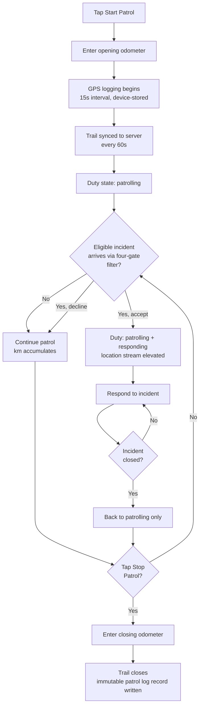

**Patrol log record fields:** patroller, sector(s), start time, end time, opening odometer, closing odometer, distance from GPS trail, distance from odometer (both stored; SARS uses odometer), trail polyline, incidents-responded-to count.

### 5.6 Broadcast from operator or admin

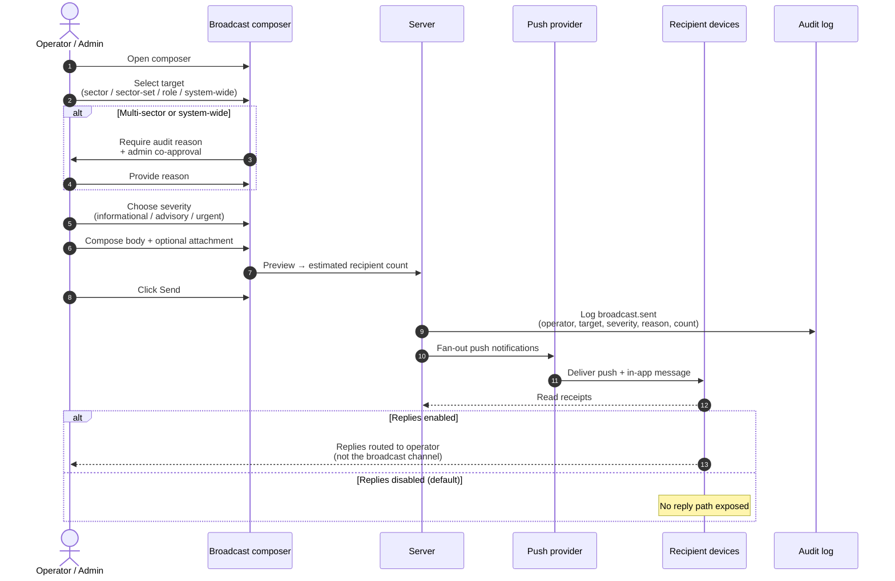

### 5.7 Incident voice conference

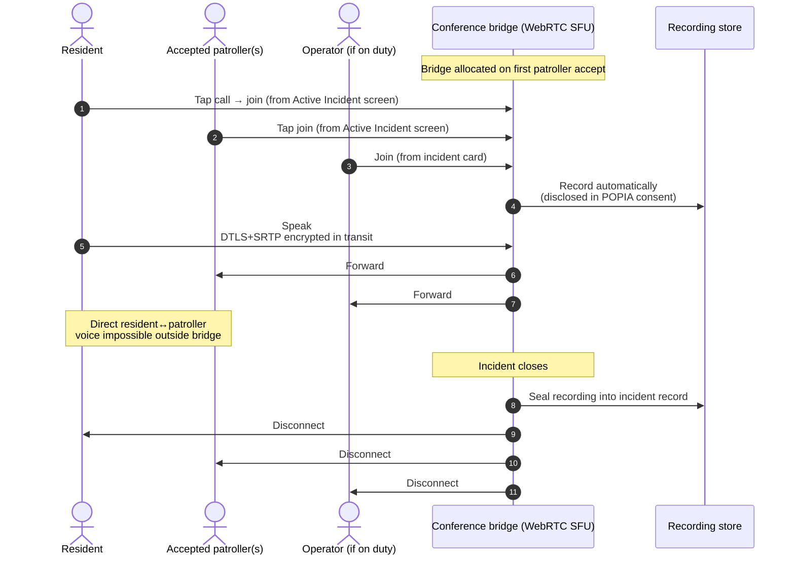

The conference bridge only exists **during an active incident**. Residents cannot call patrollers directly — this is enforced at the signalling layer, not just the UI.

### 5.8 SARS tax logbook export

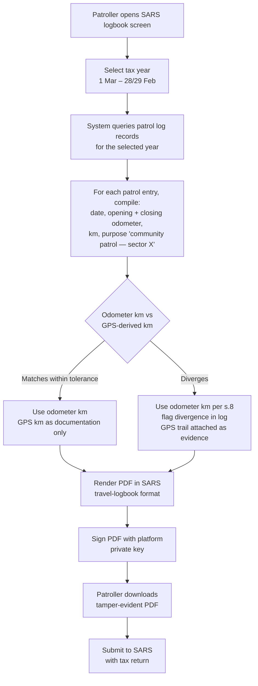

The odometer figure is authoritative for SARS per Section 8(1). The GPS trail is documentation that the patrol actually occurred. The signed PDF lets SARS verify provenance without contacting the platform.

---

## 6. Feature Manifest (FDL Blueprints)

The platform is defined as a set of FDL blueprints. Each blueprint is a self-contained YAML specification that AI code generation consumes to produce implementation. Every new blueprint declares `popia-compliance` as a required related feature.

**Tier 0 — foundation and reference data**

| Blueprint | Category | Purpose |
|---|---|---|
| `skills-taxonomy` | access | Admin-managed list of skills, incident categories, default opt-ins, required-skill mappings |
| `sector-management` | access | Geographic polygon sectors, resident and patroller rosters, SLA configuration |
| `popia-compliance` | data | *Already exists in the FDL catalogue.* Canonical POPIA reference — referenced by every other blueprint |

**Tier 1 — identity, device, and onboarding**

| Blueprint | Category | Purpose |
|---|---|---|
| `resident-sector-registration` | workflow | Resident onboarding with address verification and sector assignment |
| `patroller-onboarding-vetting` | workflow | Dual-path patroller vetting (CPF with SAPS clearance / private with PSIRA) |
| `patroller-skill-profile` | access | Skills and response opt-ins attached to a patroller; informed consent for sensitive categories |
| `device-attestation` | auth | Persistent device session with hardware-backed key, WhatsApp-style long-lived refresh |
| `patroller-revocation` | access | Instant disable of a patroller's device and access; audit-reasoned |

**Tier 2 — core incident and patrol**

| Blueprint | Category | Purpose |
|---|---|---|
| `panic-button-sos` | workflow | One-tap panic, lock-screen capable, silent-cancel window, auto-location |
| `emergency-incident-request` | workflow | Categorised help request with media attachment |
| `patrol-shift-log` | workflow | Start/Stop patrol with odometer, GPS trail, km accumulated, SARS-grade log |
| `panic-confirmation-callback` | workflow | Operator outbound call flow and stand-down logic |

**Tier 3 — dispatch and response**

| Blueprint | Category | Purpose |
|---|---|---|
| `skill-based-dispatch-routing` | workflow | Four-gate filter (capability, consent, geography, reachability), skill matching |
| `multi-acceptor-dispatch` | workflow | Broadcast + race + ETA ranking + dark-patroller auto-promote |
| `liability-ack-escalation` | workflow | Liability acknowledgement for out-of-opt-in acceptance; high-alert to callcenter |
| `incident-voice-conference` | integration | WebRTC conference bridge, scoped to active incident |

**Tier 4 — callcenter operations**

| Blueprint | Category | Purpose |
|---|---|---|
| `callcenter-triage-console` | workflow | Live queue, incident cards, outbound call, classification |
| `callcenter-live-map-console` | workflow | Aggregated live patroller + incident map with sector overlays |
| `emergency-broadcast-alert` | notification | Targeted broadcasts to sectors, roles, or system-wide with audit-reason |
| `external-service-coordination` | integration | Callcenter → ambulance / fire / SAPS referral tracking |

**Tier 5 — compliance and audit**

| Blueprint | Category | Purpose |
|---|---|---|
| `location-audit-log` | observability | Immutable log of who viewed whose location, when, and under what justification |
| `sector-scoped-messaging` | communication | Sector-scope overlay for direct-messaging, channel-messaging, pub-sub-messaging |
| `sars-travel-logbook-export` | workflow | SARS-format travel logbook PDF export for tax claims |

**Reused blueprints (already in the FDL catalogue)**

| Blueprint | Used for |
|---|---|
| `signup` | Initial phone+OTP bootstrap |
| `multi-factor-authentication` | Admin portal + sensitive operation gating |
| `client-onboarding` | Extended by `resident-sector-registration` |
| `role-based-access-control` | Role model for residents, patrollers, operators, admins |
| `realtime-driver-tracking` | Patroller GPS streaming engine |
| `driver-location-streaming` | Low-level pub/sub of position updates |
| `direct-messaging` | 1:1 DM primitives |
| `channel-messaging` | Group channels |
| `pub-sub-messaging` | Broadcast transport |
| `push-notifications` | Device push delivery |
| `mobile-push-notifications` | High-priority emergency channel |
| `admin-panel` | Administrator portal shell |
| `user-presence` | Operator/patroller availability |
| `trip-history` | Pattern for patrol log persistence |
| `geofence-management` | Sector polygons |
| `geofence-alerts` | Sector boundary events |
| `popia-compliance` | Referenced by every new blueprint |

**Total:** 23 new blueprints + 17 reused = 40 blueprints in the platform manifest.

---

## 7. Privacy and POPIA Compliance

### 7.1 Principles

The platform is built around the eight POPIA conditions (Section 4):

1. **Accountability** — every processing activity has a named operator and a documented basis. The POPIA operator panel exposes this.
2. **Processing limitation** — no location is collected outside declared duty or active-incident contexts. No profile data is collected that is not required for the specific purpose.
3. **Purpose specification** — every data element has one or more declared purposes, checked at collection and at every downstream access.
4. **Further processing limitation** — data collected for incident response is not reused for marketing, profiling, or unrelated analytics.
5. **Information quality** — residents and patrollers can view, correct, and update their profile data at any time via the app.
6. **Openness** — the consent flow shows the user exactly what will be collected, why, for how long, who can see it, and how to withdraw consent.
7. **Security safeguards** — encryption in transit and at rest, hardware-backed device keys, hash-chained audit logs, least-privilege access, regular penetration testing.
8. **Data subject participation** — Section 23 (access), Section 24 (correction and deletion), and Section 69 (opt-out of direct marketing) are implemented as first-class user features, not paperwork processes.

### 7.2 Lawful basis matrix

| Data subject | Primary basis | Secondary basis |
|---|---|---|
| Resident | Section 11(1)(a) consent | Section 11(1)(d) legitimate interest — protecting life and safety |
| CPF patroller (volunteer) | Section 11(1)(a) consent (volunteer agreement) | Section 11(1)(d) legitimate interest (community safety) |
| Private-security responder (participating as volunteer on this platform) | Section 11(1)(a) consent (volunteer agreement) | Section 11(1)(d) legitimate interest (community safety). Their employer contract sits outside this platform. |
| Volunteer operator / volunteer admin | Section 11(1)(a) consent (volunteer agreement) | Section 11(1)(d) legitimate interest (community safety) |
| Paid build-team professionals (engineers, designers, privacy officer, legal) | Section 11(1)(b) contract (employment or engagement with the platform operator entity) | — |
| External service counterparties (SAPS / ER24) | Section 11(1)(d) legitimate interest — protecting life | Section 11(1)(c)(i) obligation imposed by law (certain reporting obligations) |

Because operators and admins are volunteers rather than employees, their lawful basis is consent + legitimate interest, not contract performance. This has two implications the privacy officer must account for: (a) volunteers can withdraw consent at any time — the platform must make offboarding a clean, audit-safe operation; (b) the volunteer agreement, although not an employment contract, must still clearly set out duties, confidentiality, and data-handling obligations so that legitimate interest is balanced and defensible.

Children's data (residents under 18) invokes Section 34–35. The platform treats any registered resident flagged as a minor with stricter controls: parental consent required, no direct messaging channels, profile visibility restricted to operator and responders during active incidents only.

Special personal information — medical notes, biometric registration data — is processed under Section 27 with explicit consent and tight access controls.

### 7.3 Data minimisation

- Location is streamed only while a declared duty or incident context exists.
- Incident media is retained only for the incident's evidence-retention window.
- Profile data includes only fields required for response (name, contact, address, sector, emergency contacts, optional medical, disability flags relevant to response).
- Patroller profile includes only what vetting and dispatch require.
- Audit logs record the **fact and justification** of an access, not the content accessed where the content is sensitive.

### 7.4 Retention

| Data | Retention | Basis |
|---|---|---|
| Active incident data | Duration of incident | Purpose-limited |
| Resolved incident record (metadata, audit trail) | 7 years | Tax / legal evidence |
| Resolved incident audio recording | 2 years | Evidence; can be extended by legal hold |
| Patrol log | 7 years | SARS substantiation |
| Location streams (live) | Not retained after incident close | Minimisation |
| Location snapshots (trail polyline) | 2 years | Evidence |
| Messages (sector-scoped) | 180 days default, configurable per sector | Operational |
| Audit log | 7 years | Accountability |
| Broadcasts | 2 years | Operational |
| Deleted-user residual (audit trail references) | Pseudonymised immediately, destroyed per retention | Right to erasure Section 24 |

### 7.5 Cross-border transfer

**Default: no cross-border transfer.** All processing and storage is in South Africa (Azure South Africa North or AWS Cape Town region). This is the simplest lawful-basis posture for POPIA Section 72.

If a cross-border element becomes necessary (e.g. a specific external service's API, or a foreign-hosted WebRTC media relay), it is handled under Section 72(1)(a) adequate-protection assessment or Section 72(1)(b) binding corporate rules, documented in a Transfer Impact Assessment kept in the POPIA operator panel.

### 7.6 Breach notification

Section 22 requires notification to the Information Regulator and affected data subjects "as soon as reasonably possible" after discovery. The platform has an operational runbook for breach response:

1. Detection (monitoring alerts, anomaly detection, user report).
2. Containment within 2 hours.
3. Scope assessment within 24 hours.
4. Information Regulator notification within 72 hours (matching GDPR clock; POPIA is less specific but the platform adopts 72h as best practice).
5. Affected data subjects notified by in-app message, email, and SMS within 72 hours.
6. Post-incident report published to board within 30 days.

### 7.7 Resident privacy dashboard

Every resident has an in-app privacy dashboard (mandatory feature, not buried in settings):

- **What we hold** — categorised list of data held, last-updated timestamps.
- **Who has seen what** — every operator or responder view of the resident's data with timestamp and justification (access-log subset).
- **Consents** — toggle each consent on/off, with impact warnings ("disabling location during incidents will prevent dispatch from being able to guide responders to you").
- **Download** — Section 23 subject access request, self-service, returns a ZIP of all data held about the resident within 30 days (typically minutes — automated).
- **Delete** — Section 24 erasure request, self-service, with a 7-day grace period during which the resident can cancel. After grace, all personal data is purged; incident audit records are pseudonymised (resident reference replaced with hashed token) to preserve operational audit integrity.

### 7.8 Patroller privacy

Patrollers are data subjects too. The platform applies the same privacy principles:

- Location collection only during declared duty.
- View of their patrol log by anyone other than themselves is audit-logged.
- Performance metrics are visible to the patroller and their employer (for private security) or CPF chair (for volunteers), never published.
- Opt-in categories are private to the patroller; operators see which patrollers are eligible for an incident but not the full opt-in profile.

### 7.9 Audit trail

Every action with privacy impact is audit-logged. The audit log is hash-chained — each entry includes the hash of the previous entry — so that tampering is detectable. The log is exportable in a format that SAPS, auditors, or the Information Regulator can verify independently.

Audit-logged actions include, but are not limited to:

- Profile view by anyone other than the data subject
- Location view (live or historical)
- Incident card open
- Message read (not content — just the access fact)
- Broadcast send
- External-service referral
- Data export
- Deletion request, deletion execution
- Admin configuration changes
- Patroller revocation
- Breach detection and response actions

---

## 8. Security Architecture

### 8.1 Threat model summary

Primary threats:

- **Account takeover** — stolen phone, phishing, credential stuffing. Mitigated by device attestation, biometric re-auth on sensitive actions, instant revocation.
- **Malicious patroller** — insider who uses access to stalk a resident. Mitigated by location-view audit log with justification requirement, scheduled audit reviews, revocation flow.
- **Malicious resident** — false panic for harassment of patrollers or neighbours. Mitigated by confirmation callback, pattern detection (repeated false alarms trigger admin review), audit trail.
- **Cross-sector data leakage** — operator in sector X views a resident in sector Y. Mitigated by sector-scoped access controls enforced at the data layer, not just the UI; cross-sector access requires admin override with audited reason.
- **Recording exfiltration** — incident audio leaking. Mitigated by encrypted-at-rest storage, short-window access tokens for playback, export audit.
- **Denial of service** — flood of false incidents to saturate dispatch. Mitigated by per-device and per-sector rate limits, anomaly detection, silent-suspend for flagged accounts.
- **Platform compromise / supply chain** — third-party dependency vulnerability. Mitigated by SBOM, automated dependency scanning, vendor risk management, incident response runbook.

### 8.2 Identity and device trust

- Phone number + OTP for initial signup.
- Hardware-backed device keystore (iOS Secure Enclave, Android StrongBox or TEE) holds a device private key.
- Device enrols with the attestation service, receives a long-lived refresh token bound to the device key.
- Refresh tokens rotate on every use; revocation immediately invalidates all tokens for a device.
- Biometric re-auth (iOS Face ID / Touch ID, Android BiometricPrompt) gates sensitive actions; the platform never receives biometric data, only a platform-provided attestation that biometrics were validated.
- Session is always-on for low-risk actions (panic, incident request), re-auth for high-risk actions (profile edit, logout, deletion).

### 8.3 Encryption

- **In transit:** TLS 1.3 for all API traffic, DTLS+SRTP for WebRTC media.
- **At rest:** AES-256-GCM for database columns containing personal information. Incident recordings encrypted with per-incident keys held in a key-management service.
- **Device-held:** refresh tokens encrypted with the device's hardware-backed key.
- **Key management:** separate key-management service (cloud KMS) with audit logging of key use.

### 8.4 Least privilege

- Operators see only sectors they are assigned to.
- Admins have full access but every sensitive action is audit-logged and, for destructive actions (bulk delete, config change to dispatch rules), requires co-approval.
- Service-to-service traffic uses short-lived signed tokens with explicit scope.
- Database access is via read-only views where possible; write paths are through application services only.

### 8.5 Monitoring and response

- Centralised logging with alert rules for anomalous patterns (unusual volume of location views by a single operator, repeated failed logins from a device, unusual incident rate per sector).
- On-call rotation for platform operators with a documented runbook for each alert type.
- Quarterly penetration testing by an independent third party.
- Annual red-team exercise simulating insider threat and external compromise.

---

## 9. Technology Stack

### 9.1 Stack choice and rationale

| Layer | Choice | Rationale |
|---|---|---|
| Mobile apps (resident, patroller) | React Native + Expo | Single codebase for iOS and Android; strong native modules for push, WebRTC, biometrics; mature ecosystem; quick iteration |
| Callcenter console + admin portal | Next.js (React, TypeScript) | Server-side rendering where it helps; real-time WebSockets; fast delivery of rich operator UX |
| Backend API | Node.js + Fastify + TypeScript | Consistent language across the platform; high-throughput; mature ecosystem |
| Database (primary) | PostgreSQL 16 with PostGIS | Native geospatial queries for sector polygons and radius lookups; proven reliability |
| Cache / pub-sub | Redis (cluster) | Sub-second broadcast fan-out; presence; rate-limit primitives |
| Real-time transport | WebSocket gateway (custom) backed by Redis Streams | Simple, observable, easy to scale |
| Voice conference media | WebRTC SFU (Selective Forwarding Unit), self-hosted on dedicated media nodes in ZA region | Keeps media on-shore (POPIA); avoids per-minute fees of managed services at volume |
| Push notifications | APNs (iOS) + FCM (Android), with a platform-side priority queue | Native, reliable |
| Object storage | S3-compatible (AWS Cape Town or Azure SA North) | Incident media, recordings, exports |
| Secrets / keys | Cloud KMS + secrets manager | Centralised, audited |
| Observability | OpenTelemetry + Prometheus + Grafana + Loki | Standard, cloud-portable |
| CI/CD | GitHub Actions | Already in use |
| IaC | Terraform | Multi-cloud option (AWS or Azure ZA regions) |

### 9.2 Hosting and region

**Primary:** AWS Cape Town (af-south-1) or Azure South Africa North. Final choice based on commercial negotiation and latency testing. Both are adequate for POPIA.

**DR:** same-provider second region outside ZA is acceptable under Section 72 with a Transfer Impact Assessment. Recommended: AWS Frankfurt (eu-central-1) or Azure Europe — GDPR countries qualify for adequate-protection reciprocity.

**Network:** private networking between services, public traffic only on hardened API gateway and media edge.

### 9.3 Architecture diagram (logical)

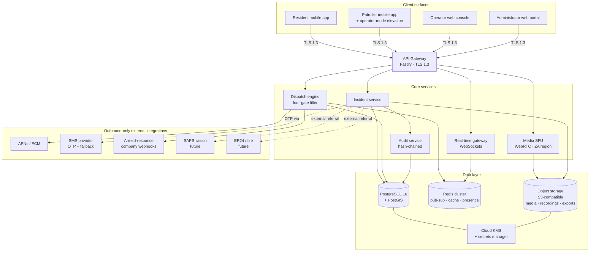

### 9.4 Design approach — how we decide what the product looks and feels like

Before Phase 2 build starts, the platform goes through a dedicated **design phase (Phase 1)** that produces a complete, agreed, and tested Figma design system. This is separated from engineering deliberately — emergency UX has failure modes that only surface through design validation (cognitive load under stress, accessibility for residents in distress, one-thumb use on a locked phone), and engineering time is too expensive to spend rediscovering those failure modes in code.

**Why a dedicated design phase:**

- **The panic button has no second chance.** A confusing screen in an emergency causes harm. We validate the critical paths with real residents and real patrollers in prototype before we ship any line of code.
- **Multi-surface consistency matters.** Four surfaces (resident, patroller, operator web, operator mobile) need a shared language. Building them in parallel without a shared design system produces drift that is expensive to correct.
- **Accessibility is a design decision, not an engineering patch.** Colour contrast, font sizing, haptic/audio/visual redundancy, screen-reader flows — these are established in design or not at all.
- **Multi-language is a layout decision.** Designing for English only and retrofitting isiZulu / Afrikaans causes visible breakage. The design phase accounts for text expansion and right-to-read cultural variance.

**Scope of Phase 1 design deliverables:**

- Design system: colour tokens (with explicit emergency-context palette), typography scale, iconography, spacing system, motion system, accessibility tokens.
- Component library: atomic components, compound components, platform-variants (React Native + web).
- Full high-fidelity screens for all four surfaces — not sketches, not wireframes, production-ready specifications.
- Five interactive prototypes, one for each critical flow: panic, categorised incident, patrol shift, operator triage, onboarding.
- Accessibility audit (WCAG 2.2 AA baseline), with panic activation paths explicitly validated for hearing- and visually-impaired residents.
- Multi-language design specimens (English, isiZulu, Afrikaans at minimum) to prove layouts survive translation.
- Pilot walk-through: validated with at least 6 resident participants and 4 patroller participants from the pilot sector.
- Handoff package to engineering: component-level specifications, interaction specifications, motion specifications, accessibility notes.

**Design governance:**

- Design lead is accountable; product lead approves; privacy officer reviews every screen for POPIA disclosures (consent flows, privacy dashboard, deletion confirmations); engineering lead signs off on feasibility at handoff.
- No Phase 2 build ticket proceeds without a matching Figma frame and the handoff specs attached.
- Design changes during build go back through the same review — no ad-hoc UI decisions made in code review.

The dedicated design plan document covers week-by-week scope, research activities, team, tools, and success criteria: [community-safety-platform-design.md](./community-safety-platform-design.md).

### 9.5 Scale envelope

The platform is architected for the following v1 scale envelope:

- 100 sectors, average 2,500 residents per sector → 250,000 residents.
- 50 patrollers per sector (mix of CPF and private) → 5,000 patrollers.
- 20 concurrent callcenter operators.
- Incident rate: sustained 100/hour, peak 1,000/hour (regional crisis scenario).
- Location updates: 5,000 patrollers × 0.25 Hz on patrol × 40% duty cycle = ~500 updates/sec sustained; peak 5× on incident response.
- Voice conferences: sustained 50 concurrent, peak 500.

This envelope fits comfortably in a 3-node API cluster + 3-node Redis cluster + 1 primary + 2 read replicas on PostgreSQL + 4 media SFU nodes. Headroom is 5× before requiring re-architecting.

---

## 10. Phased Delivery Plan

### Phase 0 — Foundation (weeks 1–6)

**Outcomes:**

- All 23 new FDL blueprints created, validated, cross-referenced, and committed.
- Architecture review signed off by board + legal + privacy officer.
- Cloud accounts, networking, CI/CD, observability baseline provisioned.
- Pilot sector identified, CPF and armed-response company partners onboarded for pilot.
- Volunteer structure established: operator volunteer call-out, admin volunteer appointment, initial rota targets agreed.
- POPIA Operator registration filed with the Information Regulator.

**Exit criteria:** blueprint set passes schema validation, completeness check, and cold-context AI review; architecture walk-through complete; pilot partner agreement signed; volunteer agreements drafted.

### Phase 1 — Design (weeks 7–16)

**Outcomes:**

- Figma design system for the platform: colour, typography, iconography, components, emergency-context motion, accessibility tokens.
- High-fidelity designs for all four surfaces (resident, patroller, volunteer operator web + mobile operator-mode, admin portal).
- Interactive Figma prototypes for the five critical flows: panic, categorised incident, patrol shift, operator triage, onboarding.
- Accessibility review (WCAG 2.2 AA baseline), including emergency activation paths for hearing- and visually-impaired residents.
- Multi-language considerations documented (English MVP, isiZulu + Afrikaans designed-in for v1, extensibility for more).
- Pilot partner walk-through completed; design feedback incorporated.

**Exit criteria:** signed-off Figma files handed to engineering with component-level specifications; prototype validated with at least 6 resident participants and 4 patroller participants; accessibility baseline certified.

**See the dedicated design plan for week-by-week scope:** [community-safety-platform-design.md](./community-safety-platform-design.md).

### Phase 2 — MVP build (weeks 17–28)

**Scope:**

- Resident mobile app (iOS + Android) with: onboarding, home screen, panic button, categorised incident request, active-incident screen with live responder pin, sector-scoped messaging (basic), history, profile, privacy dashboard (basic).
- Patroller mobile app with: onboarding, patrol shift log (no SARS export yet), incident inbox with four-gate filter, active-incident screen, accept/decline, liability-ack, on-scene/resolved, peer chat. **On-scene external-service arrangement (one-tap ambulance / fire / SAPS dial with referral record).**
- Backend: incident service, dispatch engine, real-time gateway, sector management, patroller skill profile, RBAC with multi-role privilege, audit log (minimal).
- Volunteer operator console v1 (web + mobile operator-mode): live queue, incident card, manual confirmation call (phone-dial, not VoIP), external-service referral. Designed so a volunteer can cover a shift from a laptop at home or a mobile device on the road.
- Admin portal: sector management, patroller + operator vetting queue, user management with multi-role privilege assignment, basic audit view.

**Excluded from MVP, delivered in later phases:**

- Voice conference (Phase 3)
- Broadcast composer (Phase 3)
- Live map console with full overlays (Phase 3)
- SARS logbook export (Phase 4)
- Location audit log with justification prompts (Phase 4)
- Multi-sector scale-out features (Phase 5)

**Exit criteria:** pilot sector runs for 4 weeks with real residents and patrollers, no critical incidents lost, response-time KPI (see §14) met for 95% of incidents, zero POPIA non-conformances in internal audit, volunteer rota coverage ≥ 80% of hours.

### Phase 3 — Volunteer-ops suite (weeks 29–36)

**Scope:**

- Incident voice conference (WebRTC SFU + recording + retention).
- Volunteer operator live map console with sector overlays, filters, heat-map — web **and** mobile operator-mode.
- Broadcast composer with targeting, severity, audit reason.
- Formalised external-service coordination records with status tracking, usable by operators **and** on-scene responders.
- Patroller peer messaging and operator DMs.
- Volunteer rota management: shift sign-up, handover, time contribution log.
- Enhanced analytics dashboards for admin.

**Exit criteria:** pilot extended to 3 sectors, operator volunteer roster stable, false-alarm rate below target, external-service coordination tested end-to-end with at least one partner (ambulance or SAPS), auto-escalation tested for no-operator windows.

### Phase 4 — Audit and compliance (weeks 37–42)

**Scope:**

- SARS travel logbook export (PDF, signed, tamper-evident).
- Location audit log with justification prompts and reporting.
- POPIA operator panel in admin (DSAR, deletion, breach workflow).
- Patroller revocation workflow.
- Audit log hash-chaining and export.
- Independent penetration test and remediation.
- Information Regulator liaison — submit platform description for review.

**Exit criteria:** pen test clean of criticals and highs; POPIA conformance audit passes; SARS export produced and validated by a practising tax practitioner for format correctness.

### Phase 5 — Scale-out (weeks 43–50)

**Scope:**

- Multi-sector rollout (target: 10 sectors by end of phase).
- Performance and resilience hardening: load tests at 5× v1 envelope, chaos engineering on critical paths, DR drill.
- Public-facing launch: press release, partnerships with CPF umbrella bodies, PSIRA formal endorsement approach.
- Volunteer recruitment drive: operator and admin volunteer call-outs across all target sectors.
- Operations handbook, volunteer training materials, support channels.
- Post-launch monitoring, feedback loops, backlog grooming.

**Exit criteria:** 10 sectors live, 5,000 residents registered, 500 patrollers active, volunteer operator coverage meeting defined rota targets (see §13.2), SLA met at p50 and p95.

### Phase 5+ (post-board, not in this plan)

- National scale-out.
- Deep SAPS integration (case-number linkage, evidence export).
- Deeper ER24 / fire / municipal-service integrations.
- Additional languages (isiZulu, Afrikaans, Xhosa, Sotho, Tswana as minimum).
- Accessibility features (voice activation, haptic-only panic for hearing-impaired).
- Insurance partnership (home-contents, medical, life).

---

## 11. Team and Governance

The platform has two distinct teams: a **paid build team** (engineers, designers, privacy/legal) engaged during delivery phases, and a **volunteer operating team** (operators, admins, patrollers) who run the service in steady state. The platform operator legal entity employs only build-team roles.

### 11.1 Paid build team (delivery phases)

| Role | FTE | Responsibilities | Primary phase |
|---|---|---|---|
| Product lead | 1.0 | Backlog, priorities, pilot partner relationships | All |
| Engineering lead | 1.0 | Architecture, code review, delivery pace | All |
| Design lead | 1.0 | Design system, flows, accessibility, prototype | Phase 1 lead, ongoing review |
| Supporting designer | 1.0 | Component library, screen production, handoff | Phase 1 |
| Mobile engineers (iOS+Android via RN) | 3.0 | Resident + patroller apps | Phase 2+ |
| Backend engineers | 3.0 | API, dispatch engine, real-time gateway | Phase 2+ |
| Web engineers | 2.0 | Operator console + admin portal | Phase 2+ |
| Platform / SRE | 1.5 | Infra, CI/CD, observability, DR | Phase 0+ |
| QA / test | 1.5 | Test automation, exploratory, pilot support | Phase 2+ |
| Security / privacy officer | 1.0 | POPIA, threat modelling, pen test liaison, statutory §55 role | All, continuing in steady state |
| Legal / compliance (fractional) | 0.25 | POPIA, PSIRA, volunteer agreements, SAPS liaison, contracts | All |
| Operations lead (volunteer manager) | 1.0 | Volunteer recruitment, rota, training, partner management | Phase 0+ |

**Peak build team: ~17.25 FTE** (Phases 2–4). Design-heavy phase (Phase 1) uses the design pair + product + engineering lead + privacy officer ≈ 5 FTE. Steady-state: privacy officer, operations lead, fractional legal, a skeleton engineering team (~4 FTE) for maintenance and small improvements — about **6–7 paid FTE**.

### 11.2 Volunteer operating team (steady state)

| Role | Target headcount | Commitment | Oversight |
|---|---|---|---|
| Volunteer operator | 20–30 across all sectors | 1–2 shifts/week of 4 hours minimum | Privacy officer + operations lead; quarterly reaccreditation |
| Volunteer admin | 4–6 | As needed, typically weekly check-in | Board-appointed; two-person approval on destructive actions |
| CPF patrollers | Per sector, typically 20–50 | Per CPF norms | Sector CPF chair; platform operations lead for platform matters |
| Private-security responders (volunteering their time) | Per sector, per partner company | Per partner arrangement | Partner company + platform operations lead |

**Volunteer coverage targets** (see §13.2) are set by the rota — the platform does not guarantee 24/7 operator coverage as a product feature; it is a community outcome, supported by graceful degradation when gaps occur.

### 11.3 Governance structure

- **Board oversight:** quarterly review of delivery, POPIA posture, incident metrics.
- **Steering committee:** monthly — product, engineering, operations, legal, security.
- **Privacy officer:** statutory role per POPIA Section 55, reports to board, independent of product and engineering lines.
- **Change advisory:** for dispatch-rule changes, sector boundary changes, retention-policy changes, and anything touching minors' data — requires security + privacy + product sign-off.
- **Incident response team:** 24/7 on-call rotation, clear runbooks, breach response drilled quarterly.
- **External advisors:** CPF umbrella body advisor, PSIRA liaison, SAPS community-policing liaison, medical-ethics advisor (for `gbv_trained` / `child_safeguarding` opt-ins).

---

## 12. Risks and Mitigations

| Risk | Likelihood | Impact | Mitigation |
|---|---|---|---|
| POPIA non-conformance finding by Information Regulator | Medium | Severe (fines up to R10m, reputational) | Privacy-by-design in every blueprint; privacy officer in place; quarterly POPIA audit; liaise early with Regulator |
| Patroller misuses access to stalk a resident | Medium | Severe (harm, reputational, legal) | Justification-prompted location views; audit log; anomaly detection; prompt revocation flow; quarterly audit review |
| False-alarm flood from a rogue or compromised device | Medium | Medium (dispatch saturation) | Per-device rate limits; anomaly detection; silent-suspend for flagged accounts; operator override |
| Callcenter overwhelmed during regional crisis | Medium | High (operator-centric flows degrade) | Dispatch continues without operator acknowledgement; queue for replay; tiered escalation; mutual-aid arrangements with partner callcenters |
| Volunteer operator coverage gap (rota holes, especially overnight) | High | Medium (degrades operator-dependent steps like confirmation call) | Auto-escalation to pre-configured mutual-aid numbers after SLA; on-scene responders empowered to arrange external services without operator; public rota with sign-up friction minimised; recognition program to build committed operator community |
| Volunteer attrition / onboarding drop-off | Medium | Medium (coverage and service quality degrade over time) | Ongoing recruitment; training that respects volunteer time (bite-sized, self-paced); community-building events; clear impact reporting so volunteers see their contribution; fast revocation for misconduct so community stays trusted |
| CPF volunteer killed/injured responding to armed incident they accepted with liability-ack | Low (per-incident) / Medium (lifetime) | Catastrophic (life; legal; reputational) | Informed-consent opt-in; explicit liability-ack modal; high-alert to callcenter; operator guidance; insurance for registered volunteers (out of platform scope but board should address) |
| Vendor lock-in on cloud / media SFU | Medium | Medium (cost, migration friction) | Terraform for portability; standard WebRTC SFU (not proprietary); multi-cloud-capable architecture from day 1 |
| Latency spikes on incident fan-out during network congestion | Medium | Medium (dispatch delay) | Regional edge for push; SFU regional placement; WebSocket multiplex; fallback to SMS for dispatch-accept when data unavailable |
| App-store rejection (emergency functionality has specific Apple/Google policies) | Medium | High (delivery delay) | Early App Store / Play Store review engagement; comply with emergency-services guidelines; have escalation contact |
| Privacy backlash over location tracking of patrollers | Low | Medium | Transparent consent; duty-scoped collection; privacy dashboard; clear opt-out (off-duty = no tracking); patroller advisory group |
| Device diversity / low-end Android reliability | High | Medium (service unreliable for some residents) | Minimum OS baselines; graceful degradation; SMS fallback for panic; performance testing on low-end devices |
| Dispatch to wrong sector due to GPS inaccuracy | Medium | Medium (response delay) | Hybrid location (GPS + network + last-known); resident confirms sector at onboarding; cross-sector fallback after SLA |
| Residents using the platform for non-emergencies | High | Low (operator load) | Categorisation; confirmation call; escalating warnings; throttling after repeated low-severity reports |
| Partnership failure with armed-response company (commercial dispute) | Medium | High (coverage gap) | Multiple partners per sector where possible; CPF fallback; clear SLA terms; quarterly commercial reviews |
| SAPS not interested in integrating | Medium | Low (platform stands alone without it) | Design for standalone operation; treat SAPS as an optional downstream integration; keep audit export SAPS-compatible for manual handover |
| Budget overrun | Medium | Medium | Phased delivery with clear exit criteria; scope discipline (MVP→full); monthly burn review; buffer in Phase 3/4 |

---

## 13. Operational Considerations

### 13.1 Service Level Objectives

| Metric | Target | Measurement |
|---|---|---|
| Panic → first patroller notified | p95 < 3 seconds | Server-side timestamp diff |
| Panic → first acceptor | p50 < 30 seconds, p95 < 120 seconds | Accept event timestamp |
| Panic → operator confirmation call (when operator on duty) | p95 < 30 seconds | Call initiation timestamp |
| Panic → confirmation (by operator or first on-scene responder, whichever first) | p95 < 5 minutes | Confirmation event timestamp |
| Volunteer operator coverage (active hours, sectors live) | ≥ 80% of 6am–midnight rota slots filled | Rota metric |
| Incident → on-scene | p50 < 10 minutes, p95 < 25 minutes (sector-dependent) | On-scene tap timestamp |
| Callcenter answer (inbound call) | p95 < 15 seconds | Call platform metric |
| Platform availability | 99.9% monthly (allowing 43 min/month downtime) | Uptime monitor |
| Push delivery | p95 < 2 seconds | Push-provider delivery receipt |
| Live map refresh | p95 < 1 second | Client-side render telemetry |
| DSAR (Section 23) response | 100% within 30 days (target: automated, minutes) | Ticketing metric |
| Deletion request execution | 100% within 30 days after grace period | Ticketing metric |
| Audit log durability | 100% (zero-loss) | Hash-chain verification |

### 13.2 Volunteer operator operations

- **Coverage target:** aspire to 24/7 rota coverage through volunteer sign-ups; realistic v1 is 6am–midnight committed with auto-escalation filling the overnight gap.
- **Minimum concurrent:** target 2 volunteer operators on duty during active hours; 1 is acceptable for low-traffic windows.
- **Shifts:** self-service shift sign-up in the admin portal. Typical shift is 4 hours. Handover is in-app (current incidents transferred to incoming operator with context notes).
- **Operator-mode anywhere:** operators can cover a shift from home laptop, phone, or tablet; the operator console is not location-bound.
- **Sector assignment:** each volunteer operator is trained on a subset of sectors and normally sees only those in their queue. Cross-sector incidents or no-one-available conditions escalate to an admin or to an operator with wider privilege.
- **Training:** 2-week volunteer onboarding covering platform, POPIA, triage, de-escalation, external-service protocols, simulated drills. Re-accreditation quarterly.
- **Drills:** monthly — mass-casualty simulation, system outage, breach notification, difficult-caller training.
- **Wellness:** mandatory debrief after traumatic incidents, access to trauma counselling (arranged through partner NGO or PBO sponsor), deliberate rotation so individual volunteers are not over-exposed to high-severity categories.
- **Auto-escalation for no-operator windows:** when no operator is on duty and a panic fires, the configurable auto-escalation dials a pre-configured mutual-aid number after the acceptance SLA expires. This turns a volunteer-coverage gap into a manageable graceful degradation, not a failure.
- **Time-contribution log:** each shift is recorded for SARS volunteer-time substantiation where applicable, and for recognition (public thank-yous, not monetary rewards).

### 13.3 Patroller support

- Onboarding: video training on app usage, POPIA, liability, de-escalation.
- Opt-in counselling: for sensitive categories (GBV, child, murder scene, suicide), patroller is connected with a trauma counsellor before opt-in is confirmed.
- Post-incident debrief: automatic prompt to debrief with operator or peer after high-severity responses.
- Community: peer chat within sector; monthly sector meetings (out-of-app).
- Insurance: out-of-platform but platform operator works with partner insurers for discounted group rates for registered patrollers.

### 13.4 Support for residents

- In-app help centre.
- Operator-manned support chat during business hours, operator-manned emergency calls 24/7.
- Community managers per region.
- Feedback loop: post-incident resident survey (optional, POPIA-consented).

### 13.5 Change management

- Blueprint changes go through the FDL auto-evolution pipeline (validate → generate → commit) and the 3-gate post-generation pipeline (schema → compile → AI review).
- Dispatch-rule changes require co-approval (product + privacy + operations).
- Retention-policy changes require co-approval (privacy + legal + board notification).
- Communication changes require PR advisor review for any user-facing wording.

---

## 14. Success Metrics (KPIs)

| Category | Metric | v1 target | Year-1 target |
|---|---|---|---|
| Safety outcome | Panic-to-first-responder-en-route (median) | <2 min | <90s |
| Safety outcome | Panic-to-on-scene (median) | <10 min | <7 min |
| Safety outcome | % of incidents resolved by any responder (not timed-out) | 95% | 98% |
| Usage | Active residents / registered residents | 60% | 75% |
| Usage | Active patrollers / approved patrollers | 70% | 80% |
| Usage | Patrols logged per active patroller / week | 2 | 3 |
| Quality | False-alarm rate (panic) | <25% | <15% |
| Quality | Cancelled-before-dispatch rate | <20% | <15% |
| Quality | Operator confirmation success rate (call answered by resident) | 80% | 90% |
| Reliability | Platform availability | 99.9% | 99.95% |
| Reliability | Zero-loss audit log | 100% | 100% |
| Compliance | DSAR responses within 30 days | 100% | 100% |
| Compliance | POPIA conformance audit findings (criticals) | 0 | 0 |
| Compliance | Breach notifications executed within 72h | 100% of breaches | 100% |
| Financial | Cost per active resident / month | <target from business plan | — |

---

## 15. Budget Shape

Full numerical budget is in a separate board financial paper. This document records the **cost shape** only, to support the board's review.

### 15.1 One-off (build, Phases 0–5, ~12 months)

- **Phase 1 design:** 2 FTE × 10 weeks (design lead + supporting designer) + product + privacy review time. This is the phase the board is being asked to approve next after sign-off of this plan.
- **Engineering build:** peak ~15 FTE (Phases 2–5), blended SA engineering market rate.
- **Pen testing:** two rounds (Phase 2 exit, Phase 4 exit).
- **Cloud infrastructure build-out** (development, staging, production): moderate initial, scales with usage.
- **Legal and POPIA:** external advisor days across all phases, plus drafting of volunteer agreements.
- **App store and platform fees:** nominal.
- **Partner onboarding** (CPF liaison, armed-response company engagement, SAPS community-policing introduction): mostly time, small travel and print budget.

### 15.2 Recurring (steady-state operations, post-Phase 5)

- **Platform engineering and SRE:** ~6–7 paid FTE to maintain the service, fix bugs, and deliver small improvements.
- **Volunteer operator coordination:** operations lead + fractional admin support; no operator payroll because operators are volunteers. Allowance for volunteer reimbursements (airtime, data, transport to training) is a small but real line item.
- **Cloud infrastructure:** scales roughly linearly with registered residents and concurrent incidents. v1 envelope fits in a low five-figure monthly bill in ZAR.
- **Push notifications:** APNs free; FCM free; SMS fallback is per-message cost.
- **Voice conference:** self-hosted SFU avoids per-minute fees; bandwidth cost dominates.
- **Third-party services:** SMS OTP, geocoding, error monitoring, observability SaaS.
- **Insurance (platform operator entity):** professional indemnity, cyber, general liability. Volunteer indemnity insurance for operators and patrollers is a separate workstream (see §17 Open Question 5).
- **Legal and compliance retainer.**
- **Volunteer programme:** training costs, accreditation, recognition events, wellness support (trauma counselling partnership), recruitment drives.

### 15.3 Not in this budget

- **Operator payroll** — operators are volunteers by design.
- **Patroller payroll** — CPF is unpaid; private-security responders are employed by their own companies, not by the platform.
- **Resident acquisition spend** (marketing, community events) beyond modest launch outreach.
- **Armed-response company commercial arrangements** (handled outside the platform).
- **SAPS or ER24 integration projects** (future, separate budgets).
- **Insurance for patrollers or residents** (future partnership model — see §17 Open Question 5).

---

## 16. Go-live Checklist (Phase 4 exit)

- [ ] All 23 new blueprints validated, docs generated, committed, versioned.
- [ ] Penetration test: zero criticals, zero highs open.
- [ ] POPIA conformance audit: zero criticals, privacy officer sign-off.
- [ ] Information Regulator notified of platform and registered as responsible party.
- [ ] PSIRA liaison informed and, where applicable, formally acknowledged.
- [ ] CPF umbrella bodies engaged in at least the rollout sectors.
- [ ] Operator team fully staffed and trained, 24/7 roster confirmed.
- [ ] Runbooks complete: incident response, breach response, outage response, dispatch-rule change, sector onboarding.
- [ ] DR drill passed.
- [ ] App store approvals for both iOS and Android builds.
- [ ] Resident and patroller privacy policies published, plain-language summaries in at least English and isiZulu.
- [ ] POPIA operator panel live: DSAR, deletion, opt-outs all self-service.
- [ ] Audit log hash-chain verified.
- [ ] Insurance in place (professional indemnity, cyber).
- [ ] Board sign-off on launch.
- [ ] Post-launch monitoring dashboard live; SLO burn-rate alerts configured.

---

## 17. Open Questions for the Board

1. **Funding model of the service.** Platform is free at point of use for residents. Who funds the callcenter and platform operations — a consortium of armed-response companies, a municipal contract, NPO grants, an operating company with a subscription sold to armed-response companies, or a mix? The software plan is neutral; the operating model is not.
2. **Geographic scope of v1.** The plan targets 10 sectors in Phase 4. Which 10? The board's choice materially affects partner engagement and commercial conversations.
3. **SAPS engagement.** Does the board want a formal approach to the SAPS community-policing head office in Phase 0, or wait until the platform has operating evidence in Phase 3?
4. **Minors.** Does v1 register residents under 18 at all, or defer that to a later phase given the stricter POPIA posture? Recommendation: defer; parental accounts only in v1.
5. **Insurance for patrollers.** Out of platform scope but out of whose scope? Recommend the board commissions a parallel workstream to arrange group-rate insurance before Phase 4 go-live.
6. **Language coverage.** English is the MVP language. Which additional languages for v1 vs post-launch? Recommend isiZulu + Afrikaans for v1 given common sector profiles.
7. **Data residency commitment.** The plan defaults to ZA-only hosting. Does the board want this written into the public privacy policy as a binding commitment, or keep flexibility for future DR arrangements?
8. **Public launch vs quiet pilot.** Launch posture for Phase 5 — press release and marketing, or quiet operational go-live with invited residents only for the first months?
9. **Volunteer indemnity insurance.** Operators and patrollers act in good faith under platform instruction; a resident or third party could sue them directly for an adverse outcome. The board should decide whether the platform operator entity carries a group volunteer indemnity policy, and whether volunteers are required to sign a limited-liability volunteer agreement.
10. **Design-phase commissioning.** Phase 1 design can be run by (a) an in-house design pair, (b) a commissioned external studio, or (c) a hybrid. Recommendation: hybrid — one in-house design lead who carries institutional knowledge, supported by an external production designer for capacity. Board sign-off required on the commissioning route.

---

## 18. Appendix A — Glossary

- **POPIA** — Protection of Personal Information Act, 2013. SA's primary data protection law.
- **Section 72** — POPIA section on cross-border transfer of personal information.
- **PSIRA** — Private Security Industry Regulatory Authority. Regulates private security in SA. Issues grades A–E.
- **CPF** — Community Policing Forum. SAPS-affiliated civilian structure for community safety coordination.
- **SAPS** — South African Police Service.
- **SARS** — South African Revenue Service. Tax authority. Section 8(1) governs business-travel claims and the travel logbook.
- **ER24** — a private-sector emergency medical response provider (example only). The platform treats all medical providers generically.
- **Sector** — a named geographic polygon that scopes operations and privacy in the platform.
- **Duty state** — one of `off_duty`, `patrolling`, `responding`, `patrolling + responding`.
- **Fan-out** — the act of broadcasting an incident notification to the set of eligible patrollers.
- **Multi-acceptor race** — the dispatch model where multiple patrollers can accept; the nearest-ETA wins; failover is automatic.
- **Liability-ack** — acknowledgement a patroller must make when accepting an incident outside their declared opt-ins.
- **DSAR** — Data Subject Access Request (POPIA Section 23).
- **FDL** — Feature Definition Language. The YAML blueprint specification used to define features in this platform.
- **Blueprint** — a YAML specification of a feature; the source of truth from which code is generated.
- **WebRTC** — the standard for in-browser real-time voice/video/data.
- **SFU** — Selective Forwarding Unit. A WebRTC server that forwards media streams efficiently.

---

## 19. Appendix B — Related Documents and Tools

**Source repository**

- FDL blueprint catalogue: `blueprints/INDEX.md` in the platform source repository.
- POPIA canonical blueprint: `blueprints/data/popia-compliance.blueprint.yaml`.
- Existing driver-dispatch pattern: `blueprints/workflow/driver-assignment-dispatch.blueprint.yaml`.
- Existing real-time tracking pattern: `blueprints/integration/realtime-driver-tracking.blueprint.yaml`.
- Existing messaging primitives: `blueprints/communication/direct-messaging.blueprint.yaml`, `blueprints/communication/channel-messaging.blueprint.yaml`.

**Statutes and standards**

- POPIA Act text: Republic of South Africa, Act 4 of 2013, as amended.
- PSIRA Act: Republic of South Africa, Act 56 of 2001.
- SARS Travel Logbook requirements: SARS Guide for Employees' Tax (latest annual revision).

**Diagrams**

All architecture, sequence, state, flowchart, and Gantt diagrams in this plan are written in **[Mermaid](https://mermaid.js.org/)** (v11 syntax). They render natively on GitHub, GitLab, Bitbucket, most Markdown previewers (VS Code, Obsidian, Typora), and the static docs site under `docs/`.

For board reviewers reading a plain Markdown file in a viewer that does not render Mermaid:

- Open the diagram source (the fenced `​```mermaid … ```` block) and paste it into the **[Mermaid Live Editor](https://mermaid.live/)** to render and export as SVG or PNG.
- Mermaid syntax reference: <https://mermaid.js.org/intro/>
- Mermaid is open-source (MIT licence). The platform has no runtime dependency on Mermaid — it is a documentation tool only.

---

## 20. Decision Requested from the Board

The board is asked to:

1. **Approve the full-scope plan** as described, or indicate which phases / scope items should be deferred or dropped.
2. **Approve the phased budget shape**, with detailed numbers in the separate financial paper.
3. **Nominate a privacy officer** per POPIA Section 55 to take statutory responsibility.
4. **Decide on the funding model** (see Open Question 1) so that commercial conversations with armed-response companies and municipal partners can begin in Phase 0.
5. **Name the pilot sector(s)** for Phase 1.
6. **Authorise Phase 0 to begin.**

---

*End of plan.*
