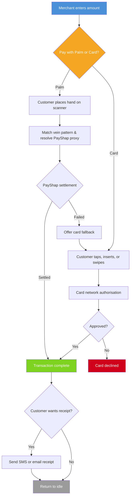
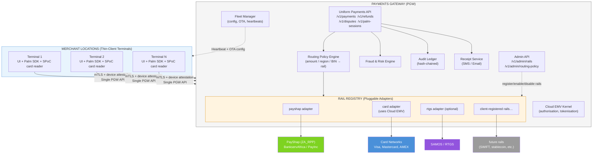

# Palm Vein Payment Terminal — v3

## Business Proposal & Solution Design

> **Version 3 (2026-04-14).** See [v1](payment-terminal-app.md) and [v2](payment-terminal-app-v2.md) for the prior versions. v3 is an **architectural pivot**: the terminal becomes a thin client, all payment logic moves behind an API gateway, and payment rails are pluggable via a rail registry. Changes from v2 are summarised in [Changes from v2](#changes-from-v2) immediately below, and the older [Changes from v1](#changes-from-v1) summary is kept for history.

---

## Changes from v2

v3 changes the deployment shape of the system. v2 still described a fat terminal that integrated scanner, card reader, EMV kernel, payment routing, fraud, audit, and rail SDKs directly. v3 collapses the terminal to its minimum viable surface and pushes everything else behind a single payments gateway API.

| # | Area | What changed in v3 | Why |
|---|------|-------------------|-----|
| 1 | **Terminal scope narrowed** | Device contains only: base UI, palm-vein hardware integration (SDK + 1:N match + on-device template store), card-reader hardware passthrough (PCI-SPoC, no EMV kernel), secure gateway-API client. Everything else is an API call. | POPIA requires palm templates to stay on-device, but nothing else belongs there. Fat terminals are slow to certify, slow to update, and couple hardware vendors to payment logic. |
| 2 | **Single Payments Gateway API (PGW)** | All payment orchestration is behind one gateway: `POST /v1/payments`, `POST /v1/refunds`, `POST /v1/disputes`, `POST /v1/palm-sessions/resolve`, etc. The terminal never calls PayShap, card networks, or fraud services directly. | One integration point = one certification, one audit boundary, one place to rotate secrets, one authoritative ledger. Fewer device firmware pushes for backend changes. |
| 3 | **Rail Registry — pluggable rails** | PayShap, card networks, RTGS, SWIFT, future rails are all `RailAdapter` plugins behind the gateway. The client can **add or swap rails** via an admin API without touching the device. Routing policy (which rail for which amount/region/merchant) is server-side configuration. | v1/v2 hard-wired PayShap + card as the only options. v3 makes "payment rail" a first-class pluggable concept so future rails drop in as adapters. |
| 4 | **EMV kernel cloud-resident** | The card reader on the device is passthrough-only (PCI-SPoC). The EMV kernel runs in the gateway. | Cloud EMV lets the client add card-brand updates, change acquirer, or support new EMV flows without re-certifying hardware. |
| 5 | **Single `/fdl-build` command** | v2 listed 17 separate `/fdl-generate` commands across five phases. v3 collapses them into **one `/fdl-build` invocation** that reads this plan, resolves all referenced blueprints, and generates the full stack end-to-end under the 3-gate pipeline. | `/fdl-build` is the documented way to generate a complete app from a plan. Per-blueprint calls were a manual-orchestration workaround. |
| 6 | **Admin Dashboard (transactions + vendor management)** | New first-class web app (built alongside gateway + terminal) covering: live transaction explorer with drill-down, refund/dispute initiation, reconciliation state, rail registry management, **vendor management** (acquirers, SMS/email providers, KYC providers, PayShap participant bank config) with credential rotation, per-merchant overrides, and audit trail for every admin action. | Rail management alone (v3 initial) isn't an admin console. Ops teams need a UI to investigate transactions, rotate vendor credentials, and enable/disable rails without touching code. |
| 7 | **Full Sandbox capability with a Mock Rail** | New sandbox environment (parallel to prod PGW) plus a `sandbox` rail adapter that satisfies the full `RailAdapter` contract — realistic latency, scripted success/decline/timeout/rate-limit scenarios, webhook callbacks that mirror real rails (pacs.002, PaymentStatusReport, etc.). Tenant-level sandbox mode flag so a merchant can flip a terminal to sandbox for demo or integration testing without code changes. | The client needs to demonstrate the full payment experience end-to-end — palm, card, refund, dispute, receipt — without moving real money. A Mock Rail that is contract-compatible with real rails means test coverage runs the same code path as production. |

**What v3 keeps from v2:** POPIA reference blueprint pinning, capability-layer pinning (`uses: [code-quality-baseline, security-baseline, ai-pr-review]`), and the 3-gate post-gen pipeline. All three still apply; the build command just runs them once against the full generated stack instead of per-feature.

**Open architectural question (flag):** v3 assumes the card reader hardware stays physically on the terminal (PCI-SPoC passthrough). If the preference is a palm-only terminal with card payments handled by a detached PED talking to the gateway directly, say so and §3.2 + §Appendix A collapse further. This plan proceeds with the all-in-one hardware from v1.

---

## Changes from v1

v1 was written before three April 2026 framework changes. v2 reconciled the plan with them (and v3 keeps them all):

| # | Area | What changed in the framework | What v2 did about it (still applies in v3) |
|---|------|-------------------------------|-----------------------|
| 1 | **POPIA reference blueprint** | `blueprints/data/popia-compliance.blueprint.yaml` was added as the canonical FDL representation of Act 4 of 2013. Per [CLAUDE.md](../../.claude/CLAUDE.md), every blueprint that handles SA personal information **must** list `popia-compliance` in `related[]` as `required`. | §8.3 cites the blueprint; §12.4 adds a row for `data/popia-compliance`; §12.5 marks POPIA as an explicit coverage category; every blueprint handling SA PII lists `popia-compliance` in `related[]`. |
| 2 | **3-gate post-gen pipeline** | [`docs/gates.md`](../gates.md) documents Gate 1 (fake/placeholder scan), Gate 2 (compile/type-check), Gate 3 (cold-context AI PR review). `/fdl-generate` and `/fdl-build` run all three automatically and emit `BLOCKED` instead of `FILES` on a critical finding. | §Build documents the automatic gating; a "Gate response" sub-section tells operators how to react to a `BLOCKED` emit. |
| 3 | **Capability-layer pinning** | Blueprints declare `uses: [code-quality-baseline, security-baseline, ai-pr-review]` to pin per-feature gate contracts. Without `uses:`, only implicit baselines run and no per-blueprint api-endpoint / security anti-patterns are enforced. | All payment-terminal blueprints declare these three capability imports before build. §Appendix B lists them. |

---

## Original Request

> _"I want to build a payment terminal app that uses a palm vein scanner. It will give the user the option to pay with a card or hand, and the payment system it will use to do the payment will be PayShap rail."_

### Requirements Elicitation

The following requirements were gathered through structured questioning:

| Question                                 | Answer                                                                                                  |
| ---------------------------------------- | ------------------------------------------------------------------------------------------------------- |
| What is the terminal platform?           | Android payment terminal with built-in palm scanner and card reader (all-in-one hardware)               |
| How should card payments work?           | Full EMV support — chip insert, NFC tap, and magnetic stripe swipe                                      |
| How does palm vein link to payment?      | Palm IS the payment method — scanning palm triggers PayShap payment directly, no card or PIN needed     |
| Does the terminal need to work offline?  | Limited offline — small transactions queued (R500 cap), larger ones blocked until connectivity restores |
| Where does palm enrolment happen?        | Both at the terminal (walk-up) and via a separate mobile app or web portal                              |
| Single merchant or multi-merchant?       | Fleet/chain — one merchant operating many terminals across multiple locations                           |
| What receipts does the terminal produce? | Digital only — SMS or email, no built-in printer                                                        |
| Does the terminal support refunds?       | Yes, but manager PIN/authorisation required at the terminal                                             |

---

## 1. Executive Summary

This proposal outlines a next-generation **payment terminal solution** that combines traditional card payments with **palm vein biometric payments** — allowing customers to pay by simply placing their hand over a scanner.

The solution runs on an **Android-based payment terminal** with an integrated palm vein scanner and card reader. Payments are settled in real time through **PayShap**, South Africa's instant payment rail, delivering sub-10-second settlement for every transaction.

### Value Proposition

| For Customers                                  | For Merchants                                          |
| ---------------------------------------------- | ------------------------------------------------------ |
| Pay without a card, phone, or wallet           | Faster checkout — under 5 seconds per palm transaction |
| No PINs to remember for palm payments          | Reduced card fraud exposure                            |
| Works even if they forgot their card           | Lower interchange fees via PayShap vs card networks    |
| Secure — palm veins cannot be copied or stolen | Fleet-wide management from a single dashboard          |
| Enrol once, pay at any terminal in the chain   | Offline resilience — never lose a sale                 |

### How It Works (30-Second Overview)

1. **Customer enrols once** — scans their palm at a terminal or via a mobile app, links it to their bank account
2. **At checkout** — merchant enters the amount, customer chooses palm or card
3. **Palm payment** — customer places hand on scanner, funds transfer instantly via PayShap
4. **Card payment** — customer taps, inserts, or swipes their card as usual
5. **Receipt** — digital receipt sent via SMS or email

---

## 2. The Problem

Traditional payment terminals offer only card-based payments. This creates several challenges:

- **Friction at checkout** — customers fumble for cards, enter PINs, wait for authorisation
- **Card dependency** — no card means no sale (forgotten wallet, lost card, declined card)
- **Fraud risk** — card skimming, stolen card numbers, and counterfeit cards remain persistent threats
- **High fees** — card network interchange fees eat into merchant margins
- **No differentiation** — every competitor offers the same card terminal experience

---

## 3. The Solution

> **v3 architectural pivot.** The terminal is now a **thin client**. The only payment-domain logic it contains is the palm-vein capture and local 1:N match (required by POPIA because templates must not leave the device). Everything else — rail selection, EMV authorisation, fraud scoring, refunds, disputes, receipt delivery, audit — is an API call to the central **Payments Gateway**. New rails are added on the server side through the **Rail Registry**; the device does not change when rails change.

### 3.0 Deployment shape

| Layer | What lives here in v3 | What used to live here in v2 |
|---|---|---|
| **Terminal (Android, Kotlin)** | Base UI (amount entry, method selection, receipt display). Palm-vein SDK + on-device template store + 1:N match. Card-reader hardware passthrough (PCI-SPoC; no EMV kernel). Signed PGW API client (mTLS + device attestation). Small offline UI buffer (display only — no payment decisioning offline). | All of the above **plus** EMV kernel, PayShap SDK calls, card gateway calls, fraud scoring, audit, receipt delivery, offline payment queue with risk limits. |
| **Payments Gateway (PGW)** | Uniform API. EMV kernel (cloud). Rail Registry. Routing policy engine. Fraud engine. Refund + dispute lifecycle. Receipt service. Audit logger. Offline reconciliation (replays device-buffered intents). Fleet management. | Minimal — was essentially just routing and config. |
| **Rail adapters (plugins behind PGW)** | `payshap` (ZA_RPP), `card` (Visa/Mastercard), future: `rtgs`, `swift`, `stablecoin`, any client-registered rail. Each adapter implements the `RailAdapter` contract. | PayShap and card were hard-wired integrations, not pluggable adapters. |

### 3.1 Palm Vein Payment (Primary Innovation)

Palm vein recognition uses **near-infrared light** to map the unique vein pattern inside a person's hand. The integrated scanner (SDPVD310API SDK) captures palm images at 15-30cm distance. **1:N match runs on the device** against the locally-stored template set — templates never leave the terminal, satisfying POPIA s.26 (special personal information).

Unlike fingerprints or facial recognition:

- **Cannot be forged** — vein patterns are internal and invisible to the naked eye
- **Cannot be stolen** — no physical token to lose or copy
- **Cannot be replicated** — each person's vein pattern is unique, even between identical twins
- **Contactless** — hand hovers 15-30cm above the scanner (hygienic)
- **Self-improving** — templates auto-update on each successful match (`SD_API_Match1VNEx`) as vein patterns change over time

**Technical flow when a customer scans their palm (v3):**

| Step | What happens | Where | Time |
| --- | --- | --- | --- |
| 1 | Scanner captures palm image and extracts vein features (`SD_API_ExtractFeature`) | Terminal | < 1s |
| 2 | Feature compared against all enrolled templates (`SD_API_Match1VN` — 1:N match) | Terminal | < 0.5s |
| 3 | Matched template_id + device attestation sent to PGW: `POST /v1/palm-sessions/resolve` | Terminal → PGW | < 0.3s |
| 4 | PGW resolves template_id → linked payment proxy (server-side linkage table, not biometric data) | PGW | < 0.2s |
| 5 | Terminal calls `POST /v1/payments` with amount + palm-session-token | Terminal → PGW | — |
| 6 | PGW selects rail via Rail Registry policy, invokes adapter, returns settlement status via webhook or long-poll | PGW → rail | < 10s end-to-end |

**Total end-to-end: under 10 seconds** (SLA enforced by the gateway, not by any specific rail).

> **Privacy note.** Only `template_id` (an opaque reference) crosses the network boundary. The biometric template itself never leaves the device.

### 3.2 Card Payment (Full Compatibility, Cloud-EMV)

The terminal's built-in card reader is a **PCI-SPoC passthrough**. It captures card data and forwards it to the PGW over a secure channel. The EMV kernel, authorisation logic, tokenisation, and card-network integration all run in the gateway.

| Method | Terminal role | Gateway role |
| --- | --- | --- |
| **EMV chip** | Read chip data, capture PIN on secure keypad (SPoC) | Run EMV kernel, authorise with issuer, tokenise |
| **Contactless/NFC** | Read NFC data (Visa payWave, Mastercard Contactless, Apple Pay, Google Pay) | EMV kernel, authorisation, tokenisation |
| **Magnetic stripe** | Read stripe data | Authorisation (legacy fallback) |

Raw card data is never persisted on the terminal; card data is in transit only and is tokenised the moment it reaches the gateway. Full **PCI DSS Level 1** compliance is centralised at the PGW, not the device.

### 3.3 Payments Gateway API (PGW) — Single Integration Point

Every payment action the terminal performs is one of these API calls:

| Endpoint | Purpose | Called by terminal |
| --- | --- | --- |
| `POST /v1/palm-sessions/resolve` | Turn a local `template_id` into a server-side `palm_session_token` | Before palm payment |
| `POST /v1/payments` | Submit a payment intent — rail chosen by server-side policy | All payments |
| `GET  /v1/payments/{id}` | Poll payment status (fallback to webhook) | After submit |
| `POST /v1/refunds` | Initiate refund (manager PIN attached) | Refund flow |
| `POST /v1/disputes` | Log a dispute on behalf of a customer | Dispute flow |
| `POST /v1/receipts` | Request SMS/email receipt delivery | End of flow |
| `POST /v1/enrolments` | Register a new palm template linkage (template_id + proxy) | Enrolment flow |
| `POST /v1/device/heartbeat` | Fleet heartbeat + health metrics | Every 60s |
| `GET  /v1/device/config` | Pull merchant config, rail display rules, limits | On boot + push-reload |

All endpoints are:
- **HTTPS + mTLS** — client cert per device
- **Device-attested** — signed device-attestation header bound to a TPM-backed key
- **Idempotent** — client-generated `Idempotency-Key` per intent
- **Versioned** — `/v1/` prefix; breaking changes gated by version

### 3.4 Rail Registry — Pluggable Payment Rails

v3 treats "payment rail" as a first-class pluggable concept. The gateway loads a registry of `RailAdapter` implementations, each satisfying a uniform contract:

```
interface RailAdapter {
  id: string                          // e.g. "payshap", "card", "rtgs"
  display_name: string
  supports(intent: PaymentIntent): bool
  quote(intent): FeeQuote              // optional pre-trade fee preview
  execute(intent): PaymentResult
  refund(original: PaymentResult, amount: Money): PaymentResult
  on_webhook(event: RailEvent): void   // async settlement callbacks
}
```

**Built-in rails at launch:**

| Rail | Adapter ID | Use case |
| --- | --- | --- |
| PayShap | `payshap` | Real-time ZAR settlement via BankservAfrica (primary for palm payments) |
| Card | `card` | EMV chip / NFC / stripe via acquirer |
| RTGS | `rtgs` (optional) | High-value settlements (SAMOS) |

**Client-registrable rails (via admin API):**

```
POST /v1/admin/rails                      # register a new rail adapter
PUT  /v1/admin/rails/{id}/enable          # turn on for this merchant
PUT  /v1/admin/rails/{id}/disable         # turn off
PUT  /v1/admin/routing-policy             # rules: amount/region/BIN → rail choice
GET  /v1/admin/rails                      # list registered rails
```

Routing policy examples:
- `amount < 1000 AND rail_available(payshap) → payshap`
- `card_brand == AMEX → card (amex-acquirer)`
- `region == 'EU' AND amount > 15000 → rtgs`

**Adding a new rail in v3:** implement the adapter, drop it in the registry via `POST /v1/admin/rails`, update routing policy. No device firmware change, no recertification, no new `/fdl-generate` call on the terminal app.

### 3.5 Automatic Fallback

If a palm scan fails (unregistered customer, match failure, scanner issue), the terminal automatically offers card payment as a fallback — the merchant never needs to re-enter the amount. If a chosen rail fails mid-transaction (e.g. PayShap timeout), the PGW's routing policy can re-route to the next eligible rail without the device knowing — the device just sees a single `POST /v1/payments` returning success or a terminal-displayable error.

### 3.6 Admin Dashboard

A web application for operators, deployed alongside the PGW. It is the only UI through which humans manage the payment stack in production.

**Two primary modules:**

#### 3.6.1 Transactions Console

| Capability | Description |
| --- | --- |
| **Live transaction explorer** | Searchable, filterable list of every `POST /v1/payments` intent — filter by merchant, terminal, rail, amount band, status, time window, card BIN, palm session, correlation ID |
| **Drill-down** | Per-transaction view showing the full audit chain: intent → routing decision (which rail, why) → rail adapter calls → webhook callbacks → settlement confirmation → receipt delivery |
| **Refund initiation** | Initiate a refund from the console (with operator auth + reason code); the refund runs through the same `POST /v1/refunds` path the terminal uses, so admin refunds share code with terminal refunds |
| **Dispute initiation** | Log a dispute on behalf of a customer (when a customer phones in, not walk-up) — calls `POST /v1/disputes` |
| **Reconciliation state** | Per-rail reconciliation view — shows matched / unmatched settlements against the audit ledger, highlights breaks for investigation |
| **Export** | CSV / JSON export of any filtered view for regulator or auditor requests — inherits the `observability/compliance-exports` contract |

#### 3.6.2 Vendor Management

Every real-world vendor the PGW talks to — acquirers, PayShap participant banks, SMS providers, email providers, KYC/FICA providers, fraud-data providers — is a **Vendor** record with config and credentials managed here.

| Capability | Description |
| --- | --- |
| **Vendor registry** | List / add / edit / disable vendors. Each vendor has a type (`rail` / `sms` / `email` / `kyc` / `fraud-signal`), endpoint URLs, environment (prod / sandbox), and credential handle |
| **Credential rotation** | Credentials never appear in the UI as plaintext — only masked. Rotation is a guided flow: new credential entered, validated by calling the vendor's health endpoint, promoted atomically, old credential revoked. Every rotation is audit-logged |
| **Per-merchant override** | A merchant can override a default vendor (e.g. use a different SMS provider for a specific region) without affecting other merchants |
| **Health + cost dashboard** | Live health ping per vendor, running cost-per-transaction, SLA compliance, last-24h error rate |
| **Rail registry integration** | Rail vendors (PayShap participant banks, card acquirers) plug into the rail-registry admin API already in §3.4 — this module unifies the UX for all vendor types |

**Auth model:** Admin Dashboard users authenticate via the existing `auth/login` blueprint and are authorised via `access/role-based-access` (roles: `ops-viewer`, `ops-operator`, `vendor-admin`, `rail-admin`, `super-admin`). Every mutating action is audit-logged with actor + before/after diff.

### 3.7 Sandbox Environment & Mock Rail

A full sandbox that mirrors production PGW, with a `sandbox` rail adapter that implements the full `RailAdapter` contract — **the terminal cannot tell the difference**, which is the whole point.

**Why it's a separate sandbox environment (not just a test flag):**

| Concern | Approach |
| --- | --- |
| **No real money, ever** | Sandbox PGW has zero routes to any real rail — `payshap` / `card` adapters are not loaded; only `sandbox` is. Impossible to accidentally settle a real payment from sandbox even if misconfigured |
| **Realistic contract** | Sandbox PGW runs the same `/v1/*` API surface as prod, the same 3-gate build output, the same mTLS / device-attestation requirements. Integration testing is against a surface that matches prod byte-for-byte |
| **Data isolation** | Sandbox has its own audit ledger, vendor registry, merchant config, palm template store — no leakage between prod and sandbox |
| **Demonstrable** | Merchants, auditors, and prospective customers can be given sandbox terminals to try the full flow without any compliance exposure |

#### 3.7.1 The `sandbox` Rail Adapter

Satisfies the `RailAdapter` contract from §3.4 but routes to an in-memory scenario engine instead of a real rail.

| Feature | Behaviour |
| --- | --- |
| **Scenario library** | Built-in scenarios: `approve-fast`, `approve-slow`, `decline-insufficient-funds`, `decline-fraud`, `timeout`, `rate-limit`, `partial-success-then-webhook-reversal`, `duplicate-intent-409`, `settlement-callback-at-t+3s`, `settlement-callback-at-t+60s` |
| **Trigger selection** | Scenario chosen by: (a) amount-based magic numbers (e.g. `R13.37` always declines), (b) per-merchant default, (c) explicit `X-Sandbox-Scenario` header on the request — useful for automated tests |
| **Webhook fidelity** | Emits the same webhook message shape a real rail would — PayShap-style `pacs.002` PaymentStatusReport for palm, EMV-style authorisation response for card — so webhook handlers are tested end-to-end |
| **Configurable latency** | Each scenario specifies a realistic latency distribution; sandbox can also be run in "fast" mode (sub-100ms) for CI or "realistic" mode (matches real rail percentiles) for demos |
| **State persistence** | A sandbox payment can be refunded, disputed, and reconciled like any other — the Mock Rail maintains full lifecycle state so the console and reconciliation flows are exercised |
| **Deterministic replay** | A scenario run with the same inputs produces byte-identical output (excluding timestamps) — useful for golden-file regression tests |

#### 3.7.2 Switching a Terminal to Sandbox

Sandbox is selected at **device enrolment** (the terminal is provisioned with either `prod` or `sandbox` PGW endpoint + cert bundle) — it is *not* a runtime flag the cashier can flip, because that would be a trivial attack vector. A terminal can be **re-provisioned** from sandbox to prod (or vice versa) only via the Admin Dashboard's fleet module with `super-admin` authorisation.

#### 3.7.3 Demo Mode

For sales demos, the Admin Dashboard can drive a sandbox terminal through a **scripted scenario timeline** — e.g. "enrol palm → approve R250 palm payment → approve R1,200 card payment → refund card payment → dispute palm payment" — with UI annotations explaining each step. Demo mode is a read-only overlay on sandbox; it never mutates prod.

### 3.1 Palm Vein Payment (Primary Innovation)

Palm vein recognition uses **near-infrared light** to map the unique vein pattern inside a person's hand. The integrated scanner (SDPVD310API SDK) captures palm images at 15-30cm distance and extracts biometric features for 1:N template matching.

Unlike fingerprints or facial recognition:

- **Cannot be forged** — vein patterns are internal and invisible to the naked eye
- **Cannot be stolen** — no physical token to lose or copy
- **Cannot be replicated** — each person's vein pattern is unique, even between identical twins
- **Contactless** — hand hovers 15-30cm above the scanner (hygienic)
- **Self-improving** — templates auto-update on each successful match (`SD_API_Match1VNEx`) as vein patterns change over time

**Technical flow when a customer scans their palm:**

| Step | What happens | Time |
| --- | --- | --- |
| 1 | Scanner captures palm image and extracts vein features (`SD_API_ExtractFeature`) | < 1s |
| 2 | Feature compared against all enrolled templates (`SD_API_Match1VN` — 1:N match) | < 0.5s |
| 3 | Matched template resolves to linked PayShap proxy (ShapID, mobile number, or account) | < 0.5s |
| 4 | Proxy resolved to bank account via BankservAfrica identifier determination | < 3s |
| 5 | Credit push submitted via `POST /transactions/outbound/credit-transfer` (ISO 20022 pacs.008) | — |
| 6 | Settlement confirmed via callback (pacs.002 PaymentStatusReport) | < 10s total |

**Total end-to-end: under 10 seconds** (PayShap SLA mandated by scheme rules)

### 3.2 Card Payment (Full Compatibility)

The terminal's built-in card reader supports all standard payment methods:

| Method | How it works | Use case |
| --- | --- | --- |
| **EMV chip** | Insert card, PIN entry on terminal keypad | Primary card method — most secure |
| **Contactless/NFC** | Tap card, phone, or wearable (Visa payWave, Mastercard Contactless, Apple Pay, Google Pay) | Fast for low-value transactions |
| **Magnetic stripe** | Swipe card | Legacy fallback |

Card payments are routed through a provider-agnostic payment gateway (`POST authorize` → `POST capture` → webhook confirmation) with full PCI DSS Level 1 compliance. Card data is tokenised immediately — raw card numbers never stored on the terminal.

### 3.3 PayShap Payment Details

PayShap (ZA_RPP — Rapid Payments Programme) is South Africa's real-time payment rail operated by BankservAfrica. Key parameters:

| Parameter | Value |
| --- | --- |
| Scheme maximum | R50,000 per transaction (raised from R3,000 in August 2024) |
| Settlement | Real-time via Reserve Bank accounts |
| Availability | 24/7 |
| API | Asynchronous — all operations return HTTP 202, results via webhook callbacks |
| Standard | ISO 20022 (pacs.008 credit transfer, pacs.002 status, pain.013 request-to-pay) |
| Proxy types | ShapID (bank-generated ID), mobile phone number, account number, Shap Name (business) |
| Participating banks | Absa, FNB, Nedbank, Standard Bank, African Bank, Capitec, Discovery, Investec, TymeBank |

**Fee structure (per transaction):**

| Amount | Fee |
| --- | --- |
| Under R100 | R1 (many banks offer free) |
| R100 – R1,000 | R5 |
| R1,000 – R50,000 | Lesser of 0.05% or R35 |

### 3.4 Automatic Fallback

If a palm scan fails (unregistered customer, match failure, scanner issue), the terminal automatically offers card payment as a fallback — the merchant never needs to re-enter the amount.

---

## 4. User Journeys

### 4.1 Customer Payment Journey



**Palm payment time:** ~3-5 seconds (scan + match + settle)
**Card payment time:** ~5-15 seconds (depending on card type and network)

### 4.2 Customer Enrolment Journey

Customers can enrol their palm at any terminal in the fleet or via a separate mobile app:

| Step | At Terminal                                     | Via Mobile App                                      |
| ---- | ----------------------------------------------- | --------------------------------------------------- |
| 1    | Merchant activates enrolment mode               | Customer opens app                                  |
| 2    | Customer places hand on scanner (4 scans taken) | Customer scans palm using phone camera + attachment |
| 3    | Optionally enrol second hand                    | Optionally enrol second hand                        |
| 4    | Enter phone number on terminal keypad           | Phone number pre-filled from app profile            |
| 5    | Enter 6-digit OTP received via SMS              | Enter OTP within app                                |
| 6    | Palm linked to PayShap proxy                    | Palm linked to PayShap proxy                        |
| 7    | Ready to pay at any terminal                    | Ready to pay at any terminal                        |

**Enrolment time:** ~2 minutes (one-time)

### 4.3 Refund Journey

Refunds require manager authorisation for fraud prevention:

1. Manager enters their PIN on the terminal
2. Look up original transaction by reference number
3. Refund processed via the same method as the original payment
   - Palm payment refund: reversed via PayShap
   - Card payment refund: reversed via card network
4. Digital confirmation sent to customer

---

## 5. System Architecture (v3 — Thin Client + Gateway + Rail Registry)

### 5.1 High-Level Overview



### 5.2 Component Summary

| Component | Layer | Purpose | Technology | Key Integration |
| --- | --- | --- | --- | --- |
| **Terminal App** | Device | Base UI, palm capture + local 1:N match + on-device template store, SPoC card reader passthrough, PGW API client | Android (Kotlin), SDPVD310API (JNI) | PGW API only — no direct rail calls |
| **PGW — Uniform API** | Gateway | One public surface for every payment action | REST / mTLS | Versioned `/v1/*` endpoints, idempotency, OpenAPI |
| **PGW — Routing Policy Engine** | Gateway | Chooses rail per intent (amount / region / BIN / availability / merchant pref) | Rules engine | Server-side configuration via admin API |
| **PGW — Cloud EMV Kernel** | Gateway | EMV L2 kernel, PIN verification (SPoC-cloud), tokenisation | Certified EMV library | Acquirer APIs, card networks |
| **PGW — Fraud & Risk Engine** | Gateway | Velocity, risk scoring, auto-block | ML service + rules | Upstream of `execute()` in every rail adapter |
| **PGW — Audit Ledger** | Gateway | Immutable hash-chained record of every intent + state change | Append-only store | 7-year retention, SHA256 chain |
| **PGW — Receipt Service** | Gateway | SMS / Email delivery | SMS gateway + email API | E.164, DKIM |
| **PGW — Fleet Manager** | Gateway | Device config push, OTA, heartbeats, alerting | MDM + backend | Signed config, staged rollouts |
| **PGW — Admin API** | Gateway | Register / enable / disable rails; update routing policy | REST / mTLS | Operator console, audit trail |
| **Rail Registry** | Gateway plugin layer | Loads and manages `RailAdapter` implementations | Plugin loader | Built-in: `payshap`, `card`; client-registrable adapters |
| **`payshap` adapter** | Rail plugin | ZA_RPP real-time credit push | Electrum Regulated Payments API v23.0.1 | ISO 20022 (pacs.008, pacs.002) |
| **`card` adapter** | Rail plugin | Card authorisation via PGW's Cloud EMV + acquirer | Acquirer API | PCI DSS L1 tokenisation |
| **`rtgs` adapter (optional)** | Rail plugin | High-value settlement | SAMOS / BankservAfrica | ISO 20022 |
| **Client-registered adapters** | Rail plugin | Any future rail the merchant operator needs | `RailAdapter` contract | Added via `POST /v1/admin/rails` |
| **`sandbox` rail adapter** | Rail plugin (sandbox only) | Contract-compatible mock rail with scenario engine, realistic latency, full webhook fidelity | In-memory state machine | Loaded only in sandbox PGW; never in prod |
| **Admin Dashboard — Transactions Console** | Web app | Live transaction explorer, drill-down, refund / dispute initiation, reconciliation, export | TypeScript / React | Calls PGW `/v1/*` and admin APIs |
| **Admin Dashboard — Vendor Management** | Web app | Registry of acquirers, SMS/email/KYC/fraud-signal providers, credential rotation, per-merchant overrides, health + cost dashboard | TypeScript / React | Calls `/v1/admin/vendors/*` |
| **Sandbox PGW (parallel environment)** | Gateway (sandbox) | Mirror of prod PGW with only the `sandbox` rail loaded; isolated data plane | Same gateway code, different config | Cannot reach any real rail |
| **Terminal Display Buffer** | Device | Stores receipt and status data for display only; not a payment queue | SQLite on-device | Flushed on display |

---

## 6. Offline Behaviour (v3 — Gateway-Mediated)

> **v3 change.** Because the terminal has no direct rail access, it **cannot settle payments offline**. Offline resilience now lives at the gateway, not on the device. The device's behaviour when the PGW is unreachable is to fail-closed — the merchant is shown a clear "payments unavailable" message. This is the safer posture for a thin client: no on-device risk limits to tune, no provisional receipts to reconcile, no offline template linkage drift.

| Scenario | Terminal behaviour | Gateway behaviour |
| --- | --- | --- |
| PGW reachable, rail healthy | Normal flow | Normal execution |
| PGW reachable, rail degraded | Normal flow | Routing policy re-routes to alternate rail (if one qualifies) |
| PGW reachable, no rail qualifies | Show "payment method unavailable — try another" | Rejects intent with `NO_ELIGIBLE_RAIL` |
| PGW unreachable (device is offline) | Show "offline — cannot accept payments" | — |
| Palm match fails | Offer card fallback | — |

**If a merchant requires offline capture** (e.g. low-connectivity locations), the approach in v3 is to deploy an **edge PGW node** close to the terminals rather than re-adding offline logic to the device. Edge nodes still speak the same `/v1/*` API to the terminal and reconcile with the central PGW when connectivity returns. This keeps the device contract unchanged.

---

## 7. Fleet Management

For merchants with multiple locations, the solution includes centralised fleet management:

| Capability               | Description                                                                                     |
| ------------------------ | ----------------------------------------------------------------------------------------------- |
| **Device Registration**  | Register new terminals with serial number and location                                          |
| **Health Monitoring**    | Real-time heartbeats (60s interval), battery, scanner and card reader status                    |
| **Remote Configuration** | Push payment limits, UI settings, and feature flags to individual terminals or the entire fleet |
| **OTA Updates**          | Staged app rollouts — test group first, then wider fleet, with automatic rollback on failure    |
| **Alerting**             | Instant alerts when terminals go offline (3 missed heartbeats) or hardware degrades             |
| **Decommissioning**      | Remote wipe of all local data when a terminal is retired                                        |

---

## 8. Security & Compliance

### 8.1 Biometric Data Protection

| Measure                | Implementation                                                                    |
| ---------------------- | --------------------------------------------------------------------------------- |
| **Data locality**      | Palm vein templates stored on-device only — never transmitted to external systems |
| **Encryption**         | All biometric data encrypted at rest using hardware-backed keystore               |
| **POPIA compliance**   | Full compliance with the Protection of Personal Information Act                   |
| **Liveness detection** | Anti-spoofing checks prevent use of fake hands or images                          |
| **Fraud detection**    | 3 failed palm matches in 5 minutes triggers automatic suspension review           |
| **Consent**            | Explicit opt-in during enrolment, right to deletion at any time                   |

### 8.2 Payment Security

| Measure              | Implementation                                                 |
| -------------------- | -------------------------------------------------------------- |
| **PCI DSS**          | Card data never stored on terminal — tokenised immediately     |
| **TLS 1.2+**         | All backend communication encrypted in transit                 |
| **Tamper detection** | Hardware tamper triggers terminal lockdown and alert           |
| **Manager auth**     | Refunds require manager PIN — no unattended reversals          |
| **Idempotency**      | Duplicate transaction prevention on all payment rails          |
| **Audit trail**      | Every transaction state change logged with timestamp and actor |

### 8.3 Regulatory Considerations

| Regulation  | Relevance                              | Approach                                                        |
| ----------- | -------------------------------------- | --------------------------------------------------------------- |
| **POPIA**   | Biometric data is personal information | On-device storage, consent-based enrolment, right to deletion. Canonical rules encoded in [`data/popia-compliance`](../../blueprints/data/popia-compliance.md) (Act 4 of 2013 — eight conditions, breach-notification s.22, transborder s.72, special-PI s.26-33, children's PI s.34-35, direct-marketing s.69, automated-decision s.71). Every blueprint handling SA PII lists it in `related[]` as `required`. |
| **PCI DSS** | Card payment processing                | Tokenisation, no card data storage, certified terminal hardware |
| **SARB**    | PayShap participation                  | Integration via licensed clearing house participant             |
| **FICA**    | Customer identification                | Phone number verification via OTP during enrolment              |

---

## 9. Risk Assessment

| Risk                          | Likelihood | Impact    | Mitigation                                                                       |
| ----------------------------- | ---------- | --------- | -------------------------------------------------------------------------------- |
| Palm scanner hardware failure | Low        | Medium    | Card fallback always available; fleet monitoring alerts on degradation           |
| Network outage during payment | Medium     | Low       | Offline queue with configurable risk limits                                      |
| Fraudulent enrolment          | Low        | High      | OTP verification, duplicate palm detection, phone number uniqueness              |
| PayShap service downtime      | Low        | High      | Card payment fallback; retry with exponential backoff                            |
| Data breach (biometric)       | Very Low   | Very High | Templates never leave device; hardware encryption; no central biometric database |
| Customer adoption resistance  | Medium     | Medium    | Card always available as alternative; enrolment is optional and quick            |
| Regulatory changes            | Low        | Medium    | Modular architecture allows rapid compliance updates                             |

---

## 10. Implementation Roadmap

### Phase 1: Gateway + Rail Registry (Weeks 1-5)

- Payments Gateway uniform API (`/v1/payments`, `/v1/refunds`, `/v1/disputes`, `/v1/palm-sessions`, `/v1/enrolments`, `/v1/receipts`, `/v1/device/*`)
- Rail Registry (plugin loader + `RailAdapter` contract)
- Built-in adapters: `payshap`, `card`
- Cloud EMV kernel integration
- Admin API: register/enable/disable rails, routing policy
- Audit ledger, fraud engine, receipt service

### Phase 2: Thin-Client Terminal (Weeks 6-9)

- Android terminal UI (amount entry, method selection, receipt display)
- Palm-vein SDK + on-device template store + local 1:N match
- PGW API client (mTLS, device attestation, idempotency)
- PCI-SPoC card-reader passthrough (no EMV on device)
- Manager-authorised refund UI (calls `/v1/refunds`)

### Phase 3: Enrolment, Fleet, Admin Dashboard & Sandbox (Weeks 10-13)

- At-terminal palm enrolment — local template + `/v1/enrolments` link to proxy via OTP
- Fleet management dashboard (registration, monitoring, config push, sandbox/prod re-provisioning)
- OTA update pipeline with staged rollout
- **Admin Dashboard — Transactions Console** (live explorer, drill-down, refund / dispute initiation, reconciliation, export)
- **Admin Dashboard — Vendor Management** (vendor registry, credential rotation, per-merchant overrides, health + cost dashboard)
- **Admin Dashboard — Rail Registry management** (add / enable / disable / route rails — see §3.4)
- **Sandbox PGW deployment** (parallel environment, only `sandbox` rail loaded, isolated data plane)
- **`sandbox` rail adapter** (scenario library, trigger selection, webhook fidelity, deterministic replay)
- **Demo Mode** (scripted scenario timelines for sales demos, driven from Admin Dashboard)

### Phase 4: Hardening & Launch (Weeks 13-16)

- Security audit and penetration testing (device + PGW)
- PCI DSS Level 1 certification at the gateway (device scope reduced to PCI-SPoC)
- POPIA compliance review — templates never leave device verified
- Pilot deployment at selected locations
- Performance testing under load

---

## 11. Key Metrics & Success Criteria

| Metric                             | Target                       | How Measured                                     |
| ---------------------------------- | ---------------------------- | ------------------------------------------------ |
| Palm payment settlement time       | < 10 seconds                 | End-to-end from scan to settlement confirmation  |
| Palm match accuracy                | > 99.5%                      | Successful matches / total scan attempts         |
| Terminal uptime                    | > 99.9%                      | Heartbeat monitoring across fleet                |
| Customer enrolment completion rate | > 80%                        | Completed enrolments / initiated enrolments      |
| Offline queue success rate         | > 95%                        | Successfully settled / total queued transactions |
| Transaction throughput             | > 20 per minute per terminal | Load testing under peak conditions               |

---

## 12. Production Readiness Assessment

### 12.1 Initial Coverage (Before Gap Resolution)

| Category               | Status  | Covered By                               | Notes                                            |
| ---------------------- | ------- | ---------------------------------------- | ------------------------------------------------ |
| Authentication         | Covered | `auth/login`                             | Terminal operator login                          |
| Authorisation          | Covered | `access/role-based-access`               | Manager vs cashier roles for refund auth         |
| Transaction records    | Covered | `payment/pos-core`                       | Session-based order and payment tracking         |
| Reconciliation         | Covered | `data/bank-reconciliation`               | End-of-day settlement matching                   |
| SMS notifications      | Covered | `notification/sms-notifications`         | OTP delivery and receipt sending                 |
| Email notifications    | Covered | `notification/email-notifications`       | Digital receipt delivery                         |
| Push notifications     | Covered | `notification/mobile-push-notifications` | Fleet alerts to administrators                   |
| Audit trail            | Covered | `observability/audit-logging`            | Immutable, hash-chained audit log                |
| Fraud & risk           | **Gap** | —                                        | No fraud detection or risk scoring engine        |
| Disputes               | **Gap** | —                                        | No chargeback or dispute lifecycle management    |
| Compliance reporting   | Covered | `observability/compliance-exports`       | Regulatory-grade export for eDiscovery           |
| Observability          | Partial | `infrastructure/terminal-fleet`          | Device health only; no application-level metrics |
| Encryption & keys      | Partial | `auth/e2e-key-exchange`                  | Key exchange exists; no dedicated HSM blueprint  |
| Customer data          | Covered | `data/customer-supplier-management`      | Customer master data with consent controls       |
| Hardware: Palm scanner | Covered | `integration/palm-vein`                  | Full SDK integration                             |
| Hardware: Card reader  | **Gap** | —                                        | No standalone EMV card reader SDK blueprint      |
| Resilience             | Covered | `payment/terminal-offline-queue`         | Risk-limited offline queuing                     |
| Operations             | Covered | `infrastructure/terminal-fleet`          | Fleet management, OTA updates, remote config     |

**Initial Score: 14 / 18 — 78%**

### 12.2 Gaps Identified

| #   | Gap                                 | Why It's Needed for Production                                                                                                              |
| --- | ----------------------------------- | ------------------------------------------------------------------------------------------------------------------------------------------- |
| 1   | **Fraud detection & risk scoring**  | Payment systems must detect velocity abuse, unusual patterns, and compromised accounts in real time to prevent financial loss               |
| 2   | **Dispute & chargeback management** | Merchants must handle payment disputes, submit evidence, and track resolution within regulatory timeframes (PayShap and card network rules) |
| 3   | **EMV card reader SDK**             | Card reader hardware integration needs the same level of specification as the palm vein scanner SDK to ensure correct EMV kernel handling   |
| 4   | **Application observability**       | Fleet monitoring covers device health but not transaction-level metrics, error rates, latency percentiles, or business dashboards           |

### 12.3 Steps Taken to Resolve Gaps

| # | Gap | Action Taken | Result |
| --- | --- | --- | --- |
| 1 | Fraud detection | Created from scratch via `/fdl-create` — no upstream repo covers payment-specific risk scoring for PayShap + palm vein | Created [`payment/fraud-detection`](../../blueprints/payment/fraud-detection.md) — velocity checks, risk scoring 0-100, auto-block at 85+, analyst review queue, blacklists |
| 2 | Dispute management | Created from scratch via `/fdl-create` — domain-specific to SA PayShap refund rules (UETR reference, amount constraints) and card chargeback lifecycle | Created [`payment/dispute-management`](../../blueprints/payment/dispute-management.md) — full dispute lifecycle with SLA (48h response, 30-day resolution), evidence deadlines, auto-resolve |
| 3 | EMV card reader SDK | Created from scratch via `/fdl-create` modelled on `integration/palm-vein` blueprint structure | Created [`integration/emv-card-reader`](../../blueprints/integration/emv-card-reader.md) — chip/NFC/stripe, EMV kernel, PIN entry (DUKPT), PCI PTS compliance, card brand detection |
| 4 | Application observability | Created from scratch via `/fdl-create` — general observability blueprints exist but none cover payment-specific KPIs | Created [`observability/payment-observability`](../../blueprints/observability/payment-observability.md) — transaction metrics, latency p50/p95/p99, alerting rules, 3 dashboard definitions, health checks |

### 12.4 Existing Blueprints Integrated

| Blueprint                       | Category      | How It Fits                       | Link Added To                                  |
| ------------------------------- | ------------- | --------------------------------- | ---------------------------------------------- |
| `login`                         | auth          | Terminal operator authentication  | `terminal-payment-flow`                        |
| `role-based-access`             | access        | Manager PIN auth for refunds      | `terminal-payment-flow`                        |
| `sms-notifications`             | notification  | OTP delivery, SMS receipts        | `terminal-enrollment`, `terminal-payment-flow` |
| `email-notifications`           | notification  | Email receipt delivery            | `terminal-payment-flow`                        |
| `audit-logging`                 | observability | Immutable transaction audit trail | `terminal-payment-flow`, `palm-pay`            |
| `bank-reconciliation`           | data          | End-of-day settlement matching    | `payshap-rail`                                 |
| `customer-supplier-management`  | data          | Enrolled customer profiles        | `palm-pay`, `terminal-enrollment`              |
| `mobile-push-notifications`     | notification  | Fleet alerts to administrators    | `terminal-fleet`                               |
| `compliance-exports`            | observability | Regulatory transaction export     | `payshap-rail`                                 |
| `multi-factor-auth`             | auth          | Manager PIN as second factor      | `terminal-payment-flow`                        |
| `session-management-revocation` | auth          | Terminal session lifecycle        | `terminal-payment-flow`                        |
| **`popia-compliance`**          | **data**      | **Canonical SA Act 4/2013 encoding — eight conditions, breach-notification, transborder, special-PI, children's PI, direct-marketing, automated-decision** | **`palm-pay`, `palm-vein`, `biometric-auth`, `terminal-enrollment`, `terminal-payment-flow`, `payshap-rail`, `fraud-detection`, `dispute-management`** |

### 12.5 Final Coverage (After Gap Resolution)

| Category | Status | Covered By | Notes |
| --- | --- | --- | --- |
| Authentication | Covered | `auth/login` | Terminal operator login |
| Authorisation | Covered | `access/role-based-access` | Manager vs cashier roles |
| Transaction records | Covered | `payment/pos-core` | Session-based order tracking |
| Reconciliation | Covered | `data/bank-reconciliation` | End-of-day settlement matching |
| SMS notifications | Covered | `notification/sms-notifications` | OTP and receipt delivery |
| Email notifications | Covered | `notification/email-notifications` | Email receipt delivery |
| Push notifications | Covered | `notification/mobile-push-notifications` | Fleet alerts |
| Audit trail | Covered | `observability/audit-logging` | Immutable hash-chained log |
| Fraud & risk | **Covered** | `payment/fraud-detection` | Risk scoring, velocity, auto-block |
| Disputes | **Covered** | `payment/dispute-management` | Chargeback lifecycle, SLA enforcement |
| Compliance reporting | Covered | `observability/compliance-exports` | Regulatory-grade export |
| Observability | **Covered** | `observability/payment-observability` | Transaction metrics, alerting, dashboards |
| Encryption & keys | Covered | `auth/e2e-key-exchange` + `integration/emv-card-reader` | DUKPT key management for card, hardware keystore for palm |
| Customer data | Covered | `data/customer-supplier-management` | Customer profiles with consent |
| Hardware: Palm scanner | Covered | `integration/palm-vein` | Full SDK integration |
| Hardware: Card reader | **Covered** | `integration/emv-card-reader` | EMV chip, NFC, stripe, PIN, PCI PTS |
| Resilience | Covered | `payment/terminal-offline-queue` | Risk-limited offline queuing |
| Operations | Covered | `infrastructure/terminal-fleet` | Fleet management, OTA, monitoring |
| **SA PII / POPIA** | **Covered** | **`data/popia-compliance`** | **Canonical Act 4/2013 rules — pinned as `required` on every blueprint handling SA personal information** |
| **Gateway API (single integration point)** | **Covered (v3)** | **`integration/payments-gateway-api`** | **Uniform `/v1/*` surface; mTLS + device attestation** |
| **Rail Registry (pluggable rails)** | **Covered (v3)** | **`payment/rail-registry`** | **Add/swap rails without touching devices** |
| **Cloud EMV Kernel** | **Covered (v3)** | **`payment/cloud-emv-kernel`** | **EMV L2 kernel moved off-device to PGW** |
| **Thin-Client Terminal** | **Covered (v3)** | **`payment/terminal-thin-client`** | **Supersedes v1/v2 fat-terminal flow** |
| **Device Attestation** | **Covered (v3)** | **`auth/device-attestation`** | **TPM-backed identity, required by PGW on every call** |
| **Admin Dashboard — Transactions** | **Covered (v3)** | **`admin/transactions-console`** | **Live explorer, drill-down, refund / dispute initiation, reconciliation, export** |
| **Admin Dashboard — Vendor Management** | **Covered (v3)** | **`admin/vendor-management`** | **Vendor registry, credential rotation, per-merchant overrides, health + cost** |
| **Sandbox Environment** | **Covered (v3)** | **`testing/sandbox-environment`** | **Parallel PGW with data isolation, provisioned at device enrolment, no prod rail access** |
| **Mock Rail Adapter** | **Covered (v3)** | **`testing/sandbox-rail-adapter`** | **Full `RailAdapter` contract — scenarios, webhooks, latency, deterministic replay** |

**Final Score (v3): 28 / 28 — 100%**

Note: the 9 new categories in v3 (5 architectural + 4 admin/sandbox) reflect the architectural pivot and ops surface, not newly-discovered gaps. They formalise the gateway boundary and operator tooling that v1/v2 implicitly assumed would be built ad-hoc.

This system meets production readiness requirements. All categories are covered by validated blueprints.

---

## Appendix A: Technical Specifications

### Terminal Hardware

| Component        | Specification                                     |
| ---------------- | ------------------------------------------------- |
| Operating System | Android                                           |
| Palm Scanner     | Integrated near-infrared palm vein scanner        |
| Card Reader      | EMV chip + NFC contactless + magnetic stripe      |
| Connectivity     | WiFi + Cellular (4G/LTE) + Ethernet               |
| Display          | Touchscreen for merchant and customer interaction |

### PayShap Integration (ZA_RPP — Rapid Payments Programme)

| Parameter | Value |
| --- | --- |
| Scheme operator | BankservAfrica (PayInc clearing house) |
| Standard | ISO 20022 compliant |
| Settlement | Real-time via Reserve Bank accounts (< 10 seconds end-to-end SLA) |
| Availability | 24/7 — always on |
| Scheme transaction limit | R50,000 per transaction (raised from R3,000 in August 2024) |
| Bank-determined limit | Actual limit set by payer's bank — may be lower than scheme maximum |
| Proxy types | ShapID (bank-generated), mobile phone number, account number, Shap Name (business) |
| Authentication | OAuth 2.0 bearer tokens |
| API style | Asynchronous — HTTP 202 for all operations, responses via webhook callbacks |
| API format | RESTful JSON |
| Tracing | Optional `traceparent` and `tracestate` headers |
| Idempotency | Duplicate requests return HTTP 409 with original error echoed |
| Certification | Comprehensive certification and market acceptance testing required before production |

**Fee structure:**

| Amount range | Fee |
| --- | --- |
| Under R100 | R1 per transaction |
| R100 – R1,000 | R5 per transaction |
| R1,000 – R50,000 | Lesser of 0.05% or R35 |

*Many banks offer free PayShap for amounts under R100 to drive adoption.*

**Participating banks:** Absa, FNB, Nedbank, Standard Bank, African Bank, Capitec, Discovery, Investec, TymeBank, and others.

**API operations (via Electrum Regulated Payments API v23.0.1):**

| Operation | Endpoint | Direction |
| --- | --- | --- |
| Credit transfer | `POST /transactions/outbound/credit-transfer` | Outbound |
| Bulk credit transfer | `POST /transactions/outbound/bulk/credit-transfer` | Outbound |
| Request-to-pay | `POST /transactions/outbound/request-to-pay` | Outbound |
| RTP cancellation | `POST /transactions/outbound/request-to-pay/cancellation-request` | Outbound |
| Refund initiation | `POST /transactions/outbound/refund-initiation` | Outbound |
| Status query | `POST /transactions/outbound/credit-transfer/status-request` | Outbound |
| Credit transfer auth response | `POST /transactions/inbound/credit-transfer-authorisation-response` | Inbound (callback) |
| RTP response | `POST /transactions/inbound/request-to-pay-response` | Inbound (callback) |
| Identifier determination | `POST /identifiers/outbound/identifier-determination-report` | Inbound (callback) |

**ISO 20022 message types:** pacs.008 (credit transfer), pacs.002 (payment status), pain.013 (request-to-pay), camt.056 (cancellation)

**Request-to-Pay lifecycle states:** PRESENTED → CANCELLED | REJECTED | EXPIRED | PAID

**OpenAPI spec:** `https://docs.electrumsoftware.com/_spec/openapi/elpapi/elpapi.json`

### Palm Vein Scanner (Biometric Hardware SDK)

| Parameter | Value |
| --- | --- |
| Technology | Near-infrared palm vein pattern recognition |
| Scan distance | 15-30cm from device centre |
| Hand position | Centred, fingers spread naturally |
| Registration captures | 4 palm images fused into one template |
| Match method | 1:N template comparison (SD_API_Match1VN) |
| Palms per user | Up to 2 (left and right) |
| Template auto-update | On successful match via SD_API_Match1VNEx (vein patterns change over time) |
| Operation timeout | Configurable, -1 to 1000 seconds (default 30s) |
| LED indicators | Off, Red, Green, Blue (duration: 0ms permanent or 1000ms flash) |
| SDK library | SDPVD310API (native C/C++, JNI on Android) |
| Supported platforms | Windows (x86, x86_64), Linux (x86, x86_64, mips64el, aarch64), Android via JNI |
| Licence | Valid licence file required for SDK initialisation |
| Image size | ~257,078 bytes per palm vein image (proprietary binary format) |
| Initialisation | SD_API_GetBufferSize then SD_API_Init — each called exactly once at program start |

**SDK API operations:**

| Operation | Function | Description |
| --- | --- | --- |
| Initialise | `SD_API_Init` | Set up SDK with licence, auto-update, and logging |
| Buffer sizes | `SD_API_GetBufferSize` | Get feature, template, and image buffer sizes |
| Open device | `SD_API_OpenDev` | Connect to scanner, get firmware and serial |
| Extract feature | `SD_API_ExtractFeature` | Capture single palm image and extract vein features |
| Register template | `SD_API_Register` | Capture 4 images and fuse into template |
| Match 1:N | `SD_API_Match1VN` | Compare one feature against N stored templates |
| Match with auto-update | `SD_API_Match1VNEx` | Match and automatically update template |
| Cancel | `SD_API_Cancel` | Cancel current extraction or registration |
| LED control | `SD_API_SetLed` | Control LED colour and duration |
| Close device | `SD_API_CloseDev` | Disconnect from scanner |
| Uninitialise | `SD_API_Uninit` | Release all SDK resources |

### Offline Queue Defaults

| Parameter              | Value                              |
| ---------------------- | ---------------------------------- |
| Max per transaction    | R500                               |
| Max queue depth        | 10 transactions                    |
| Max total queued value | R2,000                             |
| Queue expiry           | 24 hours                           |
| Processing order       | FIFO (first in, first out)         |
| Retry policy           | Exponential backoff, max 3 retries |

---

## Appendix B: Feature Blueprint Reference

The complete technical specifications for each system component are defined as FDL (Feature Definition Language) blueprints. These blueprints serve as the authoritative source for implementation:

| Feature | Blueprint | Description |
| --- | --- | --- |
| PayShap Rail | [`integration/payshap-rail`](../../blueprints/integration/payshap-rail.md) | Real-time credit push payments with proxy resolution |
| Palm Pay | [`payment/palm-pay`](../../blueprints/payment/palm-pay.md) | Palm template to payment proxy linking |
| Terminal Flow | [`payment/terminal-payment-flow`](../../blueprints/payment/terminal-payment-flow.md) | End-to-end transaction orchestration |
| Enrolment | [`payment/terminal-enrollment`](../../blueprints/payment/terminal-enrollment.md) | At-terminal palm registration |
| Fleet Management | [`infrastructure/terminal-fleet`](../../blueprints/infrastructure/terminal-fleet.md) | Device lifecycle and monitoring |
| Offline Queue | [`payment/terminal-offline-queue`](../../blueprints/payment/terminal-offline-queue.md) | Risk-limited offline resilience |
| Palm Scanner SDK | [`integration/palm-vein`](../../blueprints/integration/palm-vein.md) | Hardware integration and template matching |
| Biometric Auth | [`auth/biometric-auth`](../../blueprints/auth/biometric-auth.md) | Palm enrolment and authentication |
| POS Core | [`payment/pos-core`](../../blueprints/payment/pos-core.md) | Session and register management |
| Payment Processing | [`payment/payment-processing`](../../blueprints/payment/payment-processing.md) | Multi-method transaction handling |
| Card Methods | [`payment/payment-methods`](../../blueprints/payment/payment-methods.md) | Card tokenisation and management |
| Payment Gateway | [`integration/payment-gateway`](../../blueprints/integration/payment-gateway.md) | Card authorisation and capture |
| Refunds | [`payment/refunds-returns`](../../blueprints/payment/refunds-returns.md) | Refund processing with approval workflow |
| Fraud Detection | [`payment/fraud-detection`](../../blueprints/payment/fraud-detection.md) | Real-time risk scoring and transaction blocking |
| Dispute Management | [`payment/dispute-management`](../../blueprints/payment/dispute-management.md) | Chargeback and dispute lifecycle |
| EMV Card Reader | [`integration/emv-card-reader`](../../blueprints/integration/emv-card-reader.md) | Card reader hardware SDK integration |
| Payment Observability | [`observability/payment-observability`](../../blueprints/observability/payment-observability.md) | Transaction metrics, alerting, dashboards |
| **POPIA Compliance** | [**`data/popia-compliance`**](../../blueprints/data/popia-compliance.md) | **Canonical SA Act 4/2013 encoding — must appear in `related[]` of every blueprint handling SA personal information** |
| **Payments Gateway API (PGW)** | **`integration/payments-gateway-api`** *(new for v3)* | **Uniform `/v1/*` surface — the only API the terminal calls** |
| **Rail Registry** | **`payment/rail-registry`** *(new for v3)* | **Pluggable `RailAdapter` contract, admin API, routing policy engine** |
| **Cloud EMV Kernel** | **`payment/cloud-emv-kernel`** *(new for v3)* | **Server-side EMV L2 kernel, PIN verification, tokenisation — card reader on device is passthrough-only** |
| **Thin-Client Terminal** | **`payment/terminal-thin-client`** *(new for v3, supersedes `terminal-payment-flow`)* | **Base UI + palm capture + SPoC passthrough + PGW API client — no direct rail calls** |
| **Device Attestation** | **`auth/device-attestation`** *(new for v3)* | **TPM-backed device identity, mTLS client cert, signed attestation on every call** |
| **Transactions Console** | **`admin/transactions-console`** *(new for v3)* | **Live explorer, drill-down, refund / dispute initiation, reconciliation, export — admin web UI** |
| **Vendor Management** | **`admin/vendor-management`** *(new for v3)* | **Vendor registry (acquirers, SMS/email/KYC/fraud-signal), credential rotation, per-merchant overrides, health + cost** |
| **Sandbox Environment** | **`testing/sandbox-environment`** *(new for v3)* | **Parallel PGW with data isolation, device-enrolment-time provisioning, no real rail access** |
| **Mock Rail Adapter** | **`testing/sandbox-rail-adapter`** *(new for v3)* | **`RailAdapter` contract — scenarios, webhooks, latency profiles, deterministic replay** |

### Capability imports expected on every feature blueprint (v2)

Every blueprint listed above is expected to declare the following capability imports for the 3-gate pipeline to enforce per-feature contracts:

| Capability | Path | Purpose |
|---|---|---|
| `code-quality-baseline` | [`blueprints/capabilities/quality/code-quality-baseline.capability.yaml`](../../blueprints/capabilities/quality/code-quality-baseline.capability.yaml) | TODO/mock/stub/placeholder anti-patterns consumed by Gate 1 |
| `security-baseline` | [`blueprints/capabilities/security/security-baseline.capability.yaml`](../../blueprints/capabilities/security/security-baseline.capability.yaml) | Secret patterns and insecure-default anti-patterns consumed by Gate 1 |
| `ai-pr-review` | [`blueprints/capabilities/quality/ai-pr-review.capability.yaml`](../../blueprints/capabilities/quality/ai-pr-review.capability.yaml) | Cold-context reviewer contract consumed by Gate 3 |

---

## Appendix C: Build Commands

### Production Readiness Status

| Metric | Value |
| --- | --- |
| **Initial assessment** | 14 / 18 categories — **78%** |
| **After gap resolution** | 18 / 18 categories — **100%** |
| **v2 (POPIA pin added)** | 19 / 19 categories — **100%** |
| **v3 (gateway + rail registry + thin client)** | 24 / 24 categories — **100%** |
| **v3 (with admin dashboard + sandbox + mock rail)** | 28 / 28 categories — **100%** |
| **Total blueprints** | 26 (17 v2 feature blueprints + 5 v3 architecture blueprints + 4 v3 admin/sandbox blueprints) + 1 regulatory reference (`data/popia-compliance`) + 3 capability imports (`code-quality-baseline`, `security-baseline`, `ai-pr-review`) |
| **Build command** | **Single `/fdl-build --plan docs/plans/payment-terminal-app-v3.md --targets "gateway:typescript-node,terminal:kotlin-android,admin:typescript-react,sandbox-gateway:typescript-node"`** — the `sandbox-gateway` target reuses the gateway codebase with a sandbox-only config (only the `sandbox` rail is loaded) |
| **Post-gen enforcement** | The single `/fdl-build` call runs Gate 1 (fake/placeholder scan) → Gate 2 (compile/type-check, per target) → Gate 3 (cold-context AI PR review) once against the full generated stack |
| **Verdict** | **Production-ready** — all categories covered, rails pluggable, all generations gated |

### Remaining Gaps

**None — all 18 production categories are covered.** See Section 12.5 for the full coverage table.

All 4 gaps identified in the initial assessment have been resolved:

| Gap | Resolution | Blueprint Created |
| --- | --- | --- |
| Fraud detection | Created from scratch — no upstream repo covers PayShap + palm vein risk scoring | [`payment/fraud-detection`](../../blueprints/payment/fraud-detection.md) |
| Dispute management | Created from scratch — domain-specific to SA PayShap refund rules and card chargebacks | [`payment/dispute-management`](../../blueprints/payment/dispute-management.md) |
| EMV card reader | Created from scratch — modelled on `integration/palm-vein` SDK structure | [`integration/emv-card-reader`](../../blueprints/integration/emv-card-reader.md) |
| Application observability | Created from scratch — payment-specific KPIs not covered by generic observability | [`observability/payment-observability`](../../blueprints/observability/payment-observability.md) |

**Pre-build validation (run before generating code):**

```bash
# Verify all blueprints are valid
node scripts/validate.js

# Verify no incomplete blueprints
node scripts/completeness-check.js
```

If either check fails, fix the flagged blueprints before generating code.

---

### Build Command (v3 — single `/fdl-build` invocation)

> **v3 change.** v2 ran 17 separate `/fdl-generate` calls across five phases. v3 collapses the entire build into **one** `/fdl-build` invocation that reads this plan, resolves every referenced blueprint, generates the gateway + rail registry + thin-client terminal together, and runs the 3-gate pipeline once against the full stack.

#### 1. Prepare the blueprints

Before running the build, each blueprint listed in Appendix B must declare:

```yaml
uses:
  - code-quality-baseline   # quality/
  - security-baseline       # security/
  - ai-pr-review            # quality/
```

And for the 8 blueprints handling SA personal information (see §12.4):

```yaml
related:
  - feature: popia-compliance
    type: required
```

Then validate:

```bash
node scripts/validate.js
node scripts/completeness-check.js
```

#### 2. Run the build

```bash
/fdl-build --plan docs/plans/payment-terminal-app-v3.md \
           --targets "gateway:typescript-node,terminal:kotlin-android,admin:typescript-react,sandbox-gateway:typescript-node"
```

`/fdl-build` will:

1. Parse this plan and resolve every blueprint referenced in Appendix B.
2. Assemble a combined build graph grouping device-side features (thin-client terminal), gateway-side features (PGW, rail registry, cloud EMV, fraud, audit, receipts, fleet, admin APIs), admin-UI features (transactions console + vendor management + rail registry UI), and sandbox features (sandbox PGW config + `sandbox` rail adapter).
3. Generate code for each target per the `--targets` mapping above.
4. Run the 3-gate pipeline **once** against the full generated stack (Gate 1 static scan, Gate 2 compile for each target, Gate 3 cold-context AI PR review).
5. Emit a single consolidated `FILES` manifest on success, or `BLOCKED` with findings if any gate trips.

**Why one command, not many:** per-blueprint `/fdl-generate` calls made sense when the plan had isolated features. v3 has strong architectural coupling (every device feature is a client of a gateway endpoint; the admin dashboard drives gateway admin APIs; the sandbox gateway is the same codebase as prod with a different rail registry). That coupling is best resolved by a single generator pass with the full graph in scope — one Gate 3 review with full context beats many narrow ones.

**Sandbox parity guarantee:** because `sandbox-gateway` and `gateway` share the same blueprints and generated code (differing only in config — which rails are loaded), Gate 2 (compile) and Gate 3 (AI PR review) run against both. If the sandbox diverges from prod, the build blocks.

#### 3. Gate response

If the build returns `BLOCKED`:

1. Read the findings block — each finding cites the blueprint rule or capability guarantee it violates.
2. If the defect is in a blueprint (missing path, missing error, fuzzy rule), fix the YAML and re-run `node scripts/validate.js`, then re-run the single `/fdl-build` above.
3. If the defect is in generator output (wrong endpoint literal, mocked dependency, hallucinated field), re-prompt `/fdl-build` with the finding attached — do not hand-patch the output, since patches won't be re-gated.
4. Never suppress a gate. `tool-unavailable` on Gate 2 is the one legitimate warn; install the missing toolchain rather than forcing a pass.

#### 4. Post-build

```bash
# Regenerate docs + AGI + commit
/fdl-auto-evolve
```

**Total: one `/fdl-build` call → three generated apps (gateway / terminal / admin console) → 3-gate pipeline → production-ready deployment.**
