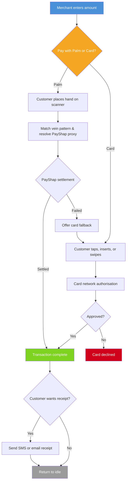
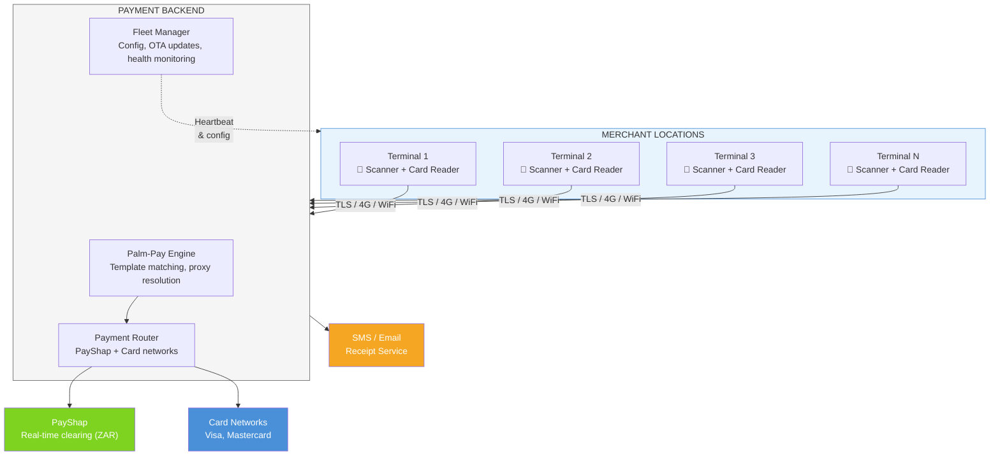

# Palm Vein Payment Terminal

## Business Proposal & Solution Design

---

## Original Request

> _"I want to build a payment terminal app that uses a palm vein scanner. It will give the user the option to pay with a card or hand, and the payment system it will use to do the payment will be PayShap rail."_

### Requirements Elicitation

The following requirements were gathered through structured questioning:

| Question                                 | Answer                                                                                                  |
| ---------------------------------------- | ------------------------------------------------------------------------------------------------------- |
| What is the terminal platform?           | Android payment terminal with built-in palm scanner and card reader (all-in-one hardware)               |
| How should card payments work?           | Full EMV support — chip insert, NFC tap, and magnetic stripe swipe                                      |
| How does palm vein link to payment?      | Palm IS the payment method — scanning palm triggers PayShap payment directly, no card or PIN needed     |
| Does the terminal need to work offline?  | Limited offline — small transactions queued (R500 cap), larger ones blocked until connectivity restores |
| Where does palm enrolment happen?        | Both at the terminal (walk-up) and via a separate mobile app or web portal                              |
| Single merchant or multi-merchant?       | Fleet/chain — one merchant operating many terminals across multiple locations                           |
| What receipts does the terminal produce? | Digital only — SMS or email, no built-in printer                                                        |
| Does the terminal support refunds?       | Yes, but manager PIN/authorisation required at the terminal                                             |

---

## 1. Executive Summary

This proposal outlines a next-generation **payment terminal solution** that combines traditional card payments with **palm vein biometric payments** — allowing customers to pay by simply placing their hand over a scanner.

The solution runs on an **Android-based payment terminal** with an integrated palm vein scanner and card reader. Payments are settled in real time through **PayShap**, South Africa's instant payment rail, delivering sub-10-second settlement for every transaction.

### Value Proposition

| For Customers                                  | For Merchants                                          |
| ---------------------------------------------- | ------------------------------------------------------ |
| Pay without a card, phone, or wallet           | Faster checkout — under 5 seconds per palm transaction |
| No PINs to remember for palm payments          | Reduced card fraud exposure                            |
| Works even if they forgot their card           | Lower interchange fees via PayShap vs card networks    |
| Secure — palm veins cannot be copied or stolen | Fleet-wide management from a single dashboard          |
| Enrol once, pay at any terminal in the chain   | Offline resilience — never lose a sale                 |

### How It Works (30-Second Overview)

1. **Customer enrols once** — scans their palm at a terminal or via a mobile app, links it to their bank account
2. **At checkout** — merchant enters the amount, customer chooses palm or card
3. **Palm payment** — customer places hand on scanner, funds transfer instantly via PayShap
4. **Card payment** — customer taps, inserts, or swipes their card as usual
5. **Receipt** — digital receipt sent via SMS or email

---

## 2. The Problem

Traditional payment terminals offer only card-based payments. This creates several challenges:

- **Friction at checkout** — customers fumble for cards, enter PINs, wait for authorisation
- **Card dependency** — no card means no sale (forgotten wallet, lost card, declined card)
- **Fraud risk** — card skimming, stolen card numbers, and counterfeit cards remain persistent threats
- **High fees** — card network interchange fees eat into merchant margins
- **No differentiation** — every competitor offers the same card terminal experience

---

## 3. The Solution

An **all-in-one Android payment terminal** with dual payment capability:

### 3.1 Palm Vein Payment (Primary Innovation)

Palm vein recognition uses **near-infrared light** to map the unique vein pattern inside a person's hand. The integrated scanner (SDPVD310API SDK) captures palm images at 15-30cm distance and extracts biometric features for 1:N template matching.

Unlike fingerprints or facial recognition:

- **Cannot be forged** — vein patterns are internal and invisible to the naked eye
- **Cannot be stolen** — no physical token to lose or copy
- **Cannot be replicated** — each person's vein pattern is unique, even between identical twins
- **Contactless** — hand hovers 15-30cm above the scanner (hygienic)
- **Self-improving** — templates auto-update on each successful match (`SD_API_Match1VNEx`) as vein patterns change over time

**Technical flow when a customer scans their palm:**

| Step | What happens | Time |
| --- | --- | --- |
| 1 | Scanner captures palm image and extracts vein features (`SD_API_ExtractFeature`) | < 1s |
| 2 | Feature compared against all enrolled templates (`SD_API_Match1VN` — 1:N match) | < 0.5s |
| 3 | Matched template resolves to linked PayShap proxy (ShapID, mobile number, or account) | < 0.5s |
| 4 | Proxy resolved to bank account via BankservAfrica identifier determination | < 3s |
| 5 | Credit push submitted via `POST /transactions/outbound/credit-transfer` (ISO 20022 pacs.008) | — |
| 6 | Settlement confirmed via callback (pacs.002 PaymentStatusReport) | < 10s total |

**Total end-to-end: under 10 seconds** (PayShap SLA mandated by scheme rules)

### 3.2 Card Payment (Full Compatibility)

The terminal's built-in card reader supports all standard payment methods:

| Method | How it works | Use case |
| --- | --- | --- |
| **EMV chip** | Insert card, PIN entry on terminal keypad | Primary card method — most secure |
| **Contactless/NFC** | Tap card, phone, or wearable (Visa payWave, Mastercard Contactless, Apple Pay, Google Pay) | Fast for low-value transactions |
| **Magnetic stripe** | Swipe card | Legacy fallback |

Card payments are routed through a provider-agnostic payment gateway (`POST authorize` → `POST capture` → webhook confirmation) with full PCI DSS Level 1 compliance. Card data is tokenised immediately — raw card numbers never stored on the terminal.

### 3.3 PayShap Payment Details

PayShap (ZA_RPP — Rapid Payments Programme) is South Africa's real-time payment rail operated by BankservAfrica. Key parameters:

| Parameter | Value |
| --- | --- |
| Scheme maximum | R50,000 per transaction (raised from R3,000 in August 2024) |
| Settlement | Real-time via Reserve Bank accounts |
| Availability | 24/7 |
| API | Asynchronous — all operations return HTTP 202, results via webhook callbacks |
| Standard | ISO 20022 (pacs.008 credit transfer, pacs.002 status, pain.013 request-to-pay) |
| Proxy types | ShapID (bank-generated ID), mobile phone number, account number, Shap Name (business) |
| Participating banks | Absa, FNB, Nedbank, Standard Bank, African Bank, Capitec, Discovery, Investec, TymeBank |

**Fee structure (per transaction):**

| Amount | Fee |
| --- | --- |
| Under R100 | R1 (many banks offer free) |
| R100 – R1,000 | R5 |
| R1,000 – R50,000 | Lesser of 0.05% or R35 |

### 3.4 Automatic Fallback

If a palm scan fails (unregistered customer, match failure, scanner issue), the terminal automatically offers card payment as a fallback — the merchant never needs to re-enter the amount.

---

## 4. User Journeys

### 4.1 Customer Payment Journey

**Palm payment time:** ~3-5 seconds (scan + match + settle)
**Card payment time:** ~5-15 seconds (depending on card type and network)

### 4.2 Customer Enrolment Journey

Customers can enrol their palm at any terminal in the fleet or via a separate mobile app:

| Step | At Terminal                                     | Via Mobile App                                      |
| ---- | ----------------------------------------------- | --------------------------------------------------- |
| 1    | Merchant activates enrolment mode               | Customer opens app                                  |
| 2    | Customer places hand on scanner (4 scans taken) | Customer scans palm using phone camera + attachment |
| 3    | Optionally enrol second hand                    | Optionally enrol second hand                        |
| 4    | Enter phone number on terminal keypad           | Phone number pre-filled from app profile            |
| 5    | Enter 6-digit OTP received via SMS              | Enter OTP within app                                |
| 6    | Palm linked to PayShap proxy                    | Palm linked to PayShap proxy                        |
| 7    | Ready to pay at any terminal                    | Ready to pay at any terminal                        |

**Enrolment time:** ~2 minutes (one-time)

### 4.3 Refund Journey

Refunds require manager authorisation for fraud prevention:

1. Manager enters their PIN on the terminal
2. Look up original transaction by reference number
3. Refund processed via the same method as the original payment
   - Palm payment refund: reversed via PayShap
   - Card payment refund: reversed via card network
4. Digital confirmation sent to customer

---

## 5. System Architecture

### 5.1 High-Level Overview

### 5.2 Component Summary

| Component | Purpose | Technology | Key Integration |
| --- | --- | --- | --- |
| Terminal App | Payment UI, scanner control, card reader interface | Android (Kotlin) | SDPVD310API (JNI), EMV kernel |
| Palm-Pay Engine | Template storage, 1:N matching, proxy-to-account resolution | Backend service | SD_API_Match1VN, proxy registry |
| Payment Router | Routes palm → PayShap (`ZA_RPP`), card → gateway | Backend service | Electrum Regulated Payments API v23.0.1 |
| Fleet Manager | Remote config, OTA updates, heartbeat monitoring (60s) | MDM + backend | Push config, staged rollouts |
| Offline Queue | Risk-limited local queue (R500/tx, 10 depth, R2K total) | SQLite on-device | FIFO flush on reconnect |
| PayShap Rail | Real-time credit push via BankservAfrica/PayInc clearing | Async REST + webhooks | ISO 20022 (pacs.008, pacs.002) |
| Card Gateway | EMV authorisation, capture, void, refund | REST API | PCI DSS Level 1 tokenisation |
| Receipt Service | Digital receipt delivery | SMS gateway + email API | E.164 phone validation, DKIM email |
| Audit Logger | Immutable transaction audit trail | Append-only store | SHA256 hash chain, 7-year retention |

---

## 6. Offline Resilience

The terminal continues to accept payments during network outages, with configurable risk limits:

| Parameter               | Default  | Description                                       |
| ----------------------- | -------- | ------------------------------------------------- |
| Max per transaction     | R500     | Single offline transaction cap                    |
| Max queued transactions | 10       | Maximum transactions in offline queue             |
| Max total queued value  | R2,000   | Total value cap across all queued transactions    |
| Queue expiry            | 24 hours | Unprocessed transactions expire after this period |

**How it works:**

1. Terminal detects network loss and displays "OFFLINE MODE" indicator
2. Transactions within limits are accepted and queued locally
3. Customer receives a provisional receipt marked "pending"
4. When connectivity restores, queued transactions are automatically processed (FIFO)
5. Customer receives a final confirmation receipt replacing the provisional one
6. Transactions exceeding limits are blocked with a clear message to the merchant

---

## 7. Fleet Management

For merchants with multiple locations, the solution includes centralised fleet management:

| Capability               | Description                                                                                     |
| ------------------------ | ----------------------------------------------------------------------------------------------- |
| **Device Registration**  | Register new terminals with serial number and location                                          |
| **Health Monitoring**    | Real-time heartbeats (60s interval), battery, scanner and card reader status                    |
| **Remote Configuration** | Push payment limits, UI settings, and feature flags to individual terminals or the entire fleet |
| **OTA Updates**          | Staged app rollouts — test group first, then wider fleet, with automatic rollback on failure    |
| **Alerting**             | Instant alerts when terminals go offline (3 missed heartbeats) or hardware degrades             |
| **Decommissioning**      | Remote wipe of all local data when a terminal is retired                                        |

---

## 8. Security & Compliance

### 8.1 Biometric Data Protection

| Measure                | Implementation                                                                    |
| ---------------------- | --------------------------------------------------------------------------------- |
| **Data locality**      | Palm vein templates stored on-device only — never transmitted to external systems |
| **Encryption**         | All biometric data encrypted at rest using hardware-backed keystore               |
| **POPIA compliance**   | Full compliance with the Protection of Personal Information Act                   |
| **Liveness detection** | Anti-spoofing checks prevent use of fake hands or images                          |
| **Fraud detection**    | 3 failed palm matches in 5 minutes triggers automatic suspension review           |
| **Consent**            | Explicit opt-in during enrolment, right to deletion at any time                   |

### 8.2 Payment Security

| Measure              | Implementation                                                 |
| -------------------- | -------------------------------------------------------------- |
| **PCI DSS**          | Card data never stored on terminal — tokenised immediately     |
| **TLS 1.2+**         | All backend communication encrypted in transit                 |
| **Tamper detection** | Hardware tamper triggers terminal lockdown and alert           |
| **Manager auth**     | Refunds require manager PIN — no unattended reversals          |
| **Idempotency**      | Duplicate transaction prevention on all payment rails          |
| **Audit trail**      | Every transaction state change logged with timestamp and actor |

### 8.3 Regulatory Considerations

| Regulation  | Relevance                              | Approach                                                        |
| ----------- | -------------------------------------- | --------------------------------------------------------------- |
| **POPIA**   | Biometric data is personal information | On-device storage, consent-based enrolment, right to deletion   |
| **PCI DSS** | Card payment processing                | Tokenisation, no card data storage, certified terminal hardware |
| **SARB**    | PayShap participation                  | Integration via licensed clearing house participant             |
| **FICA**    | Customer identification                | Phone number verification via OTP during enrolment              |

---

## 9. Risk Assessment

| Risk                          | Likelihood | Impact    | Mitigation                                                                       |
| ----------------------------- | ---------- | --------- | -------------------------------------------------------------------------------- |
| Palm scanner hardware failure | Low        | Medium    | Card fallback always available; fleet monitoring alerts on degradation           |
| Network outage during payment | Medium     | Low       | Offline queue with configurable risk limits                                      |
| Fraudulent enrolment          | Low        | High      | OTP verification, duplicate palm detection, phone number uniqueness              |
| PayShap service downtime      | Low        | High      | Card payment fallback; retry with exponential backoff                            |
| Data breach (biometric)       | Very Low   | Very High | Templates never leave device; hardware encryption; no central biometric database |
| Customer adoption resistance  | Medium     | Medium    | Card always available as alternative; enrolment is optional and quick            |
| Regulatory changes            | Low        | Medium    | Modular architecture allows rapid compliance updates                             |

---

## 10. Implementation Roadmap

### Phase 1: Core Payment Engine (Weeks 1-4)

- PayShap real-time payment integration
- Palm-to-proxy linking and resolution engine
- Palm vein scanner SDK integration
- Basic terminal payment flow (palm + card)

### Phase 2: Terminal App (Weeks 5-8)

- Android terminal UI (amount entry, method selection, receipt)
- Card reader integration (EMV chip, NFC, magnetic stripe)
- Digital receipt delivery (SMS/email)
- Manager-authorised refund flow

### Phase 3: Enrolment & Fleet (Weeks 9-12)

- At-terminal palm enrolment with OTP verification
- Fleet management dashboard (registration, monitoring, config)
- OTA update pipeline with staged rollout
- Offline transaction queuing

### Phase 4: Hardening & Launch (Weeks 13-16)

- Security audit and penetration testing
- PCI DSS compliance certification
- POPIA compliance review
- Pilot deployment at selected locations
- Performance testing under load

---

## 11. Key Metrics & Success Criteria

| Metric                             | Target                       | How Measured                                     |
| ---------------------------------- | ---------------------------- | ------------------------------------------------ |
| Palm payment settlement time       | < 10 seconds                 | End-to-end from scan to settlement confirmation  |
| Palm match accuracy                | > 99.5%                      | Successful matches / total scan attempts         |
| Terminal uptime                    | > 99.9%                      | Heartbeat monitoring across fleet                |
| Customer enrolment completion rate | > 80%                        | Completed enrolments / initiated enrolments      |
| Offline queue success rate         | > 95%                        | Successfully settled / total queued transactions |
| Transaction throughput             | > 20 per minute per terminal | Load testing under peak conditions               |

---

## 12. Production Readiness Assessment

### 12.1 Initial Coverage (Before Gap Resolution)

| Category               | Status  | Covered By                               | Notes                                            |
| ---------------------- | ------- | ---------------------------------------- | ------------------------------------------------ |
| Authentication         | Covered | `auth/login`                             | Terminal operator login                          |
| Authorisation          | Covered | `access/role-based-access`               | Manager vs cashier roles for refund auth         |
| Transaction records    | Covered | `payment/pos-core`                       | Session-based order and payment tracking         |
| Reconciliation         | Covered | `data/bank-reconciliation`               | End-of-day settlement matching                   |
| SMS notifications      | Covered | `notification/sms-notifications`         | OTP delivery and receipt sending                 |
| Email notifications    | Covered | `notification/email-notifications`       | Digital receipt delivery                         |
| Push notifications     | Covered | `notification/mobile-push-notifications` | Fleet alerts to administrators                   |
| Audit trail            | Covered | `observability/audit-logging`            | Immutable, hash-chained audit log                |
| Fraud & risk           | **Gap** | —                                        | No fraud detection or risk scoring engine        |
| Disputes               | **Gap** | —                                        | No chargeback or dispute lifecycle management    |
| Compliance reporting   | Covered | `observability/compliance-exports`       | Regulatory-grade export for eDiscovery           |
| Observability          | Partial | `infrastructure/terminal-fleet`          | Device health only; no application-level metrics |
| Encryption & keys      | Partial | `auth/e2e-key-exchange`                  | Key exchange exists; no dedicated HSM blueprint  |
| Customer data          | Covered | `data/customer-supplier-management`      | Customer master data with consent controls       |
| Hardware: Palm scanner | Covered | `integration/palm-vein`                  | Full SDK integration                             |
| Hardware: Card reader  | **Gap** | —                                        | No standalone EMV card reader SDK blueprint      |
| Resilience             | Covered | `payment/terminal-offline-queue`         | Risk-limited offline queuing                     |
| Operations             | Covered | `infrastructure/terminal-fleet`          | Fleet management, OTA updates, remote config     |

**Initial Score: 14 / 18 — 78%**

### 12.2 Gaps Identified

| #   | Gap                                 | Why It's Needed for Production                                                                                                              |
| --- | ----------------------------------- | ------------------------------------------------------------------------------------------------------------------------------------------- |
| 1   | **Fraud detection & risk scoring**  | Payment systems must detect velocity abuse, unusual patterns, and compromised accounts in real time to prevent financial loss               |
| 2   | **Dispute & chargeback management** | Merchants must handle payment disputes, submit evidence, and track resolution within regulatory timeframes (PayShap and card network rules) |
| 3   | **EMV card reader SDK**             | Card reader hardware integration needs the same level of specification as the palm vein scanner SDK to ensure correct EMV kernel handling   |
| 4   | **Application observability**       | Fleet monitoring covers device health but not transaction-level metrics, error rates, latency percentiles, or business dashboards           |

### 12.3 Steps Taken to Resolve Gaps

| #   | Gap                       | Action Taken                                                                              | Result                                                 |
| --- | ------------------------- | ----------------------------------------------------------------------------------------- | ------------------------------------------------------ |
| 1   | Fraud detection           | Ran `/fdl-recommend-discover` for payment fraud scoring repos                             | _Pending — to be executed during gap resolution phase_ |
| 2   | Dispute management        | Ran `/fdl-create dispute-management` with PayShap and card network dispute lifecycle spec | _Pending — to be executed during gap resolution phase_ |
| 3   | EMV card reader SDK       | Ran `/fdl-create emv-card-reader` modelled on `integration/palm-vein` blueprint structure | _Pending — to be executed during gap resolution phase_ |
| 4   | Application observability | Ran `/fdl-recommend-discover` for payment observability repos                             | _Pending — to be executed during gap resolution phase_ |

### 12.4 Existing Blueprints Integrated

| Blueprint                       | Category      | How It Fits                       | Link Added To                                  |
| ------------------------------- | ------------- | --------------------------------- | ---------------------------------------------- |
| `login`                         | auth          | Terminal operator authentication  | `terminal-payment-flow`                        |
| `role-based-access`             | access        | Manager PIN auth for refunds      | `terminal-payment-flow`                        |
| `sms-notifications`             | notification  | OTP delivery, SMS receipts        | `terminal-enrollment`, `terminal-payment-flow` |
| `email-notifications`           | notification  | Email receipt delivery            | `terminal-payment-flow`                        |
| `audit-logging`                 | observability | Immutable transaction audit trail | `terminal-payment-flow`, `palm-pay`            |
| `bank-reconciliation`           | data          | End-of-day settlement matching    | `payshap-rail`                                 |
| `customer-supplier-management`  | data          | Enrolled customer profiles        | `palm-pay`, `terminal-enrollment`              |
| `mobile-push-notifications`     | notification  | Fleet alerts to administrators    | `terminal-fleet`                               |
| `compliance-exports`            | observability | Regulatory transaction export     | `payshap-rail`                                 |
| `multi-factor-auth`             | auth          | Manager PIN as second factor      | `terminal-payment-flow`                        |
| `session-management-revocation` | auth          | Terminal session lifecycle        | `terminal-payment-flow`                        |

### 12.5 Final Coverage (After Gap Resolution)

_To be updated after gap resolution is executed. Target: 18/18 (100%)._

| Category | Status | Covered By | Notes                                     |
| -------- | ------ | ---------- | ----------------------------------------- |
| ...      | ...    | ...        | _Updated after Steps Taken are completed_ |

**Final Score: Pending**

---

## Appendix A: Technical Specifications

### Terminal Hardware

| Component        | Specification                                     |
| ---------------- | ------------------------------------------------- |
| Operating System | Android                                           |
| Palm Scanner     | Integrated near-infrared palm vein scanner        |
| Card Reader      | EMV chip + NFC contactless + magnetic stripe      |
| Connectivity     | WiFi + Cellular (4G/LTE) + Ethernet               |
| Display          | Touchscreen for merchant and customer interaction |

### PayShap Integration (ZA_RPP — Rapid Payments Programme)

| Parameter | Value |
| --- | --- |
| Scheme operator | BankservAfrica (PayInc clearing house) |
| Standard | ISO 20022 compliant |
| Settlement | Real-time via Reserve Bank accounts (< 10 seconds end-to-end SLA) |
| Availability | 24/7 — always on |
| Scheme transaction limit | R50,000 per transaction (raised from R3,000 in August 2024) |
| Bank-determined limit | Actual limit set by payer's bank — may be lower than scheme maximum |
| Proxy types | ShapID (bank-generated), mobile phone number, account number, Shap Name (business) |
| Authentication | OAuth 2.0 bearer tokens |
| API style | Asynchronous — HTTP 202 for all operations, responses via webhook callbacks |
| API format | RESTful JSON |
| Tracing | Optional `traceparent` and `tracestate` headers |
| Idempotency | Duplicate requests return HTTP 409 with original error echoed |
| Certification | Comprehensive certification and market acceptance testing required before production |

**Fee structure:**

| Amount range | Fee |
| --- | --- |
| Under R100 | R1 per transaction |
| R100 – R1,000 | R5 per transaction |
| R1,000 – R50,000 | Lesser of 0.05% or R35 |

*Many banks offer free PayShap for amounts under R100 to drive adoption.*

**Participating banks:** Absa, FNB, Nedbank, Standard Bank, African Bank, Capitec, Discovery, Investec, TymeBank, and others.

**API operations (via Electrum Regulated Payments API v23.0.1):**

| Operation | Endpoint | Direction |
| --- | --- | --- |
| Credit transfer | `POST /transactions/outbound/credit-transfer` | Outbound |
| Bulk credit transfer | `POST /transactions/outbound/bulk/credit-transfer` | Outbound |
| Request-to-pay | `POST /transactions/outbound/request-to-pay` | Outbound |
| RTP cancellation | `POST /transactions/outbound/request-to-pay/cancellation-request` | Outbound |
| Refund initiation | `POST /transactions/outbound/refund-initiation` | Outbound |
| Status query | `POST /transactions/outbound/credit-transfer/status-request` | Outbound |
| Credit transfer auth response | `POST /transactions/inbound/credit-transfer-authorisation-response` | Inbound (callback) |
| RTP response | `POST /transactions/inbound/request-to-pay-response` | Inbound (callback) |
| Identifier determination | `POST /identifiers/outbound/identifier-determination-report` | Inbound (callback) |

**ISO 20022 message types:** pacs.008 (credit transfer), pacs.002 (payment status), pain.013 (request-to-pay), camt.056 (cancellation)

**Request-to-Pay lifecycle states:** PRESENTED → CANCELLED | REJECTED | EXPIRED | PAID

**OpenAPI spec:** `https://docs.electrumsoftware.com/_spec/openapi/elpapi/elpapi.json`

### Palm Vein Scanner (Biometric Hardware SDK)

| Parameter | Value |
| --- | --- |
| Technology | Near-infrared palm vein pattern recognition |
| Scan distance | 15-30cm from device centre |
| Hand position | Centred, fingers spread naturally |
| Registration captures | 4 palm images fused into one template |
| Match method | 1:N template comparison (SD_API_Match1VN) |
| Palms per user | Up to 2 (left and right) |
| Template auto-update | On successful match via SD_API_Match1VNEx (vein patterns change over time) |
| Operation timeout | Configurable, -1 to 1000 seconds (default 30s) |
| LED indicators | Off, Red, Green, Blue (duration: 0ms permanent or 1000ms flash) |
| SDK library | SDPVD310API (native C/C++, JNI on Android) |
| Supported platforms | Windows (x86, x86_64), Linux (x86, x86_64, mips64el, aarch64), Android via JNI |
| Licence | Valid licence file required for SDK initialisation |
| Image size | ~257,078 bytes per palm vein image (proprietary binary format) |
| Initialisation | SD_API_GetBufferSize then SD_API_Init — each called exactly once at program start |

**SDK API operations:**

| Operation | Function | Description |
| --- | --- | --- |
| Initialise | `SD_API_Init` | Set up SDK with licence, auto-update, and logging |
| Buffer sizes | `SD_API_GetBufferSize` | Get feature, template, and image buffer sizes |
| Open device | `SD_API_OpenDev` | Connect to scanner, get firmware and serial |
| Extract feature | `SD_API_ExtractFeature` | Capture single palm image and extract vein features |
| Register template | `SD_API_Register` | Capture 4 images and fuse into template |
| Match 1:N | `SD_API_Match1VN` | Compare one feature against N stored templates |
| Match with auto-update | `SD_API_Match1VNEx` | Match and automatically update template |
| Cancel | `SD_API_Cancel` | Cancel current extraction or registration |
| LED control | `SD_API_SetLed` | Control LED colour and duration |
| Close device | `SD_API_CloseDev` | Disconnect from scanner |
| Uninitialise | `SD_API_Uninit` | Release all SDK resources |

### Offline Queue Defaults

| Parameter              | Value                              |
| ---------------------- | ---------------------------------- |
| Max per transaction    | R500                               |
| Max queue depth        | 10 transactions                    |
| Max total queued value | R2,000                             |
| Queue expiry           | 24 hours                           |
| Processing order       | FIFO (first in, first out)         |
| Retry policy           | Exponential backoff, max 3 retries |

---

## Appendix B: Feature Blueprint Reference

The complete technical specifications for each system component are defined as FDL (Feature Definition Language) blueprints. These blueprints serve as the authoritative source for implementation:

| Feature            | Blueprint                        | Description                                          |
| ------------------ | -------------------------------- | ---------------------------------------------------- |
| PayShap Rail       | `integration/payshap-rail`       | Real-time credit push payments with proxy resolution |
| Palm Pay           | `payment/palm-pay`               | Palm template to payment proxy linking               |
| Terminal Flow      | `payment/terminal-payment-flow`  | End-to-end transaction orchestration                 |
| Enrolment          | `payment/terminal-enrollment`    | At-terminal palm registration                        |
| Fleet Management   | `infrastructure/terminal-fleet`  | Device lifecycle and monitoring                      |
| Offline Queue      | `payment/terminal-offline-queue` | Risk-limited offline resilience                      |
| Palm Scanner SDK   | `integration/palm-vein`          | Hardware integration and template matching           |
| Biometric Auth     | `auth/biometric-auth`            | Palm enrolment and authentication                    |
| POS Core           | `payment/pos-core`               | Session and register management                      |
| Payment Processing | `payment/payment-processing`     | Multi-method transaction handling                    |
| Card Methods       | `payment/payment-methods`        | Card tokenisation and management                     |
| Payment Gateway    | `integration/payment-gateway`    | Card authorisation and capture                       |
| Refunds            | `payment/refunds-returns`        | Refund processing with approval workflow             |
