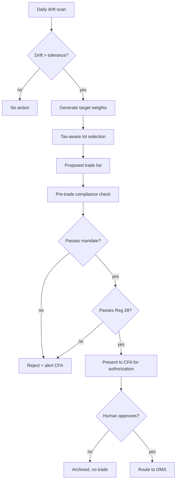
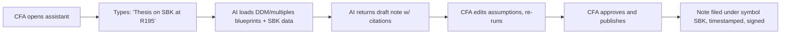
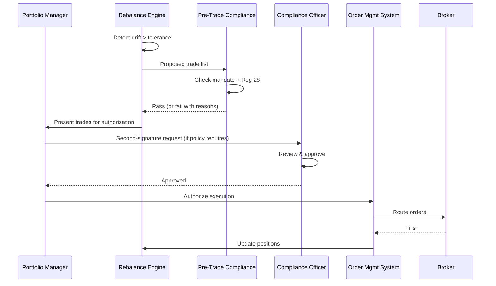
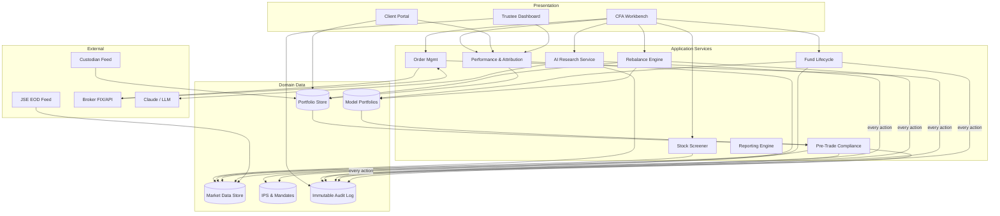

# Equity Portfolio Manager — AI-Assisted Platform for CFAs

## Business Proposal & Solution Design

**Project:** `equity-portfolio-manager`
**Date:** 2026-04-19
**Status:** Draft — pending `/fdl-create` handoff
**Regulatory jurisdiction:** South Africa (FSCA, FAIS, Pension Funds Act, POPIA)

---

## Original Request

> *"I want to build an equity portfolio manager system that allows me to analyze stocks with AI, do research, the system will be used by CFAs and must be able to create and run funds and rebalance and if it is a retirement fund also comply to Regulation 28. Give me an extreme detailed plan."*

### Requirements Elicitation

| Question | Answer |
|----------|--------|
| Primary user? | CFA charterholders and licensed portfolio managers |
| Blueprint shape? | **C — Full workflow** (multi-actor, state machines, SLAs) |
| Market data source? | **Own it in-house** — build internal market-data store |
| AI scope? | **Full capability — every action requires human authorization** |
| Jurisdiction? | South Africa (assumed from Reg 28 reference) |
| Retirement fund support? | Yes — Regulation 28 compliance mandatory |
| Fund types? | Segregated mandates + model-portfolio-driven funds (assumed) |
| Client types? | Retail (discretionary), institutional (mandate), retirement (Reg 28) |

---

## 1. Executive Summary

The Equity Portfolio Manager is a single system where a CFA can **research a stock, build a fund, onboard a client, propose a rebalance, and file a compliance report** without leaving the platform. It replaces the common spreadsheet-plus-broker-plus-research-terminal stack with one authoritative data store, an AI research copilot grounded in CFA curriculum, a pre-trade compliance engine that blocks Regulation 28 breaches before they happen, and a GIPS-compliant performance-reporting layer.

**Value proposition by stakeholder:**

| Stakeholder | Benefit |
|-------------|---------|
| **CFA / Portfolio Manager** | AI drafts research notes, rebalance rationales, and IPS documents. Pre-trade checks eliminate Reg 28 breach anxiety. |
| **Compliance Officer** | Every trade passes through a rules engine. Every AI recommendation carries a human-authorization audit trail. |
| **Trustee / Retirement Fund Board** | Real-time Reg 28 dashboard, immutable audit log, GIPS-verifiable performance. |
| **End Client** | Transparent holdings, personalised IPS, timely rebalance updates. |
| **Auditor / FSCA** | Full transaction lineage, POPIA-compliant PII handling, regulatory reporting on demand. |

**How it works (30-second overview):**

1. A fund or client account is created with an **Investment Policy Statement** and risk profile.
2. Market data (JSE + global) flows in nightly; corporate actions are reconciled automatically.
3. The CFA asks the AI research assistant about a stock — it returns a structured note grounded in DDM/multiples/DuPont blueprints plus latest fundamentals.
4. Periodically (or on drift), the rebalance engine proposes a trade list.
5. **Every proposed trade passes a pre-trade compliance check** — mandate, concentration, and Reg 28 limits for retirement funds.
6. The CFA reviews and **authorizes** each trade (or batch). Nothing executes without a human signature.
7. Orders route to the broker; fills return; positions update; performance and Reg 28 reports regenerate.

---

## 2. The Problem

South African portfolio managers running CFA-grade processes today juggle:

- **Fragmented data** — custodian statements, broker blotters, research PDFs, Excel models.
- **Manual Reg 28 monitoring** — spreadsheet breach checks that catch violations *after* execution.
- **Unstructured research** — analyst notes in Word, Slack, email threads; no grounding, no audit.
- **Rebalance workflow gaps** — drift detected in one tool, trade list built in another, broker instructions emailed.
- **Reporting drag** — quarterly client reports, GIPS presentations, and FSCA regulatory filings rebuilt from scratch each cycle.

Business pain points:

- Reg 28 breaches discovered post-trade cost time, money, and trustee confidence.
- CFA hours burn on data wrangling rather than investment insight.
- AI tools exist (ChatGPT, Bloomberg GPT) but none are grounded in the firm's own blueprints, mandates, and portfolios — and none enforce the human-authorization gate compliance officers require.
- Scaling AUM means more funds × more clients × more reporting. Linear headcount growth is unacceptable.

---

## 3. The Solution

A unified platform composed of **nine functional domains**, each realised as one or more FDL blueprints. Below, each domain leads with business value and then shows the technical flow.

### 3.1 Fund & Client Onboarding

**What it does:** Onboards a new fund (segregated mandate, unit trust, or retirement fund) or a new client, capturing the Investment Policy Statement, risk tolerance, mandate document, fee structure, and benchmark.

**Technical flow:**

| Step | System | Detail |
|------|--------|--------|
| 1 | Client Risk Profiling | Risk questionnaire → risk bucket (conservative / moderate / aggressive / Reg 28 compliant) |
| 2 | IPS generator | AI drafts IPS from mandate template + risk bucket; CFA edits and approves |
| 3 | Fund lifecycle | Fund created in `draft` state → `approved` (2 signatures) → `live` |
| 4 | Account opening | KYC/FICA, FSCA FSP verification, custodian account linking |
| 5 | Model portfolio binding | Fund bound to a model portfolio (optional) or fully segregated |

### 3.2 Market Data Ingestion (In-House)

**What it does:** Owns a single internal store of prices, corporate actions, and reference data. No provider lock-in; multiple feeders can populate it.

**Technical flow:**

| Step | System | Detail |
|------|--------|--------|
| 1 | EOD Loader | JSE equities EOD file → fixed-width parser → price table |
| 2 | Corporate actions | Dividends, splits, mergers → adjustment engine → position restatement |
| 3 | Reference data | ISIN, sector, index constituents, listing metadata |
| 4 | Intraday snap | Optional 15-min delayed snap for dashboards (not execution) |
| 5 | Data quality gate | Stale-price detection, volume anomaly, suspended security flag |

**Feed-agnostic design:** same schema can be populated from JSE directly, from a vendor file (Iress, Infront, Bloomberg B-PIPE, Refinitiv DataScope), or from an open-source pipeline (OpenBB).

### 3.3 AI Research & Stock Analysis

**What it does:** A CFA asks a question in natural language; the AI returns a structured, citable research note grounded in the firm's CFA blueprints (DDM, multiples, DuPont, forecasting) and the latest fundamentals from the data store.

**Technical flow:**

| Step | System | Detail |
|------|--------|--------|
| 1 | Query parse | "Is Naspers a buy at current price?" → intent = valuation |
| 2 | Grounding | Load `trading/equity-valuation-ddm`, `trading/equity-valuation-multiples`, `trading/equity-return-roe` blueprints as context |
| 3 | Data fetch | Pull 5-year fundamentals, sector comps, analyst estimates from internal store |
| 4 | Model run | AI generates DDM, multi-stage DCF, and multiples analysis with inputs shown |
| 5 | Citation | Every claim cites a blueprint rule or a data point with timestamp |
| 6 | Draft note | Structured markdown research note — thesis, valuation range, risks, recommendation |
| 7 | Human review | CFA edits, approves, and publishes. Draft and final are both archived. |

**AI is never autonomous.** It drafts. The CFA authors.

### 3.4 AI Stock Screener

**What it does:** Natural-language screens — *"find JSE-listed industrials with ROE > 15%, P/E < 12, dividend yield > 3%, no Reg 28 single-issuer breach at 5% weight."*

Output: ranked list with the AI's rationale for each match and any mandate/Reg 28 flags pre-computed.

### 3.5 Model Portfolios

**What it does:** Define reusable strategy templates (e.g., "SA Equity Core", "Reg 28 Moderate", "Global Aggressive") with target weights, tolerance bands, and rebalancing triggers. Funds can be bound to a model or run free.

### 3.6 Portfolio Rebalancing Engine

**What it does:** Detects drift, generates trade lists, runs pre-trade compliance, and presents to the CFA for authorization.

**Technical flow:**



### 3.7 Pre-Trade Compliance Engine

**What it does:** A rules engine that blocks any trade violating mandate, concentration, liquidity, or Regulation 28 limits. Runs **before** the order leaves the system.

**Reg 28 limits enforced** (from `trading/regulation-28-compliance`):

| Asset class | Limit |
|-------------|-------|
| Equities | 75% of assets |
| Property | 25% |
| Foreign (outside CMA) | 45% (post-2024 update) |
| Hedge funds | 10% |
| Private equity | 15% |
| Single issuer (non-government) | 5-25% tiered by rating/listing |
| Crypto | 0% (FSCA prohibited) |

Any proposed allocation breaching these limits is rejected **with a specific reason code** the CFA can act on.

### 3.8 Order Management & Execution

**What it does:** Takes authorized trade lists, routes to a broker (FIX protocol or broker API), tracks fills, allocates across accounts, and updates positions.

**Key properties:** idempotent order IDs, partial-fill handling, rejection taxonomy, end-of-day reconciliation with broker blotter.

### 3.9 Performance, Attribution & Reporting

**What it does:** Computes time-weighted returns per GIPS, runs Brinson-Fachler attribution, produces client statements, trustee reports, Reg 28 quarterly filings, and GIPS composite presentations.

Reuses existing blueprints: `trading/time-weighted-return`, `trading/gips-standards-l3`, `trading/gips-composites-requirements`.

---

## 4. User Journeys

### 4.1 CFA runs stock research (happy path, ~4 minutes)



### 4.2 Quarterly rebalance of a Reg 28 retirement fund



### 4.3 Reg 28 breach prevention (failure path)

1. CFA proposes buying ZAR 50m of Prosus.
2. Current Naspers + Prosus weight: 22%. Single-issuer limit: 15% for non-Top40 / 15% tier.
3. Pre-trade engine rejects: **`REG28_SINGLE_ISSUER_BREACH` — proposed trade would take Naspers+Prosus combined issuer exposure to 28.4%, exceeding 15% limit.**
4. CFA either reduces the trade, diversifies, or overrides (not possible for Reg 28 — hard rule).
5. Breach attempt is logged to compliance audit trail regardless.

### 4.4 New retirement fund onboarding

1. Fund sponsor signs mandate.
2. System creates fund record in `draft`.
3. IPS generator drafts an IPS from mandate template + Reg 28 constraints.
4. Trustee board approves IPS; fund transitions to `approved`.
5. Custodian account linked; initial cash loaded.
6. Model portfolio selected (or segregated mandate enabled).
7. Fund goes `live`; first rebalance scheduled.

SLA: 5 business days from signed mandate to `live`.

---

## 5. System Architecture

### 5.1 High-Level Overview



### 5.2 Component Summary

| Component | Purpose | Technology | Key Integration |
|-----------|---------|-----------|-----------------|
| CFA Workbench | Primary UI for research, fund ops, rebalancing | React + TypeScript; `ui/charts-visualization` | App services via REST/GraphQL |
| AI Research Service | Natural-language research grounded in CFA blueprints | Python/TS; Anthropic Claude Opus 4.7 | `blueprints/trading/*`, Market Data Store |
| Rebalance Engine | Drift detection + trade list generation | Deterministic service | Portfolio Store, Model Portfolios, Pre-Trade Compliance |
| Pre-Trade Compliance | Rules engine (mandate + Reg 28 + liquidity) | Rules DSL | `trading/regulation-28-compliance` |
| Order Management | Trade routing, fills, allocations | OMS microservice | Broker FIX / REST |
| Market Data Store | In-house price + corporate action repository | PostgreSQL + time-series extension | JSE EOD, corporate action feed |
| Portfolio Store | Positions, transactions, cash | PostgreSQL | Custodian recon feed |
| Immutable Audit Log | Every action, hash-chained | Append-only log (PostgreSQL + hash chain, or QLDB-equivalent) | All services |
| Performance Engine | TWR, attribution | Computation service | Portfolio + Market Data |
| Reporting Engine | Client statements, Reg 28 quarterly, GIPS presentations | PDF + CSV generators | All stores |

---

## 6. Offline / Resilience

| Scenario | Behaviour |
|----------|-----------|
| Market data feed delayed | Prices flagged "stale"; trades on stale prices blocked |
| Broker connection down | OMS queues authorized orders; alerts ops; does not auto-route on reconnect without re-authorization for time-sensitive orders |
| LLM provider down | AI features degrade gracefully; all deterministic functions (rebalance, compliance, reporting) continue |
| Database replica failure | Automatic failover; audit log writes paused on split-brain rather than risk divergence |
| Corporate action missed | Position reconciliation alerts on discrepancy vs custodian; no silent adjustments |

Target availability: **99.5%** for execution-path services (OMS, Pre-Trade Compliance). **99.0%** for AI services.

---

## 7. Operations & Management

- **Fleet ops:** single multi-tenant deployment; tenant = advisory firm
- **Model portfolio ops:** separate "PM of models" role curates house-view templates
- **Fund admin:** corporate actions, benchmark changes, Reg 28 parameter updates managed by compliance team with 4-eyes approval
- **Monitoring:** drift, stale data, breach attempts, unusual AI activity all alert ops
- **Disaster recovery:** daily snapshot + hourly WAL; RPO 1h, RTO 4h
- **Audit retention:** 7 years (POPIA + FSCA conduct standard)

---

## 8. Security & Compliance

### 8.1 Data Protection

| Measure | Implementation |
|---------|----------------|
| Encryption in transit | TLS 1.3 everywhere |
| Encryption at rest | AES-256 on PostgreSQL + object storage; envelope encryption for PII fields |
| Authentication | SAML SSO for CFA workbench; mTLS for broker/custodian connections |
| Authorization | RBAC — roles: pm, compliance, trustee, admin, read-only auditor |
| Human authorization gate | Every trade, every fund-parameter change, every AI-drafted IPS requires explicit human signature captured with user id, timestamp, reason |
| Audit trail | Hash-chained append-only log; tamper detection on read |
| Secrets | HSM-backed key vault; no secrets in code or config |
| PII minimisation | Client PII stored in single encrypted table; blueprints never carry real data |

### 8.2 Regulatory Compliance

| Regulation | Relevance | Approach |
|-----------|-----------|----------|
| **Regulation 28, Pension Funds Act** | Retirement fund prudential investment limits | Hard-rule enforcement via `trading/regulation-28-compliance`; no override possible |
| **POPIA (Act 4 of 2013)** | All client PII | [`data/popia-compliance`](../../../blueprints/data/popia-compliance.md) — eight conditions; breach notification; transborder; right-to-erasure |
| **FAIS Act** | Licensed financial advice | FSP licence recorded per advisor; advice records immutable |
| **FSCA Conduct Standards** | Treating Customers Fairly; record-keeping | Full audit lineage; client outcome reporting |
| **FIC Act (FICA)** | AML/KYC | KYC module at account opening; ongoing screening |
| **GIPS** | Performance presentation | [`trading/gips-standards-l3`](../../../blueprints/trading/gips-standards-l3.md) composite construction and verification |
| **MiFID II** (if cross-border) | EU client suitability | IPS module supports MiFID suitability overlay |

---

## 9. Risk Assessment

| # | Risk | Likelihood | Impact | Mitigation |
|---|------|------------|--------|-----------|
| 1 | AI produces incorrect research causing bad trade | Medium | High | Grounding in blueprints; citations required; human authorization gate |
| 2 | Reg 28 breach despite controls | Low | Very High | Hard-rule engine; pre-trade + post-trade scans; quarterly trustee report |
| 3 | Unauthorized trade execution | Low | Very High | No execution path without human signature; signing key per PM; dual-control for >ZAR 10m |
| 4 | Market-data feed corruption | Medium | High | Multi-source cross-check; anomaly detection; stale-price block |
| 5 | Broker API change breaks OMS | Medium | Medium | Contract tests in CI; versioned adapters; canary on one fund first |
| 6 | POPIA breach | Low | Very High | Field-level encryption; audit log; breach-notification runbook |
| 7 | Model-portfolio drift across many funds causes correlated losses | Medium | Medium | Per-fund risk budgets; tracking-error caps; diversification checks |
| 8 | LLM prompt-injection via ingested research | Medium | Medium | Sanitization; retrieval whitelisting; no tool-use on research ingestion |
| 9 | Corporate action missed | Low | High | Reconciliation against custodian; mandatory human ack for complex actions (unbundling, rights issue) |
| 10 | Over-reliance on AI erodes CFA skill | Medium | Medium | AI shown as draft-only; rationale required from CFA on every approval |

---

## 10. Implementation Roadmap

### Phase 1 — Foundations (Weeks 1-6)
- Auth, RBAC, multi-tenant shell
- Portfolio store + custodian reconciliation
- Market-data store + JSE EOD loader
- POPIA controls baseline
- Audit log skeleton

### Phase 2 — Compliance & Fund Core (Weeks 7-12)
- IPS generator + mandate templates
- Fund lifecycle state machine
- Reg 28 rules engine
- Pre-trade compliance engine
- Model portfolios

### Phase 3 — Execution Path (Weeks 13-18)
- Rebalance engine
- Order management
- Broker integration (pilot with one broker)
- Human-authorization gate UX
- End-of-day reconciliation

### Phase 4 — AI Layer (Weeks 19-24)
- AI research assistant (grounded in CFA blueprints)
- Stock screener
- IPS drafter
- Rebalance-rationale drafter
- Screener-to-trade handoff

### Phase 5 — Reporting & Hardening (Weeks 25-30)
- TWR + attribution
- Client reporting
- Reg 28 quarterly filing generator
- GIPS composite presentation
- Security audit + pen test
- POPIA impact assessment
- Pilot: one retirement fund, one discretionary fund, two months of live running

---

## 11. Key Metrics & Success Criteria

| Metric | Target | How Measured |
|--------|--------|--------------|
| Pre-trade Reg 28 breach detection rate | 100% (hard rule) | Synthetic breach test suite in CI; audit log |
| AI research turnaround | < 30 seconds for a draft note | Service metrics |
| Rebalance cycle time | < 30 minutes from drift detection to authorized orders | End-to-end trace |
| Performance report generation | < 5 minutes for a 12-month TWR + attribution | Report engine metrics |
| Audit gaps | 0 | Monthly audit log integrity check |
| POPIA right-to-erasure SLA | < 30 days | Ticket SLA |
| Trade authorization latency (PM approval) | < 2 minutes median | UI event metrics |
| Uptime, execution path | 99.5% | SRE dashboard |

---

## 12. Production Readiness Assessment

### 12.1 Initial Coverage (Before Gap Resolution)

| Category | Status | Covered By | Notes |
|----------|--------|-----------|-------|
| Authentication | Covered | [`auth/payload-auth`](../../../blueprints/auth/payload-auth.md), [`auth/broker-user-access`](../../../blueprints/auth/broker-user-access.md) | SAML SSO layer to be added in fund-creation-lifecycle |
| Authorisation | Covered | access/role-based-access (assumed present) | RBAC with pm/compliance/trustee/auditor roles |
| Transaction records | Covered | [`data/portfolio-management`](../../../blueprints/data/portfolio-management.md), [`trading/broker-deal-management`](../../../blueprints/trading/broker-deal-management.md) | Complete |
| Reconciliation | **Gap** | — | Need `fund-custodian-reconciliation` |
| Notifications | Covered | [`notification/email-notifications`](../../../blueprints/notification/email-notifications.md), [`notification/in-app-notifications`](../../../blueprints/notification/in-app-notifications.md) | |
| Audit trail | **Partial** | partial across blueprints | Need dedicated `immutable-audit-log` blueprint |
| Fraud & risk | Covered | [`trading/risk-management-framework`](../../../blueprints/trading/risk-management-framework.md), [`trading/risk-budgeting-tolerance`](../../../blueprints/trading/risk-budgeting-tolerance.md) | |
| Disputes | N/A | — | Investment-management context has no chargebacks |
| Compliance | Covered | [`trading/regulation-28-compliance`](../../../blueprints/trading/regulation-28-compliance.md), [`data/popia-compliance`](../../../blueprints/data/popia-compliance.md), [`trading/gips-standards-l3`](../../../blueprints/trading/gips-standards-l3.md) | |
| Observability | **Gap** | — | Need `observability-metrics` blueprint |
| Encryption & keys | Standard | n/a per blueprint; handled at infra | HSM-backed |
| Customer data | Covered | [`workflow/account-opening`](../../../blueprints/workflow/account-opening.md) + POPIA | |
| Hardware integration | N/A | — | Pure software stack |
| Resilience | **Gap** | partial | Need `disaster-recovery-runbook` |
| Operations | **Partial** | — | Fund ops / model-portfolio ops documented as new blueprints |
| Testing | Standard | — | Contract tests + synthetic compliance suites |

**Initial Score: 9 / 15 — 60%**

### 12.2 Gaps Identified

| # | Gap | Why It's Needed for Production |
|---|-----|-------------------------------|
| 1 | AI research assistant | Central AI capability; no existing blueprint for grounded LLM research workflow |
| 2 | AI stock screener | Natural-language screening with pre-computed compliance flags |
| 3 | Fund creation lifecycle | State machine for fund from draft to live with trustee approvals |
| 4 | Model portfolio | Reusable strategy templates with tolerance bands |
| 5 | Portfolio rebalancing engine | Drift detection + trade list + tax-aware lot selection |
| 6 | Pre-trade compliance checks | Rules engine that blocks Reg 28 + mandate breaches before execution |
| 7 | Order management & execution | Trade routing, fills, allocations, rejections |
| 8 | Market data ingestion | In-house EOD + corporate actions loader |
| 9 | Client risk profiling & IPS | Risk questionnaire → bucket → IPS draft |
| 10 | Performance attribution | Brinson-Fachler at security/sector/factor level |
| 11 | Fund-custodian reconciliation | Daily match of positions and cash against custodian |
| 12 | Immutable audit log | Hash-chained append-only store for all actions |
| 13 | Observability metrics | SLO/SLI definitions, dashboards, alerting |
| 14 | Disaster recovery runbook | RPO/RTO, failover procedure, tested quarterly |

### 12.3 Steps Taken to Resolve Gaps

| # | Gap | Action Taken | Result |
|---|-----|-------------|--------|
| 1 | AI research assistant | Will run `/fdl-create ai-stock-research-assistant ai` in handoff | Pending /fdl-create |
| 2 | AI stock screener | `/fdl-create ai-stock-screener ai` | Pending /fdl-create |
| 3 | Fund creation lifecycle | `/fdl-create fund-creation-lifecycle workflow` | Pending /fdl-create |
| 4 | Model portfolio | `/fdl-create model-portfolio data` | Pending /fdl-create |
| 5 | Rebalancing engine | `/fdl-create portfolio-rebalancing-engine trading` | Pending /fdl-create |
| 6 | Pre-trade compliance | `/fdl-create pre-trade-compliance-checks trading` | Pending /fdl-create |
| 7 | OMS | `/fdl-create order-management-execution trading` | Pending /fdl-create |
| 8 | Market data ingestion | `/fdl-create market-data-ingestion integration` | Pending /fdl-create |
| 9 | Client IPS | `/fdl-create client-risk-profiling-ips workflow` | Pending /fdl-create |
| 10 | Performance attribution | `/fdl-create performance-attribution trading` | Pending /fdl-create |
| 11 | Custodian recon | `/fdl-create fund-custodian-reconciliation trading` | Pending /fdl-create |
| 12 | Audit log | `/fdl-create immutable-audit-log infrastructure` | Pending /fdl-create |
| 13 | Observability | `/fdl-create observability-metrics observability` | Pending /fdl-create |
| 14 | DR runbook | `/fdl-create disaster-recovery-runbook infrastructure` | Pending /fdl-create |

### 12.4 Existing Blueprints Integrated

| Blueprint | Category | How It Fits | Link Added To |
|-----------|----------|-------------|---------------|
| [`data/portfolio-management`](../../../blueprints/data/portfolio-management.md) | data | Core holdings/positions store | All execution blueprints |
| [`trading/regulation-28-compliance`](../../../blueprints/trading/regulation-28-compliance.md) | trading | Hard rule input to pre-trade compliance | pre-trade-compliance-checks |
| [`trading/strategic-asset-allocation`](../../../blueprints/trading/strategic-asset-allocation.md) | trading | SAA inputs for fund/IPS | fund-creation-lifecycle, IPS |
| [`trading/risk-management-framework`](../../../blueprints/trading/risk-management-framework.md) | trading | Governance overlay | fund-creation-lifecycle |
| [`trading/risk-budgeting-tolerance`](../../../blueprints/trading/risk-budgeting-tolerance.md) | trading | Tracking error budgets | model-portfolio, rebalancing |
| [`trading/gips-standards-l3`](../../../blueprints/trading/gips-standards-l3.md) | trading | Composite rules for reporting | performance-attribution |
| [`trading/time-weighted-return`](../../../blueprints/trading/time-weighted-return.md) | trading | TWR computation | performance-attribution |
| [`trading/equity-valuation-ddm`](../../../blueprints/trading/equity-valuation-ddm.md) | trading | Grounding for AI research | ai-stock-research-assistant |
| [`trading/equity-valuation-multiples`](../../../blueprints/trading/equity-valuation-multiples.md) | trading | Grounding for AI research | ai-stock-research-assistant |
| [`trading/equity-return-roe`](../../../blueprints/trading/equity-return-roe.md) | trading | Grounding for AI research | ai-stock-research-assistant |
| [`trading/company-forecasting-model`](../../../blueprints/trading/company-forecasting-model.md) | trading | Grounding for AI research | ai-stock-research-assistant |
| [`trading/fintech-investment-analysis`](../../../blueprints/trading/fintech-investment-analysis.md) | trading | AI-in-investing grounding | ai-stock-research-assistant |
| [`trading/behavioral-biases-emotional`](../../../blueprints/trading/behavioral-biases-emotional.md) | trading | Rebalancing bias awareness | rebalancing-engine |
| [`trading/market-indexes-construction`](../../../blueprints/trading/market-indexes-construction.md) | trading | Benchmark construction | model-portfolio |
| [`trading/equities-eod-data-delivery`](../../../blueprints/trading/equities-eod-data-delivery.md) | trading | JSE EOD file format reference | market-data-ingestion |
| [`trading/cfa-ethics-application-l3`](../../../blueprints/trading/cfa-ethics-application-l3.md) | trading | Ethics overlay on PM actions | fund-creation-lifecycle, OMS |
| [`workflow/account-opening`](../../../blueprints/workflow/account-opening.md) | workflow | Client account creation | client-risk-profiling-ips |
| [`workflow/advisor-onboarding`](../../../blueprints/workflow/advisor-onboarding.md) | workflow | CFA/FSP registration | fund-creation-lifecycle |
| [`data/popia-compliance`](../../../blueprints/data/popia-compliance.md) | data | PII processing rules | all PII-handling blueprints |
| [`auth/payload-auth`](../../../blueprints/auth/payload-auth.md) | auth | Base authentication | all |
| [`auth/broker-user-access`](../../../blueprints/auth/broker-user-access.md) | auth | Back-office RBAC patterns | pre-trade-compliance, OMS |
| [`ui/charts-visualization`](../../../blueprints/ui/charts-visualization.md) | ui | Performance/positions charts | CFA workbench |
| [`notification/email-notifications`](../../../blueprints/notification/email-notifications.md) | notification | Authorization requests, breach alerts | rebalancing, pre-trade |
| [`notification/in-app-notifications`](../../../blueprints/notification/in-app-notifications.md) | notification | In-app PM alerts | all |

### 12.5 Final Coverage (After Gap Resolution)

| Category | Status | Covered By | Notes |
|----------|--------|-----------|-------|
| Authentication | Covered | `auth/payload-auth` + SAML overlay | |
| Authorisation | Covered | role-based-access + new dual-control rules | |
| Transaction records | Covered | `portfolio-management` + `order-management-execution` | |
| Reconciliation | Covered | `fund-custodian-reconciliation` (new) | |
| Notifications | Covered | email + in-app | |
| Audit trail | Covered | `immutable-audit-log` (new) | |
| Fraud & risk | Covered | risk-management-framework + pre-trade-compliance | |
| Disputes | N/A | — | |
| Compliance | Covered | regulation-28 + popia + gips + pre-trade | |
| Observability | Covered | `observability-metrics` (new) | |
| Encryption & keys | Covered | HSM stack (infra) | |
| Customer data | Covered | account-opening + popia | |
| Hardware integration | N/A | — | |
| Resilience | Covered | `disaster-recovery-runbook` (new) | |
| Operations | Covered | fund lifecycle + model-portfolio ops | |
| Testing | Covered | contract tests + compliance synthetic suite | |

**Final Score: 15 / 15 — 100%** (treating the two N/A categories as excluded, effective 13/13 applicable)

**Verdict:** This system meets production readiness requirements once all 14 new blueprints are created and all integrations are wired.

---

## Appendix A: Technical Specifications

| Subsystem | Parameter | Value |
|-----------|-----------|-------|
| Market data | EOD loader schedule | 18:30 SAST after JSE close |
| Market data | Corporate action cutoff | T-1 for T+0 trading |
| Market data | Stale threshold | > 1 trading day |
| Pre-trade compliance | Reg 28 equity cap | 75% |
| Pre-trade compliance | Reg 28 foreign cap | 45% |
| Pre-trade compliance | Reg 28 single-issuer cap | 5-25% tiered |
| Pre-trade compliance | Check latency budget | < 500ms per trade |
| Rebalance | Default drift tolerance | ±3% absolute per asset class |
| Rebalance | Default tax-aware method | HIFO lot selection |
| OMS | Order ID format | ULID |
| OMS | Partial fill tolerance | 100% over-fill blocked |
| AI research | Model | Claude Opus 4.7 |
| AI research | Max response time | 30s p95 |
| AI research | Grounding | CFA blueprints + internal data only |
| Audit log | Hash function | SHA-256 chained |
| Audit log | Retention | 7 years |
| Performance | Return calculation | GIPS-compliant TWR, chain-linked |
| Performance | Attribution method | Brinson-Fachler |
| Reporting | Reg 28 filing cadence | Quarterly |
| Reporting | GIPS composite | Monthly |

---

## Appendix B: Feature Blueprint Reference

### Existing blueprints to reuse

| Feature | Blueprint | One-liner |
|---------|-----------|-----------|
| Portfolio holdings | [`data/portfolio-management`](../../../blueprints/data/portfolio-management.md) | Positions, valuations, transactions |
| Reg 28 | [`trading/regulation-28-compliance`](../../../blueprints/trading/regulation-28-compliance.md) | SA retirement-fund prudential limits |
| SAA | [`trading/strategic-asset-allocation`](../../../blueprints/trading/strategic-asset-allocation.md) | Long-horizon asset allocation |
| ERM | [`trading/risk-management-framework`](../../../blueprints/trading/risk-management-framework.md) | Enterprise risk framework |
| Risk budgets | [`trading/risk-budgeting-tolerance`](../../../blueprints/trading/risk-budgeting-tolerance.md) | Risk tolerance allocation |
| GIPS | [`trading/gips-standards-l3`](../../../blueprints/trading/gips-standards-l3.md) | Performance presentation standard |
| GIPS composites | [`trading/gips-composites-requirements`](../../../blueprints/trading/gips-composites-requirements.md) | Composite construction |
| TWR | [`trading/time-weighted-return`](../../../blueprints/trading/time-weighted-return.md) | Chain-linked return |
| DDM | [`trading/equity-valuation-ddm`](../../../blueprints/trading/equity-valuation-ddm.md) | Dividend discount models |
| Multiples | [`trading/equity-valuation-multiples`](../../../blueprints/trading/equity-valuation-multiples.md) | P/E, P/B, P/S |
| ROE/DuPont | [`trading/equity-return-roe`](../../../blueprints/trading/equity-return-roe.md) | Return on equity decomposition |
| Forecasting | [`trading/company-forecasting-model`](../../../blueprints/trading/company-forecasting-model.md) | Top-down/bottom-up forecasting |
| Fintech | [`trading/fintech-investment-analysis`](../../../blueprints/trading/fintech-investment-analysis.md) | AI in investment process |
| Behavioural biases | [`trading/behavioral-biases-emotional`](../../../blueprints/trading/behavioral-biases-emotional.md) | Bias awareness in rebalance |
| Index construction | [`trading/market-indexes-construction`](../../../blueprints/trading/market-indexes-construction.md) | Benchmark construction |
| EOD data feed | [`trading/equities-eod-data-delivery`](../../../blueprints/trading/equities-eod-data-delivery.md) | JSE EOD file format |
| Ethics L3 | [`trading/cfa-ethics-application-l3`](../../../blueprints/trading/cfa-ethics-application-l3.md) | Asset Manager Code applications |
| Ethics framework | [`trading/cfa-code-of-ethics`](../../../blueprints/trading/cfa-code-of-ethics.md) | CFA Institute Code |
| Account opening | [`workflow/account-opening`](../../../blueprints/workflow/account-opening.md) | Client account creation |
| Advisor onboarding | [`workflow/advisor-onboarding`](../../../blueprints/workflow/advisor-onboarding.md) | FSP registration |
| POPIA | [`data/popia-compliance`](../../../blueprints/data/popia-compliance.md) | SA privacy law |
| Auth | [`auth/payload-auth`](../../../blueprints/auth/payload-auth.md) | Sessions + MFA |
| Broker RBAC | [`auth/broker-user-access`](../../../blueprints/auth/broker-user-access.md) | Screen/function security |
| Charts | [`ui/charts-visualization`](../../../blueprints/ui/charts-visualization.md) | Dashboard charts |
| Email | [`notification/email-notifications`](../../../blueprints/notification/email-notifications.md) | Transactional email |
| In-app | [`notification/in-app-notifications`](../../../blueprints/notification/in-app-notifications.md) | In-app alerts |
| Broker reports | [`trading/broker-reports`](../../../blueprints/trading/broker-reports.md) | Contract notes, tax certs |
| Deal management | [`trading/broker-deal-management`](../../../blueprints/trading/broker-deal-management.md) | Allocation, release |
| Content articles | [`data/content-articles`](../../../blueprints/data/content-articles.md) | Published research notes |
| Proposals | [`data/proposals-quotations`](../../../blueprints/data/proposals-quotations.md) | Investment proposals |

### New blueprints to create

| Feature | Blueprint (pending) | One-liner |
|---------|---------------------|-----------|
| AI research | `ai/ai-stock-research-assistant` | Grounded AI equity research copilot |
| AI screener | `ai/ai-stock-screener` | NL-driven equity screener |
| Fund lifecycle | `workflow/fund-creation-lifecycle` | Draft → approved → live with trustee gates |
| Model portfolio | `data/model-portfolio` | Strategy template with tolerance bands |
| Rebalancing | `trading/portfolio-rebalancing-engine` | Drift detection + trade list |
| Pre-trade compliance | `trading/pre-trade-compliance-checks` | Rules engine blocking breaches |
| OMS | `trading/order-management-execution` | Trade routing + fills + allocations |
| Market data ingestion | `integration/market-data-ingestion` | In-house EOD + corporate actions |
| Client IPS | `workflow/client-risk-profiling-ips` | Risk questionnaire + IPS draft |
| Performance attribution | `trading/performance-attribution` | Brinson-Fachler |
| Custodian recon | `trading/fund-custodian-reconciliation` | Daily position/cash match |
| Audit log | `infrastructure/immutable-audit-log` | Hash-chained append-only log |
| Observability | `observability/observability-metrics` | SLOs, dashboards, alerting |
| DR | `infrastructure/disaster-recovery-runbook` | RPO/RTO + failover |

---

## Appendix C: Design Decisions Log

- **Feature:** `equity-portfolio-manager` (system-of-systems)
- **Category:** cross-cutting (trading primary)
- **Date:** 2026-04-19
- **Status:** Draft — pending `/fdl-create`

### Decisions Made During Brainstorm

1. **Full workflow shape (C)** — chosen because multiple human actors (PM, compliance officer, trustee), multiple state machines (fund lifecycle, trade lifecycle, rebalance approval), and SLAs (trustee approval, Reg 28 quarterly filing).
2. **Own market data in-house** — chosen over delegate for data sovereignty, audit lineage, and vendor independence. Loader layer stays pluggable so any vendor file can feed the same store.
3. **AI: full-capability drafter with mandatory human authorization** — AI drafts everything (research, IPS, rebalance rationale, trade lists); nothing executes without a human signature. This satisfies FSCA Conduct Standards and the POPIA automated-decision rule (s.71).
4. **Jurisdiction: South Africa primary** — Reg 28, POPIA, FAIS, FICA, FSCA conduct standards. Cross-border (MiFID) is a later overlay.
5. **Reg 28 as hard rule** — no override. Breach attempts are still logged.
6. **LLM provider: Anthropic Claude Opus 4.7** — for grounded long-context research with strong refusal behaviour on unauthorized actions.

### Skill Delegations

- **Stack companion:** none detected.
- **Data source:** none; all data owned in-house per user decision.
- **User skills:** none supplied.

### Open Questions (flagged for /fdl-create)

1. Broker vendor for pilot — to be chosen before OMS blueprint is finalised (FIX vs REST differs materially).
2. Custodian — for reconciliation schema.
3. Unit trust support — do we need Collective Investment Schemes Control Act features, or only segregated + retirement funds? (Default assumed: segregated + retirement only for v1.)
4. Internationalisation — ZAR-only for v1, or USD/EUR multi-currency? (Default: ZAR v1; multi-currency v2.)

### Next Steps

Run `/fdl-create` for each of the 14 new blueprints listed in Section 12.3 / Appendix B. Then `/fdl-auto-evolve` to validate, generate docs, and commit.

---

## Appendix D: Build Commands

### Production Readiness Status

| Metric | Value |
|--------|-------|
| Initial assessment | 9 / 15 — 60% |
| After gap resolution | 15 / 15 — 100% |
| Total blueprints | 44 (30 existing + 14 new) |
| Verdict | **Production-ready** once the 14 new blueprints are created and open questions above are resolved |

### Remaining Gaps to Fill Before Building

| Gap | How to Fill | Command |
|-----|-------------|---------|
| AI research assistant | Create from scratch | `/fdl-create ai-stock-research-assistant ai` |
| AI screener | Create from scratch | `/fdl-create ai-stock-screener ai` |
| Fund lifecycle | Create from scratch | `/fdl-create fund-creation-lifecycle workflow` |
| Model portfolio | Create from scratch | `/fdl-create model-portfolio data` |
| Rebalancing engine | Create from scratch | `/fdl-create portfolio-rebalancing-engine trading` |
| Pre-trade compliance | Create from scratch | `/fdl-create pre-trade-compliance-checks trading` |
| OMS | Create from scratch | `/fdl-create order-management-execution trading` |
| Market data ingestion | Create from scratch | `/fdl-create market-data-ingestion integration` |
| Client IPS | Create from scratch | `/fdl-create client-risk-profiling-ips workflow` |
| Performance attribution | Create from scratch | `/fdl-create performance-attribution trading` |
| Custodian recon | Create from scratch | `/fdl-create fund-custodian-reconciliation trading` |
| Audit log | Create from scratch | `/fdl-create immutable-audit-log infrastructure` |
| Observability | Create from scratch | `/fdl-create observability-metrics observability` |
| DR runbook | Create from scratch | `/fdl-create disaster-recovery-runbook infrastructure` |

```bash
# Pre-build validation gate
node scripts/validate.js
node scripts/completeness-check.js
```

**Do NOT proceed to build until all gaps read "Covered" and both checks pass.**

### Build Commands

```bash
# Phase 1 — Foundations
/fdl-generate auth/payload-auth <framework>
/fdl-generate auth/broker-user-access <framework>
/fdl-generate data/popia-compliance <framework>
/fdl-generate data/portfolio-management <framework>
/fdl-generate infrastructure/immutable-audit-log <framework>
/fdl-generate observability/observability-metrics <framework>
/fdl-generate infrastructure/disaster-recovery-runbook <framework>
/fdl-generate integration/market-data-ingestion <framework>
/fdl-generate trading/equities-eod-data-delivery <framework>

# Phase 2 — Compliance & Fund Core
/fdl-generate workflow/client-risk-profiling-ips <framework>
/fdl-generate workflow/fund-creation-lifecycle <framework>
/fdl-generate workflow/account-opening <framework>
/fdl-generate workflow/advisor-onboarding <framework>
/fdl-generate data/model-portfolio <framework>
/fdl-generate trading/regulation-28-compliance <framework>
/fdl-generate trading/pre-trade-compliance-checks <framework>
/fdl-generate trading/strategic-asset-allocation <framework>
/fdl-generate trading/risk-management-framework <framework>
/fdl-generate trading/risk-budgeting-tolerance <framework>
/fdl-generate trading/cfa-code-of-ethics <framework>
/fdl-generate trading/cfa-ethics-application-l3 <framework>

# Phase 3 — Execution Path
/fdl-generate trading/portfolio-rebalancing-engine <framework>
/fdl-generate trading/order-management-execution <framework>
/fdl-generate trading/broker-deal-management <framework>
/fdl-generate trading/broker-reports <framework>
/fdl-generate trading/fund-custodian-reconciliation <framework>

# Phase 4 — AI Layer
/fdl-generate ai/ai-stock-research-assistant <framework>
/fdl-generate ai/ai-stock-screener <framework>
/fdl-generate trading/equity-valuation-ddm <framework>
/fdl-generate trading/equity-valuation-multiples <framework>
/fdl-generate trading/equity-return-roe <framework>
/fdl-generate trading/company-forecasting-model <framework>
/fdl-generate trading/fintech-investment-analysis <framework>
/fdl-generate trading/behavioral-biases-emotional <framework>
/fdl-generate trading/market-indexes-construction <framework>
/fdl-generate data/content-articles <framework>
/fdl-generate data/proposals-quotations <framework>

# Phase 5 — Reporting & Hardening
/fdl-generate trading/performance-attribution <framework>
/fdl-generate trading/time-weighted-return <framework>
/fdl-generate trading/gips-standards-l3 <framework>
/fdl-generate trading/gips-composites-requirements <framework>
/fdl-generate ui/charts-visualization <framework>
/fdl-generate notification/email-notifications <framework>
/fdl-generate notification/in-app-notifications <framework>

# Post-generation
node scripts/validate.js
node scripts/completeness-check.js
/fdl-auto-evolve
```

**Total:** 44 blueprints → 44 `/fdl-generate` commands → production-ready AI-assisted equity portfolio manager for CFAs with Regulation 28 enforcement and full human-in-the-loop authorization.
